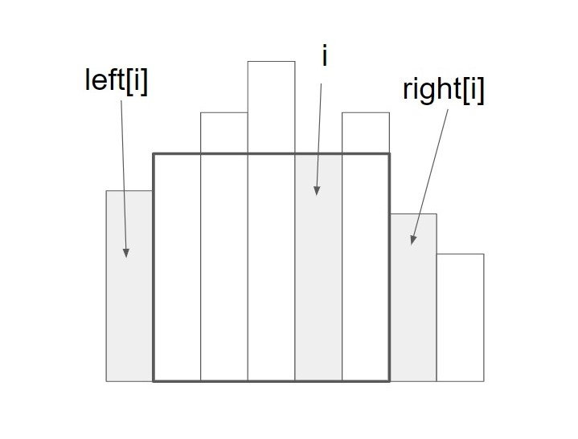
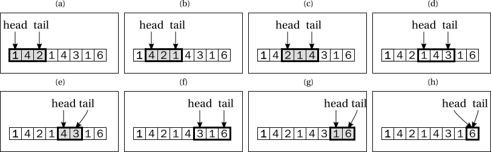

# 19 큐와 스택, 데크

## 19.1 도입

큐, 스택, 데크와 같은 자료구조들은 모두 배열, 연결리스트를 이용하면 쉬벡 구현 가능하지만, 이러한 자료구조가 중요한 이유는 흔히 사용하는 자료구조에 이름을 붙였다는 데 있다. 이로서 개발자 간의 의사소통이 더 쉬워지고, 더 큰 그림을 보며 프로그램을 설계할 수 있다.


### 큐와 스택, 데크

- 큐 (queue) : 속성이 선입선출(FIFO)이다. 줄, 스케쥴, 할일 목록등을 표현할 수 있다.
- 스택 (stack) : 속성이 후입선출(LIFO)이다.  전반적인 전산학에서 사용되며 컴퓨터 내부의 함수들의 문맥(context)를 관리하는데 사용한다. 
- 데크 (dequeue) : 양쪽 끝에서 자료들을 넣고 뺄 수 있는 자료 구조를 말한다. 데크를 이용하면 스택과 큐 모두 구현가능하다.

자료구조에서 자료를 넣는 작업을 push, 꺼내는 작업을 pop이라고 한다. 이들 자료구조에서 push, pop 연산은 모두 상수 시간 O(1)에 이루어져야 한다. 


## 19.2 큐와 스택, 데크의 구현

### 연결 리스트를 통한 구현

연결 리스트를 이용하면 양쪽 끝에서의 추가와 삭제를 모두 상수 시간에 할 수 있기 때문에, 모든 연산이 상수 시간이어야 함을 충족할 수 있다. 다만 노드 할당, 삭제, 포인터 연산 비용 때문에 가장 효율적인 구현은 아니다.


### 동적 배열을 이용한 구현

스택은 한쪽 끝에서만 추가, 삭제가 일어나서 곧장 사용할 수 있지만, 큐와 데크는 그렇지 못하며 맨 앞 원소를 삭제시 O(n)의 시간이 든다. 이것을 보완하기 위해 head와 tail을 유지하면서 삽입, 삭제시에 각각 tail과 head를 옮긴다. 

그리고 공간을 효율적으로 활용하기 위해 버려지는 공간들을 재활용하고, 더이상 원소 삽입할 곳이 없을 때만 동적 배열을 재할당한다.  이렇게 하면 동적 배열의 처음과 끝을 붙여 원형으로 만들었다고 볼 수 있다. 이러한 배열의 구현을 환형 버퍼(circular buffer)라고 부른다.

> 실제로는 tail이 마지막 원소의 위치가 아니라 마지막 원소 다음 위치를 가리키게 한다. 왜냐하면 그렇지 않으면 텅빈 큐를 표현할 수 없기 때문이다.

```
                              head     tail
                          [ ][1][2][3][4][ ][ ][ ]

                                   head     tail
                          [ ][ ][ ][3][4][5][7][ ]

                          tail     head
                          [9][ ][ ][3][4][5][7][8]
```


### 표준 라이브러리의 구현

스택, 큐, 데크는 거의 모든 언어의 표준 라이브러리에서 구현체를 제공하며, 연결 리스트만 지원해도 스텍, 큐, 데크로 사용할 수 있으니 직접 구현할 이유는 없다.


## 19.3 스택과 큐의 활용

### 예제 : 큐를 이용한 조세푸스 문제의 해법

[[문제 내용]](https://algospot.com/judge/problem/read/JOSEPHUS)

이전에 사용했던 리스트 대신 큐를 사용해서 풀어본다. 이번에는 사람들을 움직이고 그 과정에서 2명이 남을때까지 반복해서 문제를 풀 수 있다. 큐에서 원소 추가와 삭제는 상수시간에 이루어지므로 수행시간 또한 연결 리스트를 사용한 것과 같다.

- 큐의 첫 번째 사람이 나와서 죽고
- 큐의 맨 앞에 있는 사람을 맨 뒤로 보내는 작업을 k-1번 반복한다.

```java
문제 풀어볼 것
```


### 예제 : 스택을 이용한 울타리 자르기 문제의 해법

[[문제내용]](https://algospot.com/judge/problem/read/FENCE)

15.11절에 소개한 스위핑 알고리즘과 스택을 결합해 풀 수 있다. 분할 정복을 이용한 O(NlgN)해법보다 빠른 O(N)시간에 동작한다.



어떤 판자를 완전히 포함하는 사각형 중 면적이 최대인 사각형을 해당 판자의 최대 사각형이라고 부르기로 한다. 위의 그림에서 굵은 사각형은 i번 판자의 최대 사각형이다. 이 사각형의 특징은 다음과 같다.

- 이 사각형의 높이는 i번 판자와 항상 같다.
- 이 사각형의 왼쪽 끝과 오른쪽 끝은 i번 판자보다 낮은 판자들로 막혀있다. 각각 번호가 left[i], right[i]이다.

이런 경우 최대 사각형의 넓이는 `(right[i] - left[i] - 1) x h[i]` 로 계산할 수 있다. 모든 판자에 대해 최대 사각형의 넓이를 구한 후, 그 중 최대치를 구하면 문제의 답이 된다. 하지만 left[i], right[i]를 찾는 알고리즘은 판자의 개수에 비례하는 시간이 걸린다. 결국 전체 알고리즘은 O(N^2) 시간에 수행된다. 

모든 판자에 대해 left[i], right[i]를 상수 시간에 계산하는 방법은 각 판자에 대해 문제를 따로 푸는 것이 아니라 다른 판자에 대해 계산했던 정보를 재활용하는 것이다.


#### 스위핑 알고리즘의 설계

먼저 0번 판자를 보면, 이 판자의 왼쪽에는 아무 판자도 없기 대문에, 노이가 0인 판자가 -1에 있다고 가정하고 left[0] = -1로 두고 right[0] 는 일단은 내버려 둔다.  그다음은?

- h[0]  > h[1]: 1번 판자가 0번 판자의 최대 사각형의 갈 길을 막고 있기 대무에 right[0]==1임을 알 수 있다. 따라서 이 시점에서 0번 판자가 정의하는 최대 사각형을 찾을 수 있다. left[0], right[0]을 ah두 알고 있기 때문이다. 그런데 이 사각형의 넓이를 계산하고 나면, 0번 판자는 이제 더이상 의미가 없다. 1번 판자가 더 낮기 때문에 이후의 어떤 판자 i에 대해서 left[i] = 0 이 될 일이 없다. 따라서 0번 판자를 지운다. 그러면 왼쪽에 아무런 판자도 남지 않기 때문에 left[1] = -1이다. right[1]은 아직 모르기 때문에 1번 판자는 그대로 둔다.
- h[0] < h[1] : 이 경우 0번 판자가 1번 판자의 최대 사각형의 갈 길을 막고있다. 따라서 left[1]=0임을 알수 있다. 하지만 right[0], right[1]도 지금은 알 수 없기 때문에 둘 다 내버려 두기로 한다.
- h[0]=h[1] : 이 경우 두 판자의 최대 사각형은 완전히 같다. 따라서 0번 판자를 계속 남겨둘 이유가 없다. h[0] > h[1]인 경우와 똑같이 처리하도록 한다.


이 과정을 일반화 하면 스위핑 알고리즘을 얻을 수 있다. i번 판자를 봤는데, 왼쪽에 자신보다 높은 판자들이 남아있다면 그들의 최대 사각형을 자신이 막고 있는 것이다. 이들 전부에 대해 최대 사각형의 넓이를 계산하고 이들을 지운다. 그리고 나면 i번 판자 왼쪽에는 자신보다 낮은 판자만이 남아 있다. 그러면 left[i]를 항상 알 수 있다.


```c++
import java.util.ArrayList;
import java.util.Stack;

public class Main {
    // 각 판자 높이를 저장하는 배열
    public static final ArrayList<Integer> h = new ArrayList<>();
    // 스택을 사용한 O(n) 해법
    public static int solveStack() {
        // 남아 있는 판자들 중 오른쪽 끝 판자가 h[i]보다 높다면
        // 이 판자의 최대 사각형은 i에서 끝난다.
        Stack<Integer> remaining = new Stack<>();
        h.add(0);
        int ret = 0;
        for(int i=0; i<h.size(); ++i) {
            while(!remaining.empty() && h.get(remaining.peek()) >= h.get(i)) {
                int j = remaining.peek();
                remaining.pop();
                int width = -1;
				// j번째 판자 왼쪽에 판자가 하나도 안 남아 있는 경우 left[j]=-1
                // 아닌 경우 left[j]=남아 있는 판자 중 가장 오른쪽에 있는 판자 번호가 됨
                if(remaining.empty())
                    width = i;
                else
                    width = (i - remaining.peek() - 1);
                ret = Math.max(ret, h.get(j) * width);
            }
            remaining.push(i);
        }
        return ret;
    }
}
```


## 19.4 & 19.5 문제 : 짝이 맞지 않는 괄호

#### [[문제 내용]](https://algospot.com/judge/problem/read/BRACKETS2)

### 풀이

```java
public class Main {
    // 이미 열린 괄호들을 순서대로 담는 스택
    public final static Stack<Integer> stack = new Stack<>();

    // 여는 괄호 문자들, 닫는 괄호 문자들
    public final static String openBrackets = "[{(";
    public final static String closeBrackets = "]})";

    public static boolean run(String brackets) {
        stack.clear();
        for(char one : brackets.toCharArray()) {
            int idx = openBrackets.indexOf(one);
            // 여는 괄호라면 스택에 넣는다.
            if(idx != -1) stack.push(idx);
            else {
                // 아니라면 스택 맨 뒤의 문자와 비교해본다.
                // 스택이 비어있거나 스택 맨뒤의 괄호와 짝이 아니면 실패
                if(stack.empty() || stack.peek() != closeBrackets.indexOf(one)) 
                    return false;
                // 짝이 맞다면 뺀다.
                stack.pop();
            }
        }
        // 닫히지 않은 괄호가 없어야 성공이다. (꼭 확인하자.)
        return stack.empty();
    }
}
```


## 19.6 & 19.7 문제 : 외계 신호 분석

#### [[문제내용]](https://algospot.com/judge/problem/read/ITES)

### 풀이

#### 입력의 크기

이 문제는 입력의 크기가 크다. 5천만 개의 32비트 정수가 190MB의 메모리가 필요하므로 문제의 메모리 제한인 64MB에는 모든 정수를 다 저장할 수 없다. 16비트 정수로 표현하더라도 마찬가지로 넘어간다.  따라서 모든 키를 메모리에 생성해 올려놓지 않고 이 중 일부만을 사용하는 온라인 알고리즘을 작성해야 한다.

온라인 알고리즘이란 전체 입력이 한꺼번에 주어지지 않아도 계산을 시작할 수 있는 알고리즘을 말한다. 알고리즘 수행 중 새 입력을 받아 계산을 계속하기 때문에 입력 전체가 메모리에 올라와 있지 않아도 계산을 시작할 수 있다. 반면 오프라인 알고리즘이란 입력 전체를 이미 갖고 있다고 가정하고 동작하는 알고리즘을 말한다. 


#### 오프라인 알고리즘 만들기

먼저 제약 조건을 무시하고 알고리즘 설계후, 점진적으로 최적화하기로 한다. 가장 단순한 방법은 모든 부분 구간을 검사하면서 합이 K인 것을 찾는 것이다.

```c++
// 가장 단순한 알고리즘
public static int simple(int[] signals, int k) {
    int ret = 0;
    for(int head=0; head < signals.length; head++) {
        int sum = 0;
        for(int tail=head; tail < signals.length; tail++) {
            // sum은 [head, tail] 구간 합이다.
            sum += signals[tail];
            if(sum == k) ret++;
            if(sum >= k) break;
        }
    }
    return ret;
}
```

이 알고리즘은 이중 for문으로 되어 있으며 head에 대한 for문은 N번 수행, tail에 대한 for문은 K번 수행 될 것이다. 그러면 전체 시간 복잡도는 O(NK)가 될 것이다. 이것을 최적화하여 선형 알고리즘으로 바꿀 수 있다.

이를 위해 간단한 최적화를 한다. head에 대한 for문의 내부는 head에서 시작하는 구간들을 길이 순서대로 검사하는데, 구간합이 이미 K이상이 되었을 경우 더 이상 구간의 길이를 늘리지 않고 종료한다. 이 때 주목할 것은 종료하기 전에 마지막으로 검사한 구간이다. 이 구간은 head에 시작하는 구간 중 합이 K 이상인 가장 짧은 구간이다. head가 정해져 있을 때 이 구간 외의 구간은 답이 될 수 없다. 이 구간보다 짧으면 합이 반드시 K미만일테고, 이보다 길면 K를 반드시 초과하기 때문이다. 이 구간들만이 답이 될 가능성이 있다는 의미에서 이 구간들을 **후보 구간**들이라고 부른다.



문제에 주어진 예제 입력에서 각 위치마다 시작하는 후보 구간들을 그림에서 볼수 있다. 후보 구간의 합이 실제 K와 같은 경우 짙은 색으로 표시했다. 여기서 head가 늘어났을 때 tail이 줄어드는 일이 없다. head가 증가했는데 tail이 감소했다면 이 후보구간은 이전 후보구간의 부분구간이 된다. 이 구간의 합이 이미 K이상이라면 이전 후보 구간은 더 일찍 끝났어야 하므로 이런 경우는 있을 수 없다. 

여기서 중요한 **통찰**이 등장한다. head가 증가했을 때 tail이 전보다 줄어드는 일이 없다면, 후보 구간의 tail을 찾을 때 head에서부터 시작하는 것이 아니라 마지막에 찾았던 tail에서부터 시작가능하다.

```c++
// 외계 신호 분석 문제를 하결하는 최적화된 알고리즘
public static int optimized(int[] signals, int k) {
    int ret = 0, tail = 0, rangeSum = signals[0];
    for(int head = 0; head < signals.length; head++) {
        // rangeSum이 k이상인 최초의 구간을 만날 때까지 tail을 옮긴다.
        while(rangeSum < k && tail + 1 < signals.length) {
            rangeSum += signals[++tail];
        }
        if(rangeSum == k) ret++;
        // signals[head]는 이제 구간에서 빠진다.
        rangeSum -= signals[head];
    }
    return ret;
}
```

tail과 구간합을 나타내는 rangeSum 변수가 이제 head에 대한 for문 밖에 선언되어 있다. 또한 head가 증가하기 직전에 마지막에 계산했던 후보 구간의 합에서 signals[head]를 빼 주는 점을 눈여겨 본다. 이렇게 하면 head가 증가한 후에 구간합을 새로 계산할 필요가 없다.

이 알고리즘의 시간 복잡도는 중첩 반복문이 있지만, while문의 내부가 실행될 때마다 tail이 증가한다. tail은 0에서 N까지 증가하기때문에 최대 N번 수행된다. 분할 상환 분석을 이용하면 O(N)이라는 것을 알수 있다.


#### 온라인 알고리즘 만들기

모든 데이터를 미리 생성하는 대신, 구간에 새 숫자를 포함시켜야 할 때마다 해당 숫자를 하나씩 생성한다. 그리고 필요 없게 된 숫자는 지운다. head가 증가하고 나면 우리가 지나쳐온 숫자들은 고려할 필요가 없다. 따라서 메모리에 저장해야 하는 것은 우리가 유지하는 후보 구간에 포함된 숫자들 뿐이다.

```c++
int countRanges(int k, int n) {
    RNG rng; // 신호값을 생성하는 난수 생성기
    queue<int> range; // 현재 구간에 들어 있는 숫자들을 저장하는 큐
    int ret = 0, rangeSUm = 0;
    for(int i=0; i<n; i++) {
        // 구간에 숫자를 추가한다.
        int newSignal = rng.next();
        rangeSum += newSignal;
        range.push(newSignal);
        
        // 구간의 합이 k를 초과하는 동안 구간에서 숫자를 뺀다.
        while(rangeSum > k) {
            rangeSum -= range.front();
            range.pop();
        }
        
        if(rangeSum == k) ret++;
    }
    return ret;
}
```

위의 코드에서는 구현을 좀더 간단히 하기 위해, 원소를 넣는 순서와 빼는 순서를 바궜다. 구간에 원소를 먼저 넣은 뒤, 구간합이 K이하가 될떄가지 원소를 뺀다. 결과적으로 각 tail에 대해 합이 K이하가 되는 가장 긴 구간을 찾는 것이다.

이 문제에서 모든 신호는 양수이므로 큐의 크기는 항상 K이하이고, 결과적으로 적은 양의 메모리만을 쓰고 이 문제를 해결할 수 있다.


#### 신호의 생성

이 문제에서 신호를 생성하는 방법은 사실 가장 간단한 형태의 난수 생성기 중 하나인 선형 합동 난수 생성기 (linear congruential random number generator)이다. 이런 코드를 작성할 때 유의할 점은 계산 과정에서 오버플로우가 발생하는 경우를 잘 처리하는 것이다. 내부적으로 unsigned 자료형을 사용해서 2^32로 나눈 나머지를 취하는 연산을 할 필요가 없게 했다.

```c++
// 선형 합동 난수 생성기의 구현
struct RNG {
    unsigned seed;
    RNG() : seed(1983){}
    unsigned next() {
        unsigned ret = seed;
        seed = ((seed * 214013u) + 2531011u);
        return ret % 10000 + 1;
    }
}
```


```java
// 자바 버전, 자바는 unsigned가 없기 때문에 나눠줘야 한다.
class RNG {
    public final static double two32 = Math.pow(2,32);
    public double seed = 1983;

    public double next() {
        double ret = seed;
        seed = (seed * 214013 + 2531011) % two32;
        return ret % 10000 + 1;
    }
}
```


