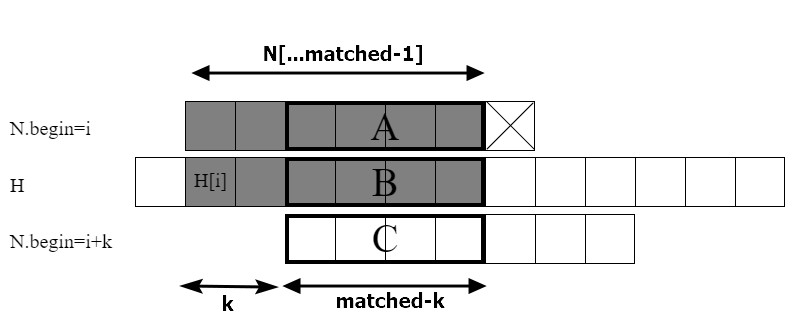

# 20 문자열

## 20.1 도입

간결한  표현을 위해 다음 표기를 정의한다.

- 문자열 S의 길이는 |S|로 표기한다. S = "Abcd", |S| = 4
- S 내부의 i번째 글자를 S[i]로 표기한다.
- 문자열 S의 i번 ~ j번 글자까지를 S의 부분 문자열(substring)이라하고 S[i ... j] 라고 한다.
- 문자열 S의 0번 ~ i번까지를 접두사(prefix)라 하고 S[...i]라 한다. 
- 문자열 S의 i번부터 끝까지를 접미사(suffix)라 하고 S[i...] 라 한다. 만약 i가 |S|라면 길이가 0인 접미사이다.


## 20.2 문자열 검색

주어진 긴 문자열이 특정 부분 문자열을 포함하는지, 포함한다면 시작 위치를 찾는 문제를 문자열 검색 문제라고 한다. 만약 두 번 이상 존재한다면 모든 위치를 반환해야 한다. 

이 문제를 푸는 간단한 방법은 N의 가능한 모든 시작 위치를 다 시도해 보는 것이다. 

```c++
// 짚더미 H의 부분문자열로 바늘 N이 출현하는 시작 위치들을 모두 반환한다.
public static ArrayList<Integer> naiveSearch(String H, String N) {
    ArrayList<Integer> ret = new ArrayList<>();
    // 모든 시작 위치를 다 시도해 본다.
    int nLen = N.length(), hLen = H.length();
    for(int begin = 0; begin + nLen <= hLen; ++begin) {
        boolean matched = true;
        for(int i=0; i<nLen; ++i) {
            if(H.charAt(begin + i) != N.charAt(i)) {
                matched = false;
                break;
            }
        }
        if(matched) ret.add(begin);
    }
    return ret;
}
```

```
a v a d a k e d a v r a
a k
  a
    a k
      a
        a k e d
```


위의 코드를 H = "avadakedavra"와 N = "aked" 로 돌려보면 대부분 1~2번의 비교로 불일치를 찾을 수 있어보여서 효율적인것 처럼 보인다. 하지만 이 알고리즘은 특정 형태의 입력에 대해서 매우 비효율적이다. 

만약 H와 N이 모두 a로만 구성된 긴 문자열이라고 한다면 |H|-|N|+1개의 모든 시작 위치에 대해서 비교를 수행한다. 시작 위치의 수는 O(|H|)라 할 수 있고 비교는 O(|N|)이므로 전체 시간 복잡도는 O(|H|x|N|) 가 될 것이다. 

하지만 구현이 단순하기에 표준 라이브러리 구현에서 널리 사용된다. C의 strstr(), C++의 string::find(), java의 indexOf() 등에서 사용된다.


### 보지 않고도 알 수 있는 것이 있다. : KMP 알고리즘

어떤 긴 문자열에서 `N = "aababac"` 를 찾는 경우가 있다고 하자. 시작 위치 i에서부터 N을 맞춰보니 첫 일곱 글자 "aababa"는 일치했지만 여덞번째 글자에서 불일치가 발생했다. 단순한 알고리즘은 다음위치인 i+1에서 답을 찾기 시작한다. 하지만 지금까지 일곱 글자가 대응되었다는 사실을 이용하면 시작 위치 중 일부는 답이 될 수 없음을 보지 않아도 알 수 있다.

```
N, begin=i		a a b a a b a c(x)
H           ?.. a a b a a b a ? ...
N, begin=i+1      a a(x)
N, begin=i+2        a(x)
N, begin=i+3          a a b a ...
N, begin=i+4            a a(x)
N, begin=i+5              a(x)
N, begin=i+6                a ...
```

위의 그림을 보면 위치 i에서 일곱 글자가 일치하기 위해서는 그림에서 볼 수 있듯이 H의 해당 부분 문자열인 H[i...i+6]이 "aabaaba" 이어야 한다. 그렇다면 i+1에서 시작하는 N은 H와 일치할 수가 없다. N[1]은 a인데 H의 대응하는 글자는 b이기 때문이다. 이렇게 i+6까지의 시작 위치를 하나하나 시도해 보면 답이 될 가능성이 있는 시작 위치는 i+3과 i+6밖에 없다는 것을 알게 된다. 따라서 시작 위치를 i+3으로 증가시키고 검색을 계속하면 된다.

여기서 시작 위치 후보들을 걸러낼 때 쓴 정보는 "현재 시작 위치에서 H와 N을 비교했을 때 몇 글자나 일치했는가" 뿐이며 현재 H내에서의 위치나 H에 포함된 문자들은 볼 필요가 없다.

일치한 글자의 수는 항상 0에서 |N|사이의 정수이기 대문에 전처리 과정에서 이 정보들을 미리 계산해 저장해 둘 수 있다. 이와 같은 최적화를 적용한 문자열 검색 알고리즘이 커누스-모리프-프랫 알고리즘으로 KMP 알고리즘이라고 부른다.


### 다음 시작 위치 찾기

KMP 알고리즘은 불일치가 일어났을 때 지금까지 일치한 글자의 수를 이용해 다음으로 시도해야 할 시작 위치를 빠르게 찾아낸다.

다음은 시작위치 i에서 H와 N을 맞춰봤을 때 matched 글자가 일치하고 다음글자가 불일치한 상황을 부여준다. matched 글자가 일치했기 때문에 B의 접두사 N[...matched-1]가 H[i...i+matched-1]와 일치했음을 알 수 있다.



그림에서 회색으로 칠해진 글자들은 서로 일치하기 때문에, 굵은 선으로 표시된 두 부분 문자열 A와 B는 서로 같음을 알 수 있다. 그런데 시작 위치 i+k가 답이 될 수 있으려면 B와 C도 서로 같아야 함로, 결과적으로 A와 C가 같아야 한다. 이때 A=C는 N[...matched-1]의 접두사이기도 하고 접미사이기도 하다.

즉, 시작 위치 i+k에서 답을 찾을 수 있기 위해서는 N[...matched-1]의 길이 matched-k인 접두사와 접미사가 같아야 한다. 그러므로 답이 될 수 있는 바로 다음 위치를 찾기 위해서는 N의 각 접두사에 대해 접두사도 되고 접미사도 되는 문자열의 최대 길이를 계산해 두면 된다. 예시에서의 "aabaaba"의 접두사도 되고 접미사도 되는 문자열이 "aaba"와 "a"의 두 가지가 있지만 ,"aaba"를 이용해 시작 위치를 3만큼 옮겼던 것처럼.

KMP 알고리즘은 전처리 과정에서 다음과 같이 정의되는 배열pi[]를 계산한다.

> pi[i] = N[...i] 이 접두사도 되고 접미사도 되는 문자열의 최대 길이

pi[]는 N이 어디까지 일치했는지가 주어질 때 다음 시작 위치를  어디로 해야 할지를 말해주기 때문에, 이를 흔히 부분 일치 데이블(partial match table)이라고 부른다. 다음 표는 바늘 문자열 "aabaabac"의 각 접두사에 대해 KMP알고리즘이 미리 계산해 두는 부분 일치 테이블의 값을 보여준다.

| i    | N[...i]  | 접두사이면서 접미사인 최대 문자열 | pi[i] |
| ---- | -------- | --------------------------------- | ----- |
| 0    | a        | (없음)                            | 0     |
| 1    | aa       | a                                 | 1     |
| 2    | aab      | (없음)                            | 0     |
| 3    | aaba     | a                                 | 1     |
| 4    | aabaa    | aa                                | 2     |
| 5    | aabaab   | aab                               | 3     |
| 6    | aabaaba  | aaba                              | 4     |
| 7    | aabaabac | (없음)                            | 0     |


### 실제 문자열 검색의 구현

pi[i]를 계산했다면 이제 문자열 검색을 수행할 수 있다. 

KMP알고리즘은 단순한 알고리즘처럼 시작 위치 0에서부터 시작해서 H와N의 글자를 비교한다. 만약 matched 글자가 일치한 후 불일치가 발생했다고 한다면, 다음으로 시도해야할 시작 위치는 어디일까?


위 그림에서 A의 길이는 pi[matched-1]이다. 따라서 시작 위치를 matched-pi[matched-1]만큼 증가 시키면 될 것이다.

여기서 중요한 점은 시작 위치를 움직인 이후 첫 글자부터 다시 대응시켜 나갈 필요가 없다는 것이다. 새로운 위치에서 비교를 시작하더라도 N의 첫 pi[matched-1] 글자는 대응되는 H의 글자와 일치한다는 사시를 이미 알고 있기 때문이다. 위의 그림에서 B와 C가 서로 같기 때문이다. 따라서 matched를 pi[matched-1]으로 변경하고 비교를 계속하면 된다.

불일치가 발생한 경우는 그렇다 치고, 답을 찾은 경우에는 어떻게 할까? 우선 현재 시작 위치를 답의 목록에 추가해야 한다는 것 빼고는 불일치가 발생한 경우와 같다. 그러고 나면 답이 될 수 있는 다음 싲가 위치에서부터 검색을 계속하면 된다.

아래 코드에서는 문자 비교가 실패했을 때 matched=0인 경우를 예외 처리했다. 한 글자도 일차하지 않고 (matched=0) 불일치가 발생했을 때 바로 다음 시작 위치에서 처음부터 검색을 재개한다.

```c++
// 짚더미 H의 부분 문자열로 바늘 N이 출현하는 시작 위치들을 모두 반환한다.
vector<int> kmpSearch(const string &h, const string &N) {
    int n = H.size(), m = N.size();
    vector<int> ret;
    // pi[i] = N[...i]의 접미사도 되고 접두사도 되는 문자열의 최대 길이
    vector<int> pi = getPartialMatch(N);
    // begin = matched = 0 에서부터 시작
    int begin = 0, matched = 0;
    while(begin <= n-m) {
        // 만약 짚더미의 해당 글자가 바늘의 해당 글자와 같다면
        if (matched < m && H[begin + matched] == N[matched]) {
            ++matched;
            // 결과적으로 m 글자가 모두 일치했다면 답에 추가한다.
            if(mtched == m) ret.push_back(begin);
        } else {
            // 예외 : matched가 0인 경우에는 다음 칸에서부터 계속
            if(matched == 0) ++begin;
            else {
                begin += matched - pi[matched - 1];
                // begin을 옮겼다고 처음부터 다시 비교할 필요가 없다.
                // 옮긴 후에도 pi[matched -1]만큼은 항상 일치하기 때문
                matched = pi[matched-1];
            }
        }
    }
    return ret;
}
```


### 시간 복잡도 분석

pi[]를 계산하기 위한 getPartialMatch()의 구현을 다루지 않았기 때문에 이 부분은 제외한다. kmpSearch()의 수행 시간을 지배하는 while문은 if문의 각 분기 내용이 최대 몇 번이나 수행되는지를 각각 계산해서 수행 시간을 분석할 수 있다. 

while문 내부의 첫 번째 if문은 최대 몇 번 성공할 까? 먼저 while문 내부의 begin+matched는 감소하지 않는다. matched가 감소할 때 begin는 그 감소분만큼 항상 증가하기 때문에 둘의 합은 변하지 않는다. 따라서 한번 matched가 증가하고 나면 H[begin+matched]를 다시 참조할 일은 없다. 따라서 문자 비교 성공은 짚더미의 각 문자당 최대 한 번씩만 일어날수 있고 결과적으로 이 분기는 최대 O(|H|)번 수행된다.

그렇다면 최대 몇 번 실패할까? begin은 0에서 시작해서 이 분기가 수해오딜 때마다 1이상씩 증가한다. 전체 알고리즘은 begin이 |H|-|N|을 초과하면 종료되기 때문에 이 분기는 최대 O(|H|)번 수행된다.

따라서 kmpSearch()의 반복문의 최대 수행 횟수는 O(|H|)이다. 바늘의 길이와 상관없이 항상 짚더미의 길이에만 비례하는 것이다.


### 부분 일치 테이블 생성하기

이제 getPartialMatch() 함수를 볼 것이다. KMP 검색 과정을 응용해 이 함수를 빠르게 구현할 수 있다.

부분 일치 테이블을 만드는 가장 간단한 방법은 N의 각 접두사에 대해 가능한 답을 하나씩 모두 시도하는 것이다. 길이 p인 접두사 N[...p-1]이 주어졌을 때 길이 p-1인 접두사, 길이 p-2인 접두사, 길이 p-3인 접두사들을 순회하며 이들이 N[...p-1]의 접미사가 되는지를 확인하는 것이다. 이 과정을 구현하면 각 접두사 길이의 제곱에 비례하는 시간이 걸리기 때문에, |N|개의 모든 접두사에 대해 수행하려면 O(|N|^3)의 시간이 걸린다.

보통 |N|은 |H|에 비해 훨씬 작기 때문에 이것만으로도 충분한 경우도 많지만, 이것을 좀더 최적화할 수 있는 방ㅂㅂ이 있다. 각 접두사에 대해 pi[]의 값을 따로 계산하는 것이 아니라 모든 접두사에 대해 값을 따로 계산하는 것이 아니라 모든 접두사에 대해 한꺼번에 계산하는 것이다. 두글자 N[i]와 N[begin+i]가 일치할 때마다 pi[begin+i]를 갱신해주면 단순한 문자열 검색에 걸리는 시간인 O(|N|^2)만에 부분 일치 테이블을 계산할 수 있다.

다음 코드는 단순한 문자열 검색을 구현했던 이전 코드와 별로 다를 것이 없지만 답을 찾을 가능성이 ㅓㅄ더라도 모든 시작 범위를 시도한다는 점과 일치가 일어날 때마다 pi[]를 갱신한다는 점이 다르다. 여기서 pi[begin + i]를 갱신할 때 이미 있는 값과 i+1중 더 큰값을 택한다. 현재보다 왼쪽에 잇는 시작 위치에서 이 위치에 값을 이미 갱신했을지도 모르기 때문이다.

```c++
// 단순한 문자열 알고리즘을 이용해 부분 일치 테이블 계산하기
// N에서 자기 자신을 찾으면서 나타나는 부분일치를 이용해 pi[]를 계산한다.
// pi[i]=N[...i]의 접미사도 되고 접두사도 되는 문자열의 최대 길이
vector<int> getPartialMatchNaive(const string& N) {
	int m = N.size();
    vector<int> pi(m,0);
    // 단순한 문자열 검색 알고리즘을 구현한다.
    for(int begin = 1; begin < m; ++begin) {
        for(int i = 0; i+begin < m; ++i) {
            if(N[begin + i] != N[i]) break;
            // i+1 글자가 서로 대응되었다.
            pi[begin + i] max( pi[begin + i], i + 1);
        }
    }
    return pi;
}
```


다음 코드는 KMP 검색을 이용하여 부분 일치 테이블을 생성하는 getPartialMatch() 구현을 보여준다. 일치가 일어 날 때마다 pi[]를 갱신하는 것만 제외하면 이전전 문자열 검색 코드와 비슷하다는 것을 알 수 있다. 또한 다음 같은 점을 눈여겨 보자.

- begin을 옮길 때 이전에 계산한 pi[] 값을 사용하고 있다. 현재 matched 글자가 일치했다면 pi[matched-1]는 항상 계산된 뒤임을 증명할 수 있기 때문이다.
- pi[]의 각 원소는 최대 한 번만 변경되기 때문에 max() 연산을 따로 해 줄 필요가 없다.

```c++
// KMP 알고리즘을 이용해 일치 테이블을 생성하기
// N에서 자기 자신을 찾으면서 나타나는 부분 일치를 이용해 pi[]를 계산한다.
// pi[i]=N[...i]의 접미사도 되고 접두사도 되는 문자열의 최대 길이
vector<int> getPartialMatch(const string& N) {
    int m = N.size();
    vector<int> pi(m,0);
    // KMP로 자기 자신을 찾는다.
    // N을 N에서 찾는다. begin=0이면 자기 자신을 찾아버리니까 안됨!
    int begin =1, matched =0;
    // 비교할 문자가 N의 끝에 도달할 때까지 찾으면서 부분 일치를 모두 기록한다.
    while(begin + matched < m) {
        if(N[begin + matched] == N[matched]) {
            ++matched;
            pi[begin + matched-1] = matched;
        } else {
            if(matched == 0) ++begin;
            else {
                begin += matched - pi[matched-1];
                matched = pi[matched-1];
            }
        }
    }
    return pi;
}
```

KMP 문자열 검색을 이용하기 때문에 이 전처리 과정의 시간 복잡도는 O(|N|)이 된다. 따라서 두 과정의 시간 복잡도를 합치면 O(|N|+|H|)이 된다.


```java

public class Main {
    public static ArrayList<Integer> kmpSearch(String H, String N) {
        int n = H.length(), m = N.length();
        ArrayList<Integer> ret = new ArrayList<>();

        // pi[i] = N[...i]의 접미사도 되고 접두사도 되는 문자열의 최대 길이
        ArrayList<Integer> pi = getPartialMatch(N);

        // begin = matched = 0 에서부터 시작
        int begin = 0, matched = 0;
        while(begin <= n-m) {
            // 만약 짚더미의 해당 글자가 바늘의 해당 글자와 같다면
            if(matched < m && H.charAt(begin+matched) == N.charAt(matched)) {
                ++matched;
                // 결과적으로 m 글자가 모두 일치했다면 답에 추가한다.
                if(matched == m) ret.add(begin);
            } else {
                if(matched == 0) ++begin;
                else {
                    begin += matched - pi.get(matched-1);
                    // begin을 옮겼다고 처음부터 다시 비교할 필요가 없다.
                    // 옮긴 후에도 pi[matched-1]만큼은 항상 일치하기 때문
                    matched = pi.get(matched-1);
                }
            }
        }
        return ret;
    }
    public static ArrayList<Integer> getPartialMatch(String N) {
        int m = N.length();
        ArrayList<Integer> pi = new ArrayList<>();
        for(int i=0; i<m; i++) pi.add(0);

        // KMP로 자기 자신을 찾는다.
        // N을 N에서 찾는다. begin=0이면 자기 자신을 찾아버리므로 안된다.
        int begin = 1, matched = 0;
        while(begin + matched < m) {
            if(N.charAt(begin+matched) == N.charAt(matched)) {
                ++matched;
                pi.set(begin+matched-1, matched);
            } else {
                if(matched == 0) ++begin;
                else {
                    begin += matched - pi.get(matched-1);
                    matched = pi.get(matched-1);
                }
            }
        }
        return pi;
    }
}
```

