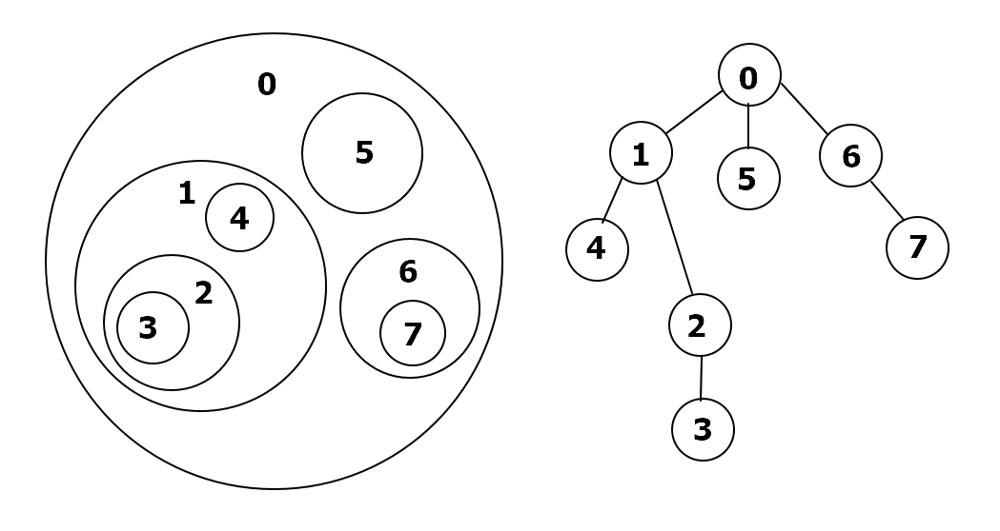

# 21 트리의 구현과 순회

## 21.1 도입

게층적 구조를 갖는 자료들을 표현하기 위한 자료구조를 트리(tree)라고 한다. 어떤 형태로 트리를 구성하느냐, 자료들을 어떻게 배치하느냐에 따라 다야한 형태의 트리가 있을 수 잇으며 ,이들ㅇ르 이용해 다양한 문제를 빠르게 풀 수 있다.


#### 트리의 구성요소

트리는 자료가 저장된 노드(node)들이 간선(edge)으로 서로 연결되어 있다.

두 연결된 노드 중 상위 노드를 부모(parent) 노드, 하위 노드를 자식(child) 노드라고 부른다. 부모 노드와 그의 부모들을 통틀어 선조(ancestor)라고 부르고, 자식 노드와 그의 자식들을 통틀어 자손(descendant)이라고 부른다. 


#### 트리와 노드의 속성

다른 모든 노드들을 자손으로 갖는 단 하나의 노드는 루트(root)라고 한다. 자식이 하나도 없는 노드들을 리프(leaf)라고 부른다. 

루트에서 어떤 노드에 도달하기 위해 거쳐야 하는 간선의 수를 해당 노드의 깊이(depth)라고 한다. 트리에서 가장 깊숙히 있는 노드의 깊이를 해당 트리의 높이(height)라고 한다. 


#### 트리의 재귀적 속성

트리는 재귀적인 성질을 가지고 있다. 한 노드와 그의 자손들을 모두 모으면 그들도 하나의 트리가 된다. 어떤 노드 t와 그 자손들로 구성된 트리를 `t를 루트로 하는 서브트리(subtree)`라고 한다. 따라서 트리를 다루는 코드들은 보통 재귀 호출을 이용해 구현된다.


#### 트리의 표현

트리는 다양한 방법으로 구현 가능하지만, 가장 일반적인 형태는 각 노드를 하나의 구조체, 객체로 표현하고 이들을 서로의 포인터로 연결한다.

```c++
class TreeNode {
    String label;
    TreeNode parent;
    ArrayList<TreeNode> children;
}
```

트리의 구조나 사용 용도에 따라서 다양한 형태로 구현이 된다. 

이진트리는 오른쪽, 왼쪽에 최대 하나의 자식만 가질 수 있다. 힙은 자리가 비어있지 않고 노드를 채워넣기 때문에 배열을 사용해 트리의 내용을 표현할 수 있다. 상호 배타적 집합 구조에서는 각 노드가 자신의 부모를 가리키는 포인터를 가지고 있으며, 부노는 자식에 대한 정보가 없다.


## 21.2 트리의 순회

자료 구조의 가장 기초적인 연산 중 하나는 포함되어 있는 자료를 전부 순회하는 것이다. 트리는 재귀적 속성을 이용해서 순회를 한다. 모든 트리는 각 자식들을 루트로 하는 서브트리와 루트로 나눌 수 있으므로, 트리의 루트가 주어질 때 루트를 방문한 뒤 각 서브트리를 재귀적을 방문하는 함수를 만들어 트리의 모든 노드를 순회할 수 있다.

```c++
// 주어진 트리의 각 노드에 저장된 값을 모두 출력한다.
public void printLabels(TreeNode root) {
    // 루트에 저장된 값을 출력한다.
    System.out.println(root.label);
    // 각 자손들을 루트로 하는 서브트리에 포함된 값드을 재귀적으로 출력한다.
    for(int i=0; i<root.children.size(); ++i)
        printLabels(root.children.get(i));
}
```


순회의 또 다른 사용 예로 트리의 높이를 구하는 문제가 있다. 서브트리의 개념을 이용하면 트리의 높이 또한 재귀적으로 정의할 수 있기 때문이다. 루트의 각 자식들을 루트로 하는 서브트리들의 높이중 최대치에 1을 더한 값이 전체 트리의 높이이다. 자손이 없는 경우에는 높이가 0인 점을 조심한다.

```java
public int height(TreNode root) {
    int h = 0;
    for(int i=0; i<root.children.size(); i++)
        h = Math.max(h, 1+height(root.children.get(i)));
    return h;
}
```


## 21.3 & 21.4 문제 : 트리 순회 순서 변경

#### [[문제내용]](https://algospot.com/judge/problem/read/TRAVERSAL)

### 풀이

재귀 호출을 이용하면 간단하게 구현 가능하다.

> printPostOrder(preorder[], inorder[]) = 트리의 전위 순회 순서 preorder[]와 주위 순회 순서 inorder[]가 주어질 때, 후위 순회 순서를 출력한다.

트리의 루트는 전위 순회에서 가장 먼저 방문하기 때문에 preorder[0]이 루트 번호이다. 이 루트 번호를 inorder[]에서 찾아보면 각 서브트리의 크기를 알 수 있다. 그러면 preorder[]와 inorder[]를 적절히 잘라 왼쪽 서브트리의 방문 순서, 오른쪽 서브트리의 방문 순서를 나눌 수 있다. 그리고 각 서브트리를 후위 순회한 결과를 재귀 호출을 이용해 출력하고, 마지막으로 루트의 번호를 출력하면 된다.

```java
void printPostOrder(List<Integer> preorder, List<Integer> inorder) {
    // 트리에 포함된 노드의 수
    int N = preorder.size();
    // 기저 사례 : 텅 빈 트리면 곧장 종료
    if(preorder.isEmpty()) return;
    // 이 트리의 루트는 전위 탐색 결과로부터 바로 알 수 있다.
    int root = preorder.get(0);
    // 이 트리의 왼쪽 서브트리의 크기는 중위 탐색 결과에서 루트 위치를 찾아서 알 수 있다.
    int L = inorder.indexOf(root);
    // 오른쪽 서브트리의 크기는 N에서 왼쪽 서브트리와 루트를 빼면 알 수 있다.
    int R = N - 1 - L;
    // 왼쪽과 오른쪽 서브트리의 순회 결과를 출력
    printPostOrder(preorder.subList(1, L+1), inorder.subList(0, L) );
    printPostOrder(preorder.subList(L+1, N), inordr.subList(L+1, N));
    // 후위 순회이므로 루트를 가장 마지막에 출력한다.
    System.out.println(root + " ");
}
```


## 21.5 & 6 문제 : 요새 (FORTRESS)

#### [[문제내용]](https://algospot.com/judge/problem/read/FORTRESS)

### 풀이

성벽이 서로 닿거나 겹치지 않기에 성벽들간의 포함 관계를 트리로 나타낼 수 있다. 이를 위해 성벽으로 구분된 요새 내부의 각 구역에 번호를 부여한다. 한 구역이 다른 구역을 직접 포함할 경우 이 두 구역을 연결해서 포함 관계를 트리로 표현해 본다.



이렇게 트리를 만들어보면, 한 구역에서 인접한 다른 구역으로 가기 위해 성벽을 넘는 일은 이 트리에서 간선을 따라 다른 노드로 옮겨가는 것으로 대응된다. 결국 이 문제는 트리에서 가장 멀리 떨어진 두 노드를 찾는 문제가 된다. 이 때 두 노드 사이를 연결하는 간선들을 트리 위의 경로(path)라고 한다.


#### 트리에서 가장 긴 경로 찾기

최장 경로 문제를 푸는 열쇠는 최장 경로의 양 끝 노드가 항상 루트 혹은 리프 노드여야 함을 깨닫는 것이다. 만약 트리의 내부 노드가 경로의 끝 점이라면 내부 노드에서 경로가 끝나는 경우 연결된 간선 중 최소한 하나는 사용되지 않고 남아 있게 되어 이를 이용하면 더 긴 경로를 만들수 있어서 최장 경로일 수가 없다. 따라서 최장 경로의 길이는 다음 둘 중 더 큰 값이 된다.

1. 가장 긴 루트-리프 경로의 길이
2. 가장 긴 리프 - 리프 경로의 길이

이 때 가장 긴 루트-리프 경로의 길이는 트리의 높이이다. 그 다음은 가장 긴 리프-리프의 경로 길이만 찾으면 된다. 리프-리프 경로들은 항상 어떤 노드까지 위로 올라가다 아래로 내려가는 형태로 구성된다. 이렇게 경로가 올라가다가 내려가는 지점을 이 경로의 최상위 노드라고 부르자. 이때 경로의 올라오는 부분과 내려가는 부분의 길이는 각각의 서브트리 높이의 1을 더한 값이 된다.  이제 트리 순회 과정에서 각 노드마다 각 노드를 최상위 노드로 갖는 가장 긴 리프-리프 노드를 계산하고, 그 중 최대값을 선택하면 된다.

이 과정은 트리의 높이를 계산하는 과정과 비슷하기 때문에 트리의 높이를 계산하는 재귀 호출 함수를 바꿔서 풀 수 있다.

```c++
struct TreeNode {
    vector<TreeNode*> children;
};
// 지금까지 찾은 가장 긴 리프-리프 경로의 길이를 저장한다.
int longest;
// root를 루트로 하는 서브트리의 높이를 반환한다.
int height(TreeNode* root) {
    // 각 자식을 루트로 하는 서브트리의 높이를 계산한다.
    vector<int> heights;
    for(int i=0; i<root->children.size(); ++i) 
        heights.push_back(height(root->children[i]));
    // 만약 자식이 하나도 없다면 0을 반환한다.
    if(heights.empty()) return 0;
    sort(heights.begin(), heights.end());
    // root를 최상위 노드로 하는 경로를 고려하자.
    int len = heights.size()
    if(len >= 2)
        longest = max(longest, 2 + heights[len-2] + heights[len-1]);
    // 트리의 높이는 서브트리 높이의 최대치에 1을 더해 계산한다.
    return heights.back() + 1;
}
// 두 노드 사이의 가장 긴 경로의 길이를 계산한다.
int solve(TreeNode* root) {
    longest = 0;
    // 트리와 높이와 최대 리프-리프 경로 길이 중 큰 것을 선택한다.
    int h = height(root);
    return max(longest, h);
}
```

height()로 트리 전체를 처리하는데는 O(n)의 시간이 걸린다. 서브트리들의 높이를 정렬하는데 드는 O(nlgn)의 시간을 무시하면 트리의 순회와 다를바가 없기 때문이다.


#### 실제 구현

이 문제의 실제 구현은 입력으로부터 트리를 생성하는 과정과 생성한 트리에서의 최장 경로를 구하는 부분으로 나눌 수 있다. 최장 경로를 구하는 과정은 위에 있으니 트리를 생성하는 과정을 알아본다.

가장 직관적인 방법은 트리의 루트부터 시작하는 것이다. 0번 성벽은 다른 모든 성벽을 포함하는 외벽이므로 항상 트리의 루트가 된다. 이때 0번 성벽 바로 밑에 들어갈 성벽들을 찾고 각각 성벽을 루트로 하는 서브트리를 재귀적으로 생성한다. 

```c++
// 주어진 번호의 성벽에 포함된 구역들을 표현하는 트리를 생성한다.
// root 성벽을 루트로 하는 트리를 생성한다.
TreeNode* getTree(int root) {
    TreeNode* ret = new TreeNode();
    for(int ch = 0; ch < n; ++ch) {
        // ch 성벽이 root 성벽에 직접적을 ㅗ포함되어 있다면
        // 트리를 만들고 자손 목록에 추가한다.
        if(isChild(root, ch))
            ret->children.push)back(getTree(ch));
    }
    return ret;
}
```


getTree()에서 사용하는 isChild() 함수를 구현하는 가장 간단한 방법은 다른 모든 성벽들을 보면서 주어진 두 성벽 사이에 있는 성벽이 있는지 확인하는 것이다.

```c++
// 한 성벽이 다른 성벽에 포함되었는지, 그리고 직접 포함되었는지 확인하는 함수
// 입력 데이터
int n, y[100], x[100], radius[100];
// x^2를 반환한다.
int sqr(int x) {
    return x*x;
}
// 두 성벽 a,b의 중심점 간의 거리의 제곱을 반환한다.
int sqrdist(int a, int b) {
    return sqr(y[a] - y[b]) + sqr(x[a] - x[b]);
}
// 성벽 a가 성벽 b를 포함하는지 확인한다.
bool encloses(int a, int b) {
    return radius[a] > radius[b] && sqrdist(a,b) < sqr(radius[a] - radius[b]);
}
// 성벽 트리에서 parent가 child의 부모인지 확인한다.
// parent는 child를 꼭 직접 포함해야 한다.
bool isChild(int parent, int child) {
    if(!encloses(parent, child)) return false;
    for(int i=0; i<n; ++i) {
        if(i != parent && i != child && encloses(parent, i) && encloses(i, child))
            return false;
    }
    return true;
}
```

이렇게 구현하면 isChild() 함수는 O(n) 시간에 수행되는데, 트리 생성과정에서 각 노드를 방문할 때마다 n번 호출되기 때문에 전체 트리 생성 과정의 시간 복잡도는 O(n^3)이 된다.

이 과정을 최적화하는 좋은 방법은 트리를 잎에서부터 시작해 거꾸로 생성해 올라오는 것이다. 모든 성벽에는 하나의 부모 성벽 밖에 없기 때문에, 자신을 포함하는 성벽 중 가장 작은 성벽을 찾으면 그것이 부모 성벽이 된다. 미리 성벽들을 크기 순서대로 정렬해 두면, 트리 생성 과정을 O(n^2)에 수행할 수 있다.


#### 다른 구현

isChild() 함수만을 구현하고 이 함수를 이용해 암시적으로 트리를 구성할 수도 있다.

