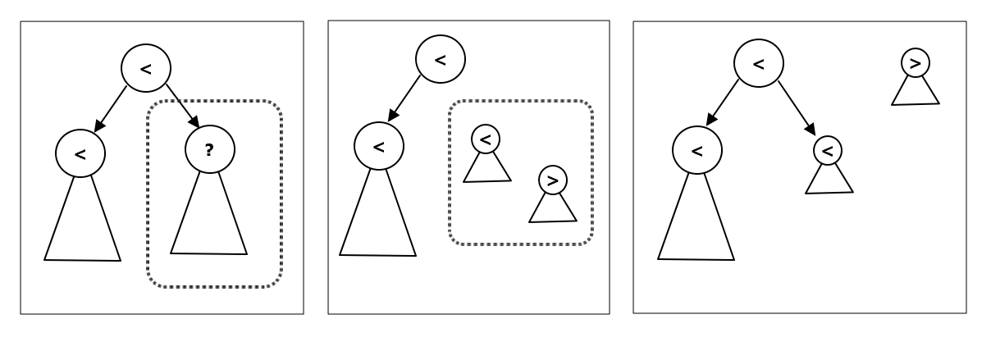

# 22 이진 검색 트리

## 22.1 도입

검색 트리는 자료들을 일정한 순서에 따라 정렬한 상태로 저장해 둔다. 입력이 주어진 순서에 따라 자료들을 배치하는 리스트, 큐와는 다른 속성이다. 검색 트리는 이 점을 이용해 원소의 추가와 삭제만이 아니라 다양한 연산을 빠르게 수행한다. 그 중 가장 흔하게 사용되는 것이 이진 검색 트리(binary search tree)와 그 변종들이다. 


## 22.2 이진 검색 트리의 정의와 조작

### 정의

이진 트리는 각 노드가 왼쪽과 오른쪽, 최대 두 개의 자식 노듬만을 가질 수 있는 트리를 의미한다. 그래서 자식 노드들의 배열 대신 두 개의 포인터(left, right)를 담는 객체로 구현된다.

이진 검색 트리는 이진 탐색 아이디어를 가져와서 만든 트리이다. 이진 검색 트리의 각 노드는 하나의 원소를 갖고 있다. 각 노드의 왼쪽 서브 트리는 해당 노드의 원소보다 작은 원소를 가진 노드들이, 오른쪽 서브트리에는 보다 큰 원소를 가진 노드들이 들어간다.


### 순회

이진 검색 트리를 중위 순회하면 크기 순서로 정렬된 원소의 목록을 얻을 수 있다. 가장 왼편의 리프 노드는 최소 값, 가장 오른편의 리프노드는 최대 값을 갖는다.


### 조작

이진 검색 트리가 진가를 드러내는 곳은 집합에 원소를 추가하거나 삭제하는 조작 연산을 해야 할 때이다. 새 원소를 삽입할 때 정렬된 배열에서는 위치를 찾고, 그 이후 원소들을 한 칸씩 옮겨야 한다. 반면에 이진 검색트리에는 새 원소가 들어갈 위치를 찾고 노드를 추가하기만 하면 된다.

이진 검색 트리에서 가장 까다로운 연산은 집합에서 원소를 삭제하는 것이다. 구현 방법에는 여러가지가 잇지만 가장 간편한 방법은 '합치기' 연산이다. 노드 t를 지울 거라면, t의 두 서브트리를 합친 새로운 트리를 만든 뒤 이 트리를 t를 루트로 하는 서브트리로 바꿔치기하는 것이다.


## 22.3 시간복잡도 분석과 균형 잡힌 이진 검색 트리

이진 검색 트리에 대한 모든 연산은 모두 루트에서부터 한 단계씩 트리ㅣ를 내려가며 재귀 호출을 통해 수행되므로, 최대 재귀 호출의 횟수는 트리의 높이 h와 같다. 따라서 모든 연산의 시간 복잡도가 트리의 높이 O(h)라고 할 수 있다.

한쪽으로 기울어진 (skewed) 이진 검색 트리는 사실상 연결 리스트이다. 반면 가로로 넓게 퍼지고 평평한 트리가 가장 이상적인 트리이며, 이때 트리의 최소 높이는 O(lgN)이다. 

입력이 오름차순, 내림차순일때 이렇게 기울어진 트리가 만들어질 수 있는데 이와같은 단점을 개선한 트리가 균형 잡힌 이진 검색 트리 (balanced binary search tree) 이다. 대표적인 예로 레드-블랙 트리가 있다. 대부분의 표준 라이브러리에서 제공하는 이진 검색트리 구현도 내부적으로는 대개 레드-블랙 트리를 사용한다.


## 22.4~5 문제 : 너드인가, 너드가 아닌가? 2

### 문제 내용

[[문제 링크]](https://algospot.com/judge/problem/read/NERD2)


### 문제 풀이

각 사람의 문제 수와 그릇 수를 x, y 좌표로 각각 해서 점으로 표현해 본다. 그러면 아래와 같이 표현된다. 이때 모서리가 아니라 영역 안에 있을 경우 참가할 수 없는 점이 된다. 점을 추가할 때마다 다른 점에 포함되지 않는 점을 계산하면 되는 것이다.


포함 되지 않는 점을 계산할 떄 가장 간단한 방법은 배열에 저장하는 것이다. 하지만 매번 O(N) 반복문을 수행하므로 전체 시간 복잡도는 O(N^2)가 된다. 입력 최대 값이 50,000 이기때문에 시간 초과가 일어난다.

위의 그림에서 포함되지 않는 점들을 모아서 x좌표로 정렬하면 y좌표는 항상 감소한다. 이것을 활용한다.

아래그림에서 q1을 포함하기 위해서는 P점들은 q1오른쪽&위에 있어야 한다. 따라서 오른쪽에 있는 점을 찾는 연산, 점의 추가와 삭제를 모두 빠르게 할 수 있는 자료구조가 적절할 것이다. 이진 검색 트리는 모든 연산을 O(lgn)에 하므로 적절하다.


STL의 균형 잡힌 이진 검색 트리 구현인 map(int, int)를 이용해 각 점의 정보를 저장한다. lower_bound(x)는 트리에 포함된 x이상의 키중 가장 작은 값을 돌려주므로 문제에 적합하다.

```c++
// C++
// 한 점이 다른 점에 포함되는지 확인하는 함수
// 현재 다른 점에 포함되지 않는 점들의 목록을 저장한다.
// coords[x]=y
map<int, int> coords;

// 새로운 점(x,y)가 기존의 다른 점들에 포함되는지 확인한다.
bool isContained(int x, int y) {
    // x보다 오른쪽에 있는 점 중 가장 왼쪽에 있는 점을 찾는다.
    map<int, int>::iterator it = coords.lower_bound(x);
    // 그런 점이 없으면 (x,y)는 포함당하지 않는다.
    if(it == coords.end()) return false;
    // 이점은 x보다 오른쪽에 있는 점 중 가장 위에 있는 점이다.
    // (x, y)가 어느 점에 포함되려면 이 점에도 포함되어야 한다.
    return y < it->second;
}
```


자바에서 레드블랙트리를 반영하는 것은 TreeMap이 있다. 이 컬렉션은 lower_bound 대신 higherKey , higherEntry가 있는데 값을 복사해서 반환한다.

```java
// java
TreeMap<Integer, Integer> coords = new TreeMap<>();	// 인스턴스 변수

public boolean isContained(int x, int y) {
    Map.Entry<Integer, Integer> v = coords.higherEntry(x);
    if(v == null) return false;
    return y < v.getValue();
}
```


다음은 트리에서 새로운 점에 포함되는 점들을 모두 지우는 것이다. 왼쪽에 있는 점부터 시작해서 지워나가다가 포함되지 않는 점이 등장하면 종료하면 된다. 

코드에서 보면 바로 종료하는게 보인다. 그 이유는 구현상 x값이 작아질수록 y값이 커지게 되어 있는데 특정 x의 y값이 새로운 점 y보다 크면 그 앞은 전부다 y보다 클 것이기 때문이다.

```java
// C++ 구현
// 포함되는 점들을 삭제하는 함수
// 새로운 점 (x, y)에 포함되는 점들을 트리에서 지운다.
void removeContained(int x, int y) {
    map<int, int>::iterator it = coords.lower_bound(x);
    // (x, y)보다 왼쪽에 있는 점이 없다
    if(it == coords.begin()) return;
    --it;
    
    // 반복문 불변식 : itsms (x, y)바로 왼쪽에 있는 점
    while(true) {
        // x,y 바로 왼쪽에 오는 점을 찾는다.
        // it가 표시하는 점이 x,y에 포함되지 않는다면 곧장 종료
        if(it->second > y) break;
        if(it == coords.begin()) {
            coords.erase(it);
            break;
        }
        // 이전 점으로 이터레이터를 하나 옮겨 놓고 it를 지운다.
        else {
            map<int, int>::iterator jt = it;
            --jt;
            coords.erase(it);
            it = jt;
        }
    }
}
```
```java
// 구현 1
// 이터레이터를 받은 다음에 x--로 돌면서 체크한다음에 삭제하려고 만들었다.
// 이터레이터는 next밖에 없기 때문에 역순으로 재정렬한 다음
// tailMap으로 x기준으로 맵을 뽑아내고, 다시 entrySet, iterator를 했다.
public void removeContained(int x, int y) {
    Iterator<Map.Entry<Integer, Integer>> itr = coords
                                                .descendingMap().tailMap(x)
                                                .entrySet().iterator();
    Map.Entry<Integer, Integer> one;
    while(itr.hasNext()) {
        one = itr.next();
        if(one.getValue() > y) break;
        itr.remove();
    }
}


// 구현 2
// c++과 달리 자바에서 이터레이터를 쓰는거 보다 아래 방식이 더 깔끔하기도 하고 
// 속도도 잘 나왔다. 하나만 체크하는거고, 그 하나가 새로운 y보다 크면 멈추는 로직이라서
// 아래와 같이 하는게 자바에서는 더 나아 보였다. 
public void removeContained(int x, int y) {
    Map.Entry<Integer, Integer> one;
    while((one = coords.lowerEntry(x)) != null) {
        if(one.getValue() > y) break;
        coords.remove(one.getKey());
    }
}
```

```java
// 새 점(x, y)가 추가되었을 때 coords를 갱신하고 
// 다른 점에 포함되지 않는 점들의 개수를 반환한다.
// 이건 C++코드와 거의 동일해서 자바코드만 올린다.
public int registed(int x, int y) {
    if(isContained(x, y)) return size();
    removeContained(x, y);
    coords.put(x, y);
    return size();
}
```


## 22.6 균형 잡힌 이진 검색 트리 : 트립

표준 라이브러리의 이진 검색 트리는 X보다 작은 원소의 수를 계산하거나 k번째 원소를 찾는 연산을 지원하지 않는 경우가 많다. 단순한 이진 검색 트리는 특정 형태의 입력(1,2,3...) 에 대해 연결 리스트가 되어 버리기 때문에 균형잡힌 이진 검색 트리를 구현해야 한다.

AVL트리나 레드 블랙 트리 등은 구현이 까다로우니 좀더 구현이 간단한 이진 검색 트리 (treap)을 구현해 보자.


### 트립의 정의 (tree + heap)

트립은 이진 검색 트리의 단점을 해결하기 위해 고안된 일종의 랜덤화된 이진 검색트리이다. 트립은 트리의 형태가 원소들의 추가 순서가 아닌 난수에 의해 임의대로 결정된다. 때문에 원소들이 어느 순서대로 추가되도 삭제되더라도 트리 높이의 기대치가 일정한 편이다.

트립은 새 노드가 추가될 때마다 해당  노드에 우선순위를 난수로 부여한다. 트립은 항상 부모의 우선 순위가 자식의 우선순위보다 높은 이진 검색 트리를 만든다. 트립의 조건은 아래와 같다.

- 이진 검색 트리의 조건 : 모든 노드에 대해 왼쪽 서브트리에 있는 노드들의 원소는 해당 노드의 원소보다 작고, 오른쪽 서브트리에 있는 노드들의 원소는 해당 노드의 원소보다 크다. 
- 힙의 조건 : 모든 노드의 우선순위는 각자의 자식 노드보다 크거나 같다.

트립은 노드들을 우선순위가 높은 것부터 순서대로 추가한 이진 검색 트리라고 봐도 된다.


### 트립의 구현

```c++
// 트립의 노드를 표현하는 객체의 구현
typedef int KeyType;
// 트립의 한 노드를 저장한다. 
struct Node {
    // 노드에 저장된 원소
    KeyType key;
    // 이 노드의 우선순위
    // 이 노드를 루트로  하는 서브트리의 크기
    int priority, size;
    // 두 자식 노드의 포인터
    Node *left, *right;
    // 생성자에서 난수 우선순위를 생성하고, size와 left right를 초기화
    Node (const KeyType& _key) 
        : Key(_key), priority(rand()), size(1), left(NULL), right(NULL) {}
    
    void setLeft(Node* newLeft) {
        left = new Left; 
        calcSize();
    }
    void setRight(Node* newRight) {
        right = newRight; 
        calcSize();
    }
    // size 멤버를 갱신한다.
    void calcSize() {
        size = 1;
        if(left) size += left-> size;
        if(right) size += right->size;
    }
}
```

가장 중요한 건 트립의 노드 객체는 포함하는 원소 key외에도 우선순위 priority를 가진다는 것이다. 노드가 생성될 때 rand() 함수의 반환 값을 priority를 부여하는 것을 볼 수 있다. 또 하나 유의할 점은 자신을 루트로 하는 서브트리에 포함된 노드의 수를 저장하는 size멤버이다. 이 값은 left나 right가 바뀔 때마다 자동으로 갱신되며, 이 값을 이용하면 k번째 원소를 찾는 연산이나 x보다 작은 원소를 세는 연산 등을 쉽게 구현할 수 있다.


### 노드의 추가와 '쪼개기' 연산

트립에 새 node를 삽입할 때 가장 먼저 확인해야 할 것은 root와 node의 우선순위이다. 만약 root의 우선순위가 더 높다면 node는 root아래로 가야 한다. 왼쪽 또는 오른쪽으로 갈지는 두 노드의 원소를 비교해서 정하면 된다. 그리고 나서 재귀 호출을 통해 해당 서브트리에 node를 삽입하면 된다.

만약 node의 우선순위가 root보다 높다면, node가 기존에 있던 root를 밀어내고 트리의 루트가 되어야 한다. 기존의 노드들은 모두 이 node의 자손이 되어야 한다. 이것을 구현하는 좋은 방법은 기존의 트리를 node가 가진 원소를 기준으로 쪼개는 것이다. 이 트리를 쪼개서 기준보다 작은 원소만을 갖는 서브트리 하나, 큰 원소만을 갖는 서브트리 하나를 만든다. 그리고 이들을 node의 양쪽 서브트리로 두면 삽입 작업이 완료된다.

'쪼개기' 연산은 다음과 같다. root를 루트로 하는 서브트리를 원소가 key보다 작은 노드들과 큰 노드들로 쪼개는 split(root, key)를 작성한다. 구현을 간단히 하는 요령은 root의 원소가 key보다 작은 경우와 큰 경우로 나눠서 생각해 보는 것이다. 두 경우의 구현은 비슷하다.

아래 첫번째 그림은 root의 원소가 더 작은 경우 트리이 원소들과 key의 대소 관계를 보여준다. root의 원소가 key보다 작기 때문에 그 왼쪽 서브트리의 원소들은 전부 key보다 작을 수 밖에 없다. 따라서 key보다 큰 원소가 있을 수 있는 곳은 점선으로 표현된 오른쪽 서브트리 뿐이다.  

아래 가운데 그림은 재귀호출을 적용해 해당 트리를 key를 기준으로 쪼갠다. 쪼갠 결과 중 eky보다 작은 원소를 갖는 트리를 root의 오른쪽 자손을 연결하면 이제 key보다 작은 원소를 갖는 트리와 eky보다 큰 원소를 갖는 트리로 원래 트리가 쪼개졌음을 알 수 있다. 



insert() 함수는 root를 루트로 하는 서브트리에 node를 삽입한 뒤 새 트리의 루트를 반환한다. 해당 서브트리에 새 노드를 삽입한 결과 트리의 루트는 기존 트리의 루트와 다를 수 있기 때문이다. insert()를 재귀 호출할 때마다 setLeft(), setRight()를 호출한다.

```java
// 트립에서의 노드 추가와 트립 쪼개기 연산의 구현
typedef pair<Node*, Node*> NodePair;
// 자바에서는 Entry를 대신 쓰기로 한다.
// root를 루트로 하는 트립을 key 미만의 값과 이상의 값을 갖는 두개의 트립으로 분리
NodePair split(Node* root, KeyType key) {
    if(root == NULL) return NodePair(NULL, NULL);
    // 루트가 key 미만이면 오른쪽 서브트리를 쪼갠다.
    if(root->key < key) {
        NodePair rs = split(root->right, key);
        root-setRight(rs.first);
        return NodePair(root, rs.second);
    }
    // 루트가 key 이상이면 왼쪽 서브트리를 쪼갠다.
    NodePair ls = split(root->left, key);
    root->setLeft(ls.second);
    return NodePair(ls.first, root);
}

// root를 루트로 하는 트립에 새 노드 node를 삽입한 뒤 결과 트립의 루트를 반환한다.
Node* insert(Node* root, Node* node) {
    if(root == NULL) return node;
    // node가 루트를 대체해야 한다. 해당 서브트리를 반으로 갈라 각각 자손으로 한다.
    if(root->priority > node->priority) {
        NodePair splitted = split(root, node->key);
        node->setLeft(splitted.first);
        node->setRight(splitted.second);
        return node;
    }
    else if(node->key < root->key)
        root-setLeft(insert(root->left, node));
    else
        root->setRight(insert(root->right, node));
    return root;
}
```


트립의 루트를 가리키는 포인터 root가 있을 때, 새 값 value를 다음과 같이 추가할 수 있다.

```java
root = insert(root, new Node(value));
```


### 노드의 삭제와 '합치기' 연산

트립에서 노드의 삭제는 이전에 설명한 이진 검색 트리에서 노드의 삭제와 비슷하다. 두 서브트리를 합칠 때 어느 쪽이 루트가 되어야 하는지를 우선순위를 통해 판단한다는 점을 제외하면 거의 같다.

아래 코드에서 erase() 함수 또한 새로운 트리의 루트를 반환한다. root가 지워질 경우 새 노드를 반환해야 하니 당연한 결과이다. merge() 내부에서 두 노드 중 하나가 NULL인지 확인하기 때문에 root가 한쪽 자손만 갖고 있는 경우, 그리고 root가 자손이 없는 경우  등을 모두 별도의 예외 처리 없이 처리할 수 있음을 보여준다.

```c++
// 트립에서 노드의 삭제와 합치기 연산의 구현
// a와 b가 두개의 트립이고 max(a) < min(b) 일 때 이둘을 합친다.
Node* merge(Node* a, Node* b) {
    if(a==NULL) return b;
    if(b==NULL) return a;
    if(a->priority < b.priority) {
        b.setLeft(merge(a, b->left));
        return b;
    }
    a.setRight(merge(a->right, b));
    return a;
}

// root를 루트로 하는 트립에서 key를 지우고 결과 트립의 루트를 반환한다.
Node* erase(Node* root, KeyType key) {
    if(root == NULL) return root;
    // root를 지우고 양 서브트리를 합친뒤 반환한다.
    if(root->key == key) {
        Node* ret = merge(root->left, root->right);
        delete root;
        return ret;
    }
    if(key < root->key)
        root->setLeft(erase(root->left, key));
    else
        root->setRight(erase(root->right, key));
    return root;
}
```


### k번째 원소 찾기

이진 검색 트리를 직접 작성하는 것은  표준 라이브러리의 구현에서 제공하지 않는 기능이 필요할 때 이다. 그와 같은 기능 중 하나가 주어진 서브트리의 노드들을 포함한 원소의 크기 순으로 나열했을 때 k번째로 오는 노드를 찾는 연산이다. Node 클래스는 서브트리의 크기 size를 계산해 저장해 두기 때문에 구현에 용이하다.

root를 루트로 하는 서브트리는 왼쪽 자식 root->left를 루트로 하는 서브트리, 오른쪽 자식 root->right를 루트로 하는 서브트리, root 자신으로 구성되어 있다.  각 서브트리의 크기를 알고 있으면 k번째 노드가 어디에 속해 있을지 쉽게 알 수 있다. 왼쪽 서브트리의 크기가 l이라고 할 때, 다음과 같이 세개의 경우로 나눌 수 있다.

- k<=l : k번째 노드는 왼쪽 서브트리에 속해 있다.
- k==l+1 : 루트가 k번째 노드이다.
- k>=l+1 : k번째 노드는 오른쪽 서브트리에서 k-l-1번째 노드가 된다.


다음 코드는 k번재 원소를 계산하는 kth() 함수의 구현을 보여준다. kth() 함수에서는 이 트리가 트립이라는 점에 대해서는 전혀 신경 쓰지 않는다. 따라서 트립이 아니라 다른 종류의 이진 검색 트리를 구현하더라도 각 서브트리의 크기만 알 수 있으면 이 함수는 사용할 수 있다. 그러나 kth()의 시간 복잡도는 트리의 높이에 비례하기 때문에 트립 등의 균형 잡힌 이진 검색 트리에 적용해야만 O(lgN) 시간에 수행할 수 있다.

```java
// 트립에서 k번째 원소를 찾는 알고리즘의 구현
// root를 루트로 하는 트리 중에서 k번째 원소를 반환한다.
Node* kth(Node* root, int k) {
    // 왼쪽 서브트리의 크기를 우선 계산한다.
    int leftSize = 0;
    if(root->left != NULL) leftSize = root->left->size;
    if(k<=leftSize) return kth(root->left, k);
    if(k==leftSize +1) return root;
    return kth(root->right, k-leftSize-1);
}
```


### X보다 작은 원소 세기

또 다른 유용한 연산으로 특정 범위 [a,b)가 주어질 때 이 범위 안에 들어가는 원소들의 숫자를 계산하는 연산이 있다. 이 연산은 주어진 원소 X보다 작은 원소의 수를 반환하는 countLessThan(X)가 있으면 간단하게 구현할 수 있다. [a, b) 범위 안에 들어가는 원소들의 수는 countLessThan(b) - countLessThan(a)로 표현할 수 있기 때문이다.

countLessThan(X)는 탐색 함수를 변형해 간단하게 만들 수 있다. 먼저 root의 원소가 X와 같거나 그보다 큰지 한다. 만약 root의 원소가 X와 같거나 더 크다면 root와 그 오른쪽 서브트리에 있는 원소들은 모두 X이상이므로 왼쪽 서브트리에 있는 원소들만을 재귀적으로 세서 반환하면 된다. 만약 root의 원소가 X보다 작다면, 그 왼쪽 서브트리에 있는 원소들은 모두 X보다 작으므로 재귀적으로 세지 않아도 전부 답에 들어간다. 오른쪽 서브트리에서 X보다 작은 원소들의 수를 재귀적으로 찾고, 이것에 왼쪽 서브트리에 포함된 노드 및 루트의 개수를 더해 주면 된다.

아래의 코드도 트립이 아니라 이진 검색 트리이면 잘 동작한다. 이 함수의 수행 시간 또한 트리의 높이에 비례한다.

```c++
// 트립에서 x보다 작은 원소의 수를 찾는 알고리즘의 구현
// key보다 작은 키값의 수를 반환한다.
int countLessThan(Node* root, KeyType key) {
    if(root == NULL) return 0;
    if(root->key >= key)
        return couuntLessThan(root->left, key);
    int ls = root->left ? root->left->size : 0;
    return ls + 1 + countLessThan(root->right, key);
}
```

