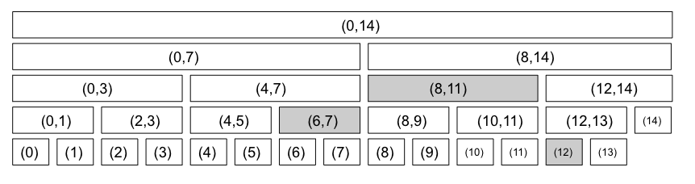

# 24 구간트리 (Segment Tree)

## 24.1 구간에 대한 질문 대답하기

구간 트리는 흔히 일차원 배열의 특정 구간에 대한 질문을 빠르게 대답하는데 사용한다. 구간 트리의 기본적인 아이디어는 주어진 배열의 구간들을 표현하는 이진트리를 만드는 것이다. 

> 이 장에서 다루는 구간 트리는 프로그래밍 대회 커뮤니티에서 통용되는 구간트리의 정의를 따른다. 이 장에서 다루는 트리와 일반적으로 이야기하는 구간트리는 엄밀하게 보자면 다르니 주의하자.



구간 트리는 노드마다 해당 구간에 대한 계산 결과를 저장해둔다. 이런 전처리 과정을 통해 어떤 구간이 나오더라도 구간 트리의 노드에 포함된 구간들의 합집합으로 표현할 수 있다.

​        

### 구간 트리의 표현

구간 트리를 설명하기 위한 문제의 예로 특정 구간의 최소치를 찾는 문제를 풀어보자. 구간 최소 쿼리 (range minimum query, RMQ)라고 한다. 구간 트리는 비교적 꽉 찬 이진 트리이다. 꽉 찬 이진 트리는 배열을 활용할 수 있다. 배열의 길이는 안전하게 `log2(n)` 의 올림 + 1한 값을 2의 거듭제곱 한 값이다. 

```javascript
2 ** (Math.ceil(Math.log2(n))+1)
// 또는 간편하게 n * 4를 해도 된다.
```


### 구간 트리의 초기화

배열이 주어질 때, 각 노드마다 해당 구간의 최소치를 계산하는 함수 init()을 구현한다. 초기화 과정의 시간 복잡도는 O(n)이 된다.

```java
// 배열의 구간 최소 쿼리를 해결하기 위한 구간 트리의 구현
class RMQ {
    int n;	            // 배열의 길이
    int[] rangeMin;	    // 각 구간의 최소치
    
    RMQ(int[] array) {
        n = array.length;
		rangeMin = new int[n * 4];
        init(array, 0, n-1, 1);
    }
    
    // node 가 array[left..right] 배열을 표현할 때
    // node를 루트로 하는 서브트리를 초기화하고, 이 구간의 최소치를 반환
    public int init(int[] array, int left, int right, int node) {
        if(left == right) {
            return rangeMin[node] = array[left];
        }
        int mid = (left + right) / 2;
        int leftMin = init(array, left, mid, node * 2);
        int rightMin = init(array, mid+1, right, node * 2 + 1);
        return rangeMin[node] = Math.min(leftMin, rightMin);
    }
}
```

​    

### 구간 트리의 질의 처리

초기화를 했으면 임의의 구간의 최소치를 구하는 질의(query)연산을 하면 된다. 이것은 구간트리에서의 순회를 응용해서 구현할 있다. query()는 우선 node가 표현하는 구간 `[nodeLeft, nodeRight]`와 최소치를 찾을 구간 `[left, right]`의 교집합을 구한 뒤, 그에 따라 서로 다른 값을 반환한다.

- 교집합이 공집합이 경우 : 서로 겹치지 않는다. 반환 값은 존재하지 않으므로 무시되도록 아주 큰 값을 반환한다.
- 교집합이 `[nodeLeft, nodeRight]` 인 경우 : `[left, right]` 가 노트의 집합을 완전히 포함하는 경우이다. 이 노드에 미리 계산해 둔 최소치를 반환한다.
- 이 외의 모든 경우 : 두 개의 자손 노드에 대해 query()를 재귀 호출 한 뒤, 이 두 값 중 더 작은 값을 택해 반환한다.

```java
class RMQ {
    // ...
    // node가 표현하는 범위 array[nodeLeft..nodeRight]가 주어질 때
    // 이 범위와 array[left..right]의 교집합의 최소치를 구한다.
    private int query(int left, int right, 
                     int node, int nodeLeft, int nodeRight) {
        // 두 구간이 겹치지 않으면 아주 큰 값을 반환한다.
        if(right < nodeLeft || nodeRight < left) return Integer.MAX_VALUE;
        
        // node가 표현하는 범위가 array[left..right]에 완전히 포함되는 경우
        if(left <= nodeLeft && nodeRight <= right) return rangeMin[node];
        
        // 양쪽 구간을 나눠서 푼 뒤 결과를 합친다.
        int mid = (nodeLeft + nodeRight) / 2;
        return min(query(left, right, node*2, nodeLeft, mid),
                   query(left, right, node*2+1, mid+1, nodeRight));
    }
    
    // query()를 외부에서 호출하기 위한 인터페이스
    public int query(int left, int right) {
        return this.query(left, right, 1, 0, n-1);
    }
}
```


### 구간 트리의 갱신

전처리를 통해 구간 트리를 생성한 다음에 값이 하나 바뀔 때에는 구간 트리를 빠른 시간에 갱신할 수 있다. 원래 배열의 값 하나가 변경되었을 때 이 위치를 포함하는 구간은 트리에 O(lgn)개 있으니 이들만 재계산하면 갱신할 수 있다.

해당 노드가 표현하는 구간에 index가 포함되지 않는다면 그냥 무시하고, 포함되다면 재귀 호출해서 두 자손 구간의 최소치를 계산한 뒤 다시 최소치를 구해주면 된다.

```java
class RMQ {
    // 생략 ...
    // array[index] = newValue로 변경시 node를 루트로 하는 구간 트리를 갱신하고 
    // 노드가 표현하는 구간의 최소치를 반환한다.
    private int update(int index, int newValue, int node, int nodeLeft, int nodeRight) {
        // 노드가 표현하는 구간과 상관없는 index일때에는 무시한다.
        if(index < nodeLft || nodeRight < index) 
            return rangeMin[node];
        
        // 트리의 리프까지 내려온 경우
        if(nodeLeft == nodeRight)
            return rangeMin[node] = newValue;
        
        int mid = (nodeLeft + nodeRight) / 2;
        return rangeMin[node] = min(
        	update(index, newValue, node*2, nodeLeft, mid),
            update(index,newValue, node*2+1, mid+1, nodeRight)
        );
    }
    // update를 외부에서 호출하기 위한 인터페이스
    public int update(int index, int newValue) {
        return update(index, newValue, 1, 0, n-1);
    }
    
}
```


### 예제 : 정렬된 수열의 특정 구간에서 최대 출현 빈도 계산

정렬된 정수 수열 A\[\] 가 주어질 때, 주어진 구간의 최대 출현 빈도를 계산하는 문제가 있다. 어떤 수열의 최대 출현 빈도란 이 수열에서 가장 자주 등장하는 수의 출현 횟수이다. 예를 들어 `A={0, 0, 1, 1, 1, 1, 2, 3, 3, 3, 4}` 라고 해보자. 왼쪽 구간의 최대 출현 빈도와 오른쪽 구간의 최대 출현 빈도 중 더 큰 것을 무조건 취할 수 있으면 좋겠지만, 다음과 같은 예외도 있다.

- 두 구간에서 가장 많이 출현하는 수가 같은 경우 : 왼쪽 부분 구간이 `{1, 2, 2, 2}`, 오른쪽 부분 구간이 `{2, 2, 2, 3}` 인 경우 두 답중 더 큰 쪽을 택하는 것이 아니라 두 답의 합을 반환해야 한다.
- 두 구간을 이어 보면 가장 많이 출현하는 수가 바뀌는 경우 : 왼쪽부분 구간이 `{1, 1, 1, 2, 2}`, 오른쪽 부분 구간이 `{2, 2, 3, 3, 3}` 이라고 하자. 양쪽 부분 구간에서 가장 많이 출현하는 수는 각각 1과 3이지만, 두 구간을 합쳐 보면 2가 네번으로 가장 많이 출현한다.

이런 문제를 풀 때는 문제의 답, 두 개의 답을 합치는데 필요한 추가 정보도 계산해서 반환할 필요가 있다. 앞의 두 예제에서는 왼쪽 구간의 오른쪽 끝 수가 오른쪽 구간의 왼쪽 끝 수와 같다는 것에 착안해서 모든 구간에 대해 답을 계산할 때 구간의 왼쪽 끝 수와 오른쪽 끝 수 그리고 그들의 갯수를 함께 계산한다.

두 부분 구간에 대해 각각 이 정보들이 있으면 이들을 합칠 수 있다. 왼쪽 구간의 오른쪽 끝 숫자와 오른쪽 구간의 왼쪽 끝 숫자가 같은 경우 이들을 합쳐 보고, 최대 출현 빈도가 바뀌는지 확인하면 된다. 

```java
// 부분 구간의 계산 결과
class RangeResult {
	public int size;                        // 이 구간의 크기
    public int mostFrequent;                // 가장 자주 등장하는 숫자의 출현 횟수
    public int leftNumber, leftFreq;        // 왼쪽 끝 숫자와 왼쪽 끝 숫자의 출현 횟수
    public int rightNumber, rightFreq;      // 오른쪽 끝 숫자와 오른쪽 끝 숫자의 출현 횟수
       
    static RangeResult merge(RangeResult a, RangeResult b) {
        RangeResult ret = new RangeResult();
        
        // 구간의 크기는 쉽게 계산 가능
        ret.size = a.size + b.size;
        
        // 왼쪽 숫자는 a.leftNumber로 정해져 있다.
        // 왼쪽 부분 구간이 전부 a.leftNumber인 경우만 별도로 처리
        // 예 : [1,1,1,1]과 [1,2,2,2]를 합칠 때
        ret.leftNumber = a.leftNumber;
        ret.leftFreq = a.leftFreq;
        
        if(a.sieze == a.leftFreq && a.leftNumber == b.leftNumber)
            ret.leftFreq += b.leftFreq;
        
        // 오른쪽 끝 숫자도 비슷하게 계산하자.
        ret.rightNumber = b.rightNumber;
        ret.rightFreq = b.rightFreq;
        
        if(b.size == b.rightFreq && a.rightNumber == b.rightNumber)
            ret.rightFreq += a.rightFreq;
        
        // 기본적으로 가장 많이 출현하는 수의 빈도수는 둘 중 큰 쪽으로
        ret.mostFrequent = max(a.mostFrequent, b.mostFrequent);
        
        // 왼쪽 구간의 오른쪽 끝 숫자와 오른쪽 구간의 왼쪽 끝 숫자가 합쳐지는 경우
        // 이 두 수를 합쳤을 때 mostFrequent보다 커지는지 확인한다.
        if(a.rightNumber == b.leftNumber)
            ret.mostFrequent = max(ret.mostFrequent, a.rightFreq + b.leftFreq);
        
        return ret;
    }
}
```


## 24.2 문제 : 등산로 (ID : MORDOR)

### 문제 내용

[[문제 링크]](https://www.algospot.com/judge/problem/read/MORDOR)


### 문제 풀이

이 문제는 구간이 주어질 때 구간 내에서의 최대치와 최소치의 차이를 찾는 문제이다. 각 구간의 최대치와 최소치를 계산하는 구간 트리를 작성해서 이 문제를 풀 수도 있지만, 더 간단한 방법은 최소치를 구하는 RMQ 클래스를 재활용하는 것이다. 입력에 주어진 높이의 배열 h로 RMQ 클래스를 초기화한 뒤, h의 값들에 모두 -1을 곱해 부호를 뒤집는다. 그러고 나서 RMQ 클래스를 만들면 해당 구간의 최대치도 쉽게 구할 수 있다.

