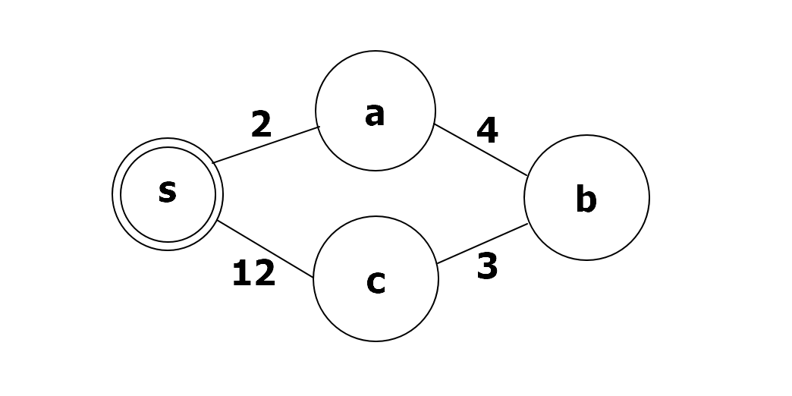

# 다익스트라의 최단 경로 알고리즘

다익스트라의 최단 경로 알고리즘 혹은 다익스트라 알고리즘은 단일 시작점 최단 경로 알고리즘으로, 시작 정점 s에서부터 다른 정점들까지의 최단 거리를 계산한다.


### 우선순위 큐를 사용하는 너비 우선 탐색

다익스트라 알고리즘은 너비 우선 탐색과 유사한 형태를 가진 알고리즘으로, 너비 우선 탐색처럼 시작점에서 가까운 순서대로 정점을 방문해 간다. 물론 가중치가 있는 그래프에서는 너비 우선 탐색을 그대로 적용할 수 없다. 더 늦게 발견한 정점이라고 더 먼저 방문할 수 있어야 하기 때문이다. 

다익스트라 알고리즘은 큐 대신에 우선순위 큐를 사용해서 이문제를 해결한다. 너비 우선 탐색에서는 큐에 정점의 번호를 넣었지만, 다익스트라 알고리즘에서는 우선순위 큐에 정점의 번호와 하께 지금까지 찾아낸 해당 정점까지의 최단 거리를 쌍으로 넣는다. 우선순위 큐는 정점까지의 최단 거리를 기준으로 정점을 배열해서 아직 방문하지 않는 정점 중 시작점으로부터의 거리가 가장 가까운 점을 찾는 과정을 간단하게 해준다.

각 정점까지의 최단 거리를 저장하는 배열dist[]를 유지하며, 정점을 방문할 때마다 인접한 정점을 모두 검사한다. 간선(u,v)를 검사했는데 v가 만약 아직 방문하지 않는 정점이라고 하자. 그러면 u까지의 최단 거리에 (u, v)의 가중치를 더해 v까지의 경로의 길이를 찾는다. 이것이 지금까지 우리가 찾은 최단 거리라면 dist[v]를 갱신하고 (dist[v],  v)를 큐에 넣는 것이다.

이때 유의해야 할 것은 각 정점까지의 최단 경로가 갱신될 수 있다는 점이다. 



위의 그림에서 시작점s를 방문하고 나면 (2, a)와 (12, c)가 우선순위 큐에 들어간다. 최단 거리 순으로 정점들을 큐에서 꺼낸다고 하면 c는 큐에 그대로 들어 있고, a와 b가 순서대로 방문되게 된다.

문제는 b가 방문될 때ㅣ다. b까지의 최단 경로에 (b,c) 간선을 덧붙이면 s에서 c로 가는 길이 9인 경로를 찾을 수 있다. 이것은 지금까지 우리가 알고 있던 길이 12인 경로보다 짧은 것이다. 이때 dist[c]를 갱신하기는 간단하다고 해도, 우선순위 큐에 이미 들어 있는 (12, c)는 어떻게 할까? 

1. 우선순위 큐 내에서 (12, c)를 찾아내 (9,c)로 바꾼다.
2. (12, c)를 그대로 두고 (9,c)를 추가한 뒤, 나중에 큐에서 (12, c)가 꺼내지면 무시한다.

1번방법은 직접 구현하기에 복잡하고 까다로워 2번을 사용한다.

큐에서 정점 번호 u와 최단 거리 cost의 쌍을 뽑아낸 후, dist[u]와 cost를 비교한다. 만약 dist[u] < cost라면 u까지 오는 cost보다 짧은 경로가 이미 발견되었다는 의미이므로 (cost, u)쌍을 무시하면 된다.

```c++
// 정점의 개수
int V;
// 그래프의 인접 리스트, (연결된 정점 번호, 간선 가중치) 쌍을 따른다.
List<List<MyPair>> adjList = new ArrayList<>(MAX_V);

public static int[] dijkstra(List<List<MyPair>> adjList, int V, int src) {
    // 각 정점까지의 최단 거리를 저장하는 배열
    int[] distArr = new int[V+1];
    Arrays.fill(distArr, Integer.MAX_VALUE);
    distArr[src] = 0;
    PriorityQueue<MyPair> pq = new PriorityQueue<>();
    pq.add(new MyPair(src, 0));

    while(!pq.isEmpty()) {
        MyPair pair = pq.poll();
        int here = pair.here;
        int cost = pair.cost;

        if(distArr[here] < cost) continue;

        List<MyPair> oneList = adjList.get(here);
        for(int i=0; i<oneList.size(); i++) {
            int there = oneList.get(i).here;
            int newCost = cost + oneList.get(i).cost;

            // 더 짧은 경로를 발견하면 distArr[]를 갱신하고 우선순위 큐에 넣는다.
            // bfs에서는 이미 순회한 것들에 대해서 그냥 저장한다.
            // 반면 여기서는 이미 지나온 것에 대해서도 더 최소비용이면 다시 순회해서
            // 더 최소비용인 것으로부터 다시 순회해서 고치도록 하는 것이다.
            if(distArr[there] > newCost) {
                distArr[there] = newCost;
                pq.add(new MyPair(there, newCost));
            }
        }
    }
    return arrayCopy(distArr, 1, V);
}

public static int[] arrayCopy(int[] oriArr, int oriIdx, int copyLength) {
    int[] retArr = new int[copyLength];
    System.arraycopy(oriArr, oriIdx, retArr, 0, copyLength);
    return retArr;
}

// c++과 달리 java는 pair클래스에 Comparable이 안 되어 있어서 
// PriorityQueue에 넣으면 제대로 정렬 안되는 문제가 있어 구현함.
class MyPair implements Comparable<MyPair>{
    int here;
    int cost;
    MyPair(int here, int cost) {
        this.here = here;
        this.cost = cost;
    }
    @Override
        public int compareTo(MyPair myPair) {
        return cost - myPair.cost;
    }
}
```

