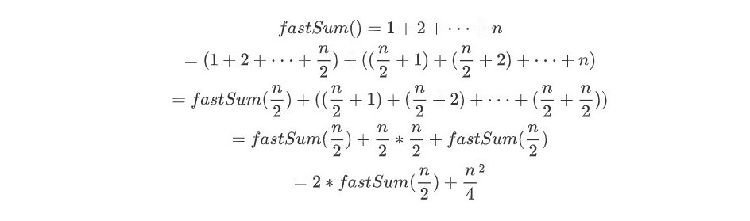

# 07 Divide & Conquer

## 7.1 도입

분할 정복 패러다임을 차용한 알고리즘들은 주어진 문제를 둘 이상의 부분 문제로 나눈 뒤 각 문제에 대한 답을 재귀 호출을 이용해 계산하고, 각 부분 문제의 답으로부터 전체 문제의 답을 계산해 낸다. 분할 정복은 많은 경우 같은 작업을 더 빠르게 처리해 준다.

분할 정복이 일반적인 재귀 호출과 다른 점은 문제를 한 조각과 나머지 전체로 나누는 대신 **거의 같은 크기의 부분 문제로 나누는 것**이다. 

```
// 일반적인 재귀 호출
ㅁ ㅁㅁㅁㅁㅁㅁㅁ
　ㅁ ㅁㅁㅁㅁㅁㅁ
　　ㅁ ㅁㅁㅁㅁㅁ
　　　ㅁ ㅁㅁㅁㅁ

// 분할 정복 알고리즘
　　　 ㅁㅁㅁㅁㅁㅁㅁㅁ
　　　ㅁㅁㅁㅁ　ㅁㅁㅁㅁ
　　ㅁㅁ　ㅁㅁ　ㅁㅁ　ㅁㅁ
ㅁ　ㅁ　ㅁ　ㅁ　ㅁ　ㅁ　ㅁ　ㅁ
```


### 분할 정복 알고리즘의 3가지 구성요소

- 문제를 더 작은 문제로 분할하는 과정 (divide)
- 각 문제에 대해 구한 답을 원래 문제에 대한 답으로 병합하는 과정 (merge)
- 더이상 답을 분할하지 않고 곧장 풀 수 있는 매우 작은 문제 (base case)


### 분할 정복 적용 가능 문제 특성

- 문제를 둘 이상의 부분 문제로 나누는 자연스러운 방법이 있어야 한다. 

- 부분 문제의 답을 조합해 원래 문제의 답을 계산하는 효율적인 방법이 있어야 한다.


### 예제 : 수열의 빠른 합

분할 정복을 이용해 합계를 구하는 fastSum을 만들어보자. 1부터 n까지의 합을 n개의 조각으로 나눈 뒤, 이들을 반으로 잘라 n/2개의 조각들로 만들어진 부분 문제 2개를 만든다. (편의상 n은 짝수)




```java
// 1~n까지 합을 구하는 분할 정복 알고리즘
// 필수 조건 : n은 자연수
public class Main {
    public static int fastSum(int n) {
        if(n == 1) return 1; // base case
        if(n%2 == 1) return fastSum(n-1) + n; // 홀수 처리
        return 2*fastSum(n/2) + (int)Math.pow(n/2, 2);
    }
}
```


#### 시간 복잡도 분석

recursiveSum()의 경우 n번의 함수 호출이 필요하다는 것을 알 수 있다. 반면 fastSum()은 호출될 때마다 n이 절반을 줄어든다. 좀더 들여자 보자면 이진수로 표현했을 때 1이 0으로 변하고, 0일 때는 자릿수가 줄어든다는 것을 알수 있다. 즉 이 알고리즘의 총 호출 개수는 n의 이진수 표현의 자릿수 + 첫 자리를 제외하고 나타나는 1의 개수이다.  두 값의 상한은 모두 logn이므로 이 알고리즘의 실행시간은 O(logn) 이다.

```
fastSum(11)
fastSum(10) + 11
fastSum(5) + 25
fastSum(4) + 5
fastSum(2) + 4
fastSum(1) + 1
```


### 예제 : 행렬의 빠른 제곱

n x n 크기의 행렬 A가 주어질 때, A의 거듭제곱 A^m은 A를 연속해서 m번 곱한 것이다. 이것을 계산하는 알고리즘은 m이 매우 클때 A^m을 구하는 것이 시간이 오래 걸리는 작업이다. 행렬의 곱셈에는 O(n^3)의 시간이 들기 때문에 곧이 곧대로 구하려면 모두 O(n^3m)번희 연산이 필요하다. 

이것을 분할 정복을 통해서 구하면 절반으로 계속 나눠서 구할수 있다.` A^m = A^(m/2) * A^(m/2) `


```java
public class Main {
    public static void main(String[] args) {
        int[][] d = {{1, 2, 1, 0},{0, 2, 0, 1},{4, 0, 0, 0},{5, 1, 1, 2}};
        SquareMatrix one = new SquareMatrix(d);
        System.out.println(one.pow(2));
        System.out.println(one.pow(3));
        System.out.println(one.pow(4));
        System.out.println(one.pow(6));

        int[][] d2 = {{5,6,1,2},{5,5,1,4},{4,8,4,0},{19,14,7,5}};
        SquareMatrix one1 = new SquareMatrix(d2);
        System.out.println(one1.pow(2));
    }
}

class SquareMatrix {
    int[][] data;
    int length;

    SquareMatrix(int[][] target) {
        if(target[0].length != target.length)
            throw new RuntimeException("행과 열이 동일한 크기이어야 합니다.");

        data = target;
        this.length = target.length;
    }
    public SquareMatrix identity() {
        int[][] arr = new int[length][length];

        for(int i=0; i<length; i++) {
            for(int j=0; j<length; j++) {
                if(j==i) arr[i][j] = 1;
                else arr[i][j] = 0;
            }
        }
        return new SquareMatrix(arr);
    }
    // 거듭제곱을 분할정복을 이용해서 구현
    public SquareMatrix pow(int m) {
        if(m == 0) return this.identity();
        if(m%2==1) return this.multi(this.pow(m-1));
        SquareMatrix half = pow(m/2);
        return half.multi(half);
    }
    public SquareMatrix multi(SquareMatrix v) {
        if(this.length != v.length)
            throw new RuntimeException("열&행 길이가 서로 다른 정방행렬입니다.");

        int[][] resultArr = new int[length][length];
        int temp = 0;
        for(int i=0; i<length; i++) {
            for(int j=0; j<length; j++) {
                for(int k=0; k<length; k++) {
                    resultArr[i][j] += this.data[i][k] * v.data[k][j];
                }
            }
        }
        return new SquareMatrix(resultArr);
    }
    public String toString() {
        StringBuilder sb = new StringBuilder();
        for(int[] a : this.data){
            for(int aa : a) sb.append(aa).append(" ");
            sb.append("\n");
        }
        return sb.toString();
    }
}
```


## 7.2 문제 : 쿼드 트리 뒤집기


## 7.3 풀이 : 쿼드 트리 뒤집기


## 7.4 문제 : 울타리 잘라내기


## 7.5 풀이 : 울타리 잘라내기


## 7.6 문제 : 팬미팅


## 7.7 풀이 : 팬미팅