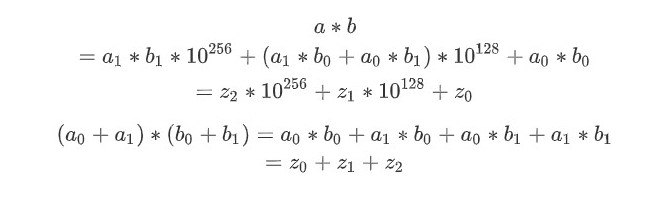

# 07 Divide & Conquer

## 7.1 도입

분할 정복 패러다임을 차용한 알고리즘들은 주어진 문제를 둘 이상의 부분 문제로 나눈 뒤 각 문제에 대한 답을 재귀 호출을 이용해 계산하고, 각 부분 문제의 답으로부터 전체 문제의 답을 계산해 낸다. 분할 정복은 많은 경우 같은 작업을 더 빠르게 처리해 준다.

분할 정복이 일반적인 재귀 호출과 다른 점은 문제를 한 조각과 나머지 전체로 나누는 대신 **거의 같은 크기의 부분 문제로 나누는 것**이다. 

```
// 일반적인 재귀 호출
ㅁ ㅁㅁㅁㅁㅁㅁㅁ
　ㅁ ㅁㅁㅁㅁㅁㅁ
　　ㅁ ㅁㅁㅁㅁㅁ
　　　ㅁ ㅁㅁㅁㅁ

// 분할 정복 알고리즘
　　　 ㅁㅁㅁㅁㅁㅁㅁㅁ
　　　ㅁㅁㅁㅁ　ㅁㅁㅁㅁ
　　ㅁㅁ　ㅁㅁ　ㅁㅁ　ㅁㅁ
ㅁ　ㅁ　ㅁ　ㅁ　ㅁ　ㅁ　ㅁ　ㅁ
```


### 분할 정복 알고리즘의 3가지 구성요소

- 문제를 더 작은 문제로 분할하는 과정 (divide)
- 각 문제에 대해 구한 답을 원래 문제에 대한 답으로 병합하는 과정 (merge)
- 더이상 답을 분할하지 않고 곧장 풀 수 있는 매우 작은 문제 (base case)


### 분할 정복 적용 가능 문제 특성

- 문제를 둘 이상의 부분 문제로 나누는 자연스러운 방법이 있어야 한다. 

- 부분 문제의 답을 조합해 원래 문제의 답을 계산하는 효율적인 방법이 있어야 한다.


### 예제 : 수열의 빠른 합

분할 정복을 이용해 합계를 구하는 fastSum을 만들어보자. 1부터 n까지의 합을 n개의 조각으로 나눈 뒤, 이들을 반으로 잘라 n/2개의 조각들로 만들어진 부분 문제 2개를 만든다. (편의상 n은 짝수)


```java
// 1~n까지 합을 구하는 분할 정복 알고리즘
// 필수 조건 : n은 자연수
public class Main {
    public static int fastSum(int n) {
        if(n == 1) return 1; // base case
        if(n%2 == 1) return fastSum(n-1) + n; // 홀수 처리
        return 2*fastSum(n/2) + (int)Math.pow(n/2, 2);
    }
}
```


#### 시간 복잡도 분석

recursiveSum()의 경우 n번의 함수 호출이 필요하다는 것을 알 수 있다. 반면 fastSum()은 호출될 때마다 n이 절반을 줄어든다. 좀더 들여자 보자면 이진수로 표현했을 때 1이 0으로 변하고, 0일 때는 자릿수가 줄어든다는 것을 알수 있다. 즉 이 알고리즘의 총 호출 개수는 n의 이진수 표현의 자릿수 + 첫 자리를 제외하고 나타나는 1의 개수이다.  두 값의 상한은 모두 logn이므로 이 알고리즘의 실행시간은 O(logn) 이다.

```
fastSum(11)
fastSum(10) + 11
fastSum(5) + 25
fastSum(4) + 5
fastSum(2) + 4
fastSum(1) + 1
```


### 예제 : 행렬의 빠른 제곱

n x n 크기의 행렬 A가 주어질 때, A의 거듭제곱 A^m은 A를 연속해서 m번 곱한 것이다. 이것을 계산하는 알고리즘은 m이 매우 클때 A^m을 구하는 것이 시간이 오래 걸리는 작업이다. 행렬의 곱셈에는 O(n^3)의 시간이 들기 때문에 곧이 곧대로 구하려면 모두 O(n^3m)번희 연산이 필요하다. 

이것을 분할 정복을 통해서 구하면 절반으로 계속 나눠서 구할수 있다.` A^m = A^(m/2) * A^(m/2) `


```java
public class Main {
    public static void main(String[] args) {
        int[][] d = {{1, 2, 1, 0},{0, 2, 0, 1},{4, 0, 0, 0},{5, 1, 1, 2}};
        SquareMatrix one = new SquareMatrix(d);
        System.out.println(one.pow(2));
        System.out.println(one.pow(3));
        System.out.println(one.pow(4));
        System.out.println(one.pow(6));

        int[][] d2 = {{5,6,1,2},{5,5,1,4},{4,8,4,0},{19,14,7,5}};
        SquareMatrix one1 = new SquareMatrix(d2);
        System.out.println(one1.pow(2));
    }
}

class SquareMatrix {
    int[][] data;
    int length;

    SquareMatrix(int[][] target) {
        if(target[0].length != target.length)
            throw new RuntimeException("행과 열이 동일한 크기이어야 합니다.");

        data = target;
        this.length = target.length;
    }
    public SquareMatrix identity() {
        int[][] arr = new int[length][length];

        for(int i=0; i<length; i++) {
            for(int j=0; j<length; j++) {
                if(j==i) arr[i][j] = 1;
                else arr[i][j] = 0;
            }
        }
        return new SquareMatrix(arr);
    }
    // 거듭제곱을 분할정복을 이용해서 구현
    public SquareMatrix pow(int m) {
        if(m == 0) return this.identity();
        if(m%2==1) return this.multi(this.pow(m-1));
        SquareMatrix half = pow(m/2);
        return half.multi(half);
    }
    public SquareMatrix multi(SquareMatrix v) {
        if(this.length != v.length)
            throw new RuntimeException("열&행 길이가 서로 다른 정방행렬입니다.");

        int[][] resultArr = new int[length][length];
        int temp = 0;
        for(int i=0; i<length; i++) {
            for(int j=0; j<length; j++) {
                for(int k=0; k<length; k++) {
                    resultArr[i][j] += this.data[i][k] * v.data[k][j];
                }
            }
        }
        return new SquareMatrix(resultArr);
    }
    public String toString() {
        StringBuilder sb = new StringBuilder();
        for(int[] a : this.data){
            for(int aa : a) sb.append(aa).append(" ");
            sb.append("\n");
        }
        return sb.toString();
    }
}
```


#### 나누어 떨어지지 않을 때의 분할과 시간 복잡도

m이 홀수 일때, A^m = A x A^(m-1)로 나누지 않고, 좀더 절반에 가깝게 나누는게 좋지 않을까 생각할 수 있다. 실제로 문제의 크기가 매번 절반에 가깝게 줄어들면 기저 사례에 도달하기 까지 걸리는 분할의 횟수가 줄어들기 때문에 대부분의 분할 정복 알고리즘은 가능한 한 절반에 가깝게 문제를 나누고자 한다. 하지만 이 문제에서는 오히려 알고리즘을 더 느리게 만든다. 이렇게 문제를 나누면 A^m을 찾기 위해 계산해야 할 부분 문제의 수가 늘어나기 때문이다.

```
// (a) 홀수를 절반으로 나누는 경우
pow(A,31) -> pow(A,16) -> pow(A,8) -> pow(A,4) -> pow(A,2) -> pow(A,1)
　　　　　　-> pow(A,15) -> pow(A,8) -> pow(A,4) -> pow(A,2) -> pow(A,1)
　　　　　　　　　　　　   -> pow(A,7) -> pow(A,4) -> pow(A,2) -> pow(A,1)
　　　　　　　　　　　　   　　　　　　　-> pow(A,3) -> pow(A,2) -> pow(A,1)
      　　　　　　　　　　　　   　　　　　　　　    -> pow(A,1)

// (b) 홀수에서 1을 빼서 짝수로 만드는 경우
pow(A,31) -> pow(A,30) -> pow(A,15) -> pow(A,14) -> pow(A,7) -> pow(A,6) -> pow(A,3) -> pow(A,2) -> pow(A,1)
```

(a)와 같은 경우는 같은 값을 중복으로 계산하는 일이 많기 때문에 m이 증가함에 따라 pow(A,m)을 계산하는데 필요한 pow() 호출 횟수는 m에 대해 선형적으로 증가한다. 사실상 O표기법으로 보면 m-1번 곱셈을 하는 것과 다를바가 없다.

(b)에서는 pow()가 O(logn)개의 거듭제곱에 대해 한번씩만 호출된다.

이렇게 절반으로 나누는 알고리즘이 큰 효율 저하를 불러오는 이유는 여러 번 중복되어 계산되면서 시간을 소모하는 부분 문제들이 있기때문이다. 이런 속성을 Overlapping subproblems(부분 문제 중복)이라고 부르며 동적 계획법의 계기가 된다.


### 예제 : 병합 정렬과 퀵정렬

병합 정렬과 퀵 정렬은 분할 정복 패러다임을 기반으로 해서 만들어진 것들이다. 

병합 정렬 알고리즘은 주어진 수열을 가운데에서 쪼개 비슷한 크기의 수열 두 개로 만든 뒤 이들ㅇ르 재귀 호출을 이용해 각각 정렬한다. 그후 정렬된 배열을 하나로 합침으로써 정렬된 전체 수열을 얻는다. 
[시간복잡도 O(nlogn)]

퀵 정렬은 배열을 병합 과정이 필요없도록 한쪽의 배열에 포함된 수가 다른 쪽 배열의 수보다 항상 작도록 배열을 분할한다. 이를 위해 퀵 정렬은 파티션이라는 단계를 도입하여 기준 수(pivot)를 지정한 후 기준보다 작거나 같은 숫자를 왼쪽, 더 큰 숫자를 오른쪽으로 보내는 과정이다. pivot값에 따라서 시간복잡도가 달라지기 때문에 절반에 가까운 분할을 얻기 위해 좋은 기준을 뽑는 여러 방법들을 사용한다. 
[시간복잡도 O(nlogn) ~  O(n^2)]


### 예제 : 카라츠바의 빠른 곱셈 알고리즘

```
// 일반적인 정수 곱
　　  1 2 3 4
　　x 5 6 7 8
ㅡㅡㅡㅡㅡㅡㅡㅡ
　　　9 8 7 2
　　8 6 3 8
　7 4 0 4
6 1 7 0
ㅡㅡㅡㅡㅡㅡㅡㅡ
7 0 0 6 6 5 2
```


이 과정을 코드로 옮겼을 때 정수형 배열들을 맨 아래 자리부터 저장한다. 이렇게 하면 순서가 역순이긴 하지만 A[i]에 주어진 자릿수의 크기를 10^i로 쉽게 구할 수 있다. 그래서 A[i]와 B[i]의 곱한 결과를 C[i+j]에 저장해서 좀더 직관적인 코드가 가능하다. [[전체코드](https://gist.github.com/brightchul/c61031cff9b975cd6935eb6a1838d1f4)]

```java
public void normalize(final ArrayList<Integer> num) {
    // 자릿수 올림을 처리한다.
    num.add(0);
    for(int i=0; i<num.size()-1; i++) {
        int one = num.get(i);
//      카라츠바 곱셈 음수 자릿수 연산할때 필요하다고 함
//      if(one < 0) {
//           int borrow = (Math.abs(one)+9)/10;
//           num.set(i+1, num.get(i+1)-borrow);
//           num.set(i, one+borrow*10);
//      } else
        {
            // 이부분때문에 out of range가 발생한다.
            // num.size()-1해줘야함
            num.set(i+1, num.get(i+1) + one/10);
            num.set(i, one % 10);
        }
    }
    while(num.size() > 1 && num.get(num.size()-1) == 0) num.remove(num.size()-1);
}
public ArrayList<Integer> multiply(ArrayList<Integer>a, ArrayList<Integer> b) {
    ArrayList<Integer> c = new ArrayList<>();
    int alen = a.size(), blen = b.size(), clen = a.size() + b.size() + 1;

    for(int i=0;i<clen; i++) c.add(0);

    for(int i=0; i<alen; i++) {
        for(int j=0; j<blen; j++)
            c.set(i+j, c.get(i+j) + (a.get(i) * b.get(j)));
    }
    normalize(c);
    return c;
}
```

이 알고리즘의 시간 복잡도는 O(n^2) 이다. 

카라츠바의 빠른 곱셈 알고리즘은 두 수를 각각 절반으로 쪼갠다. a와 b가 각각 256자리 수라면 a1과 b1은 첫 128자리, a0, b0은 그다음 128자리를 저장하는 것이다.


이렇게 한다음 a*b를 하게되면 4번의 곱셈이 발생한다. 이것을 분할 정복 알고리즘으로 재귀 호출해서 해결하면 결국 전체 수행시간은 O(n^2)이 된다.  하지만 카라츠바는 이것을 4번 대신 3번의 곱셈으로 계산할수 있다.



```
// 위 식 결과로 z0과 z2를 빼서 z1를 구할수 있다.

z2 = z1 * b1;
z0 = a0 * b0;
z1 = (a0 + a1) * (b0 + b1) - z0 - z2;
```


```java
// a += b * (10^k) 구현
public void addTo(ArrayList<Integer> aArr, ArrayList<Integer> bArr, int k) {
    int aLen = aArr.size(), bLen = bArr.size();
    int bIdx = 0;
    int totalLength = bArr.size() + k;

    for(int i = k; i < aLen; i++, bIdx++)
        aArr.set(i, aArr.get(i) + bArr.get(bIdx));

    if(totalLength > aLen)
        while(bIdx < bLen) aArr.add(bArr.get(bIdx++));
}
// a -= b를 구현한다. a >= b를 가정한다.
public void subFrom(ArrayList<Integer> aArr, ArrayList<Integer> bArr) {
    int aLen = aArr.size(), bLen = bArr.size();
    if(aLen < bLen) throw new RuntimeException("a길이가 b길이보다 더 작습니다.");

    boolean flag = false;
    for(int i=0; i<bLen; i++) {
        int temp = aArr.get(i) - bArr.get(i);
        if(flag) --temp;

        if(temp < 0) {
            temp = 10 + temp;
            flag = true;
        } else flag = false;

        aArr.set(i, temp);
    }
}
public String karatsuba(int a, int b) {
    final ArrayList<Integer> al = makeIntToArr(a);
    final ArrayList<Integer> bl = makeIntToArr(b);
    final ArrayList<Integer> result = karatsuba(al, bl);
    return makeArrToStr(result);
}
// 두 긴 정수의 곱을 반환한다.
public ArrayList<Integer> karatsuba(ArrayList<Integer> aArr, ArrayList<Integer> bArr) {
    int aLen = aArr.size(), bLen = bArr.size();
    // aArr가 bArr보다 짧을 때 둘을 바꾼다.
    if(aLen < bLen) return karatsuba(bArr, aArr);
    // 기저 사례 : a나 b가 비어있는 경우
    if(aLen == 0 || bLen == 0) return new ArrayList<Integer>();
    // 기저 사례 : a가 비교적 짧은 경우 O(n^2) 곱셈으로 변경한다.
    if(aLen <= 50) return multiply(aArr,bArr);
    int half = aLen / 2;

    //a와 b를 밑으로 half자리와 나머지로 분리한다.
    ArrayList<Integer> a0 = new ArrayList<>(aArr.subList(0, half));
    ArrayList<Integer> a1 = new ArrayList<>(aArr.subList(half, aLen));
    ArrayList<Integer> b0 = new ArrayList<>(bArr.subList(0, Math.min(half, bLen)));
    ArrayList<Integer> b1 = new ArrayList<>(bArr.subList(Math.min(half, bLen), bLen));

    // z2 = a1 * b1;
    ArrayList<Integer> z2 = karatsuba(a1, b1);
    // z0 = a0*b0
    ArrayList<Integer> z0 = karatsuba(a0, b0);
    // a0+a1, b0+b1
    addTo(a0, a1, 0);
    addTo(b0, b1, 0);

    // z1 = (z0*b0)-z0-z2;
    ArrayList<Integer> z1 = karatsuba(a0, b0);
    subFrom(z1, z0);
    subFrom(z1, z2);

    // ret = z0+z1*10^half+z2*10(half*2)
    ArrayList<Integer> ret = new ArrayList<>();
    addTo(ret, z0, 0);
    addTo(ret, z1, half);
    addTo(ret, z2, half+half);
    return ret;
}
```


#### 시간 복잡도 분석

카라츠바 알고리즘은 두 개의 입력을 절반씩으로 쪼갠 뒤, 세 번 재귀 호출을 한다. 분석을 위해서 수행 시간을 병합 단계와 기저 사례의 두 부분으로 나눈다. 병합 단계의 수행 시간은 `addTo()`와 `subFrom()`의 수행 시간에 지배되고, 기저 사례의 처리 시간은 `multiply()`의 수행시간에 지배된다.

**기저사례 시간 계산**

코드에서는 기존의 `multiply()`를 이용하지만 1자리일 때 사용한다는 경우를 가정하고 계산해보자. 자릿수 n이 2의 거듭제곱 2^k라고 했을 때, 재귀 호출의 깊이는 k가 된다.  한 번 쪼갤 때마다 해야 할 곱셈의 수가 세 배씩 늘어나기 때문에 마지막 단ㄱ에는 3^k개의 부분 문제가 있는데, 마지막 단계에서는 두 수 모두 한자리라서 곱셈 한번이면 충분하다. 따라서 곱셈의 수는 O(3^k)가 된다. n=2^k라고 가정했으니 k=lgn이고, 이때 곱셈의 수를 n에 대해 표현하면 다음과 같다.
$$
O(3^k)=(3^{lgn})=O(n^{lg3})
$$
**병합 단계 시간 계산**

`addTo()` 와 `subFrom()`은 숫자의 길이에 비례하는 시간만이 걸리도록 구현할 수 있다. 따라서 각 단계에 해당하는 숫자의 길이를 모두 더하면 병합 단계에 드는 시간을 계산할 수 있다. 각 단계가 내려갈 때마다 숫자의 길이는 절반으로 줄고 부분 문제의 개수는 새 배 늘기 때문에 i번째 단계에 필요한 연산 수는 `(1.5^i) * n`이 된다. 따라서 전체 연산의 수는 다음에 비례한다.
$$
n*\sum_{i=0}^{lgn}(\frac{3}{2})^i
$$
이 함수는 n^lg3과 같은 속도로 증가하므로 카라츠바 알고리즘의 시간 복잡도는 곱셈이 지배하며, 최종 시간 복잡도는 O(n^lg3)이 된다. 카라츠바 알고리즘은 구현이 복잡하기 때문에 크기가 작을때는 O(n^2)보다 느린 경우가 많다.


## 7.2 문제 : 쿼드 트리 뒤집기


## 7.3 풀이 : 쿼드 트리 뒤집기


## 7.4 문제 : 울타리 잘라내기


## 7.5 풀이 : 울타리 잘라내기


## 7.6 문제 : 팬미팅


## 7.7 풀이 : 팬미팅