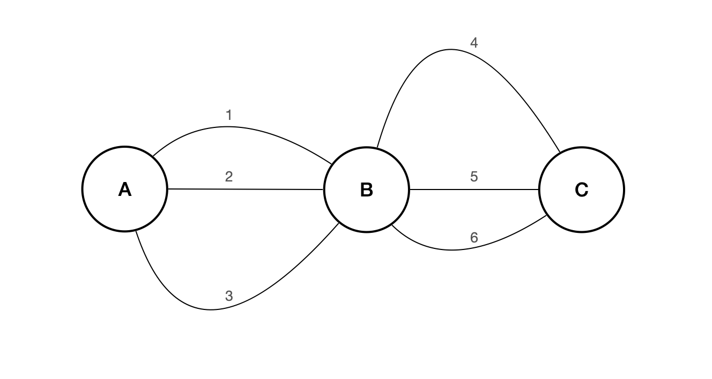
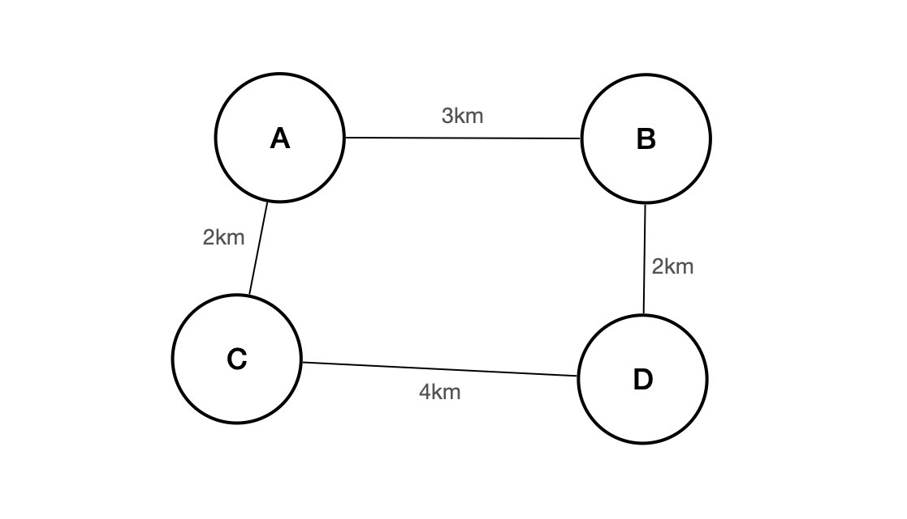

# 2장 재귀 호출의 특징과 메모 전략

## 2.1 최적의 하위 구조

> 최적의 하위 구조(optimal substructure) : 크기가 n인 문제가 있고 이 문제를 풀 때 형태는 같지만 n미만의 원소를 가지는 더 작은 크기의 문제의 풀이법을 사용하는 게 최적의 풀이법인 구조

​      

### 두 도시 간의 최단 경로 구하기	

````
[A->C로 가는 최단 경로] = [A->B 최단 경로] + [B->C 최단 경로]
````

A에서 B까지의 경로를 구하는 문제는 A에서 C까지의 경로를 구하는 문제에 겹쳐서 들어가 있다. 즉 **재귀 접근 방법으로 최단 경로 찾기 문제의 풀이법을 구할 수 있다**. 

플로이드-워셜 알고리즘, 벨먼-포드 알고리즘 같은 알고리즘도 다이나믹 프로그래밍의 예시이다.

​      

### 4개 지점 최장 거리



A-D로 가는 최장 경로는 C를 거치는 6km이다. 하지만 이것은 A-C까지의 최장 경로 + C-D까지의 최장 경로의 합이 아니다. 이 문제에서의 최장 경로 구하기는 최적의 하위 구조 특성을 가지지 않음을 알수 있다. 이럴 경우 다이나믹 프로그래밍으로 해결하기 적합한 문제가 아니다.

> 어떤 문제의 풀이법을 같은 문제의 더 작은 문제로 정의하는 게 최적의 풀이법 이라면 이 문제는 최적의 하위 구조를 가졌다고 한다. 최적의 하위 구조를 가진 문제는 다이나믹 프로그래밍 방법을 적용하기 좋은 문제이다.


​     

### 다이나믹 프로그래밍 문제 조건

1. 최적의 하위 구조 특성
2. 하위 문제의 반복 계산

​      

### 다이나믹 프로그래밍에서 최적의 하위 구조 활용하기

다이나믹 프로그래밍 관련 문제는  먼저 문제의 점화식을 작성하거나 최적의 하위 구조를 정의하는 것이다. 그렇게 재귀 접근 방식을 사용해서 문제를 푼 다음, 같은 로직을 사용해 상향식으로 접근하는 것이 좋다.


​      

## 2.2 하위 문제의 반복 계산

> 하위 문제의 반복 계산 (overlapping subproblems) : 완전히 같은 인수를 사용한 반복된 재귀 호출이 여러 번 발생하는 특성

​       

### 예제 : 피보나치 수열

피보나치 수열은 다음과 같은 점화식으로 정의할 수 있다.

```
fibonacci(1) = fibonacci(2) = 1
fibonacci(n) = fibonacci(n-1) + fibonacci(n-2)   (n > 2일 때)
```

이 예제는 최적의 하위 구조 특성을 가지고 있다. n-1번째 항과 n-2번째 항의 최적 해법을 사용해 n번째 항의 최적 해법을 찾을 수 있다. 

실행시간은 다음과 같으며 지수 시간(exponential time)이 필요하다.

```
T(n) = T(n-1) + T(n-2) + O(1)
```

​     

#### 반복 계산으로 구하는 함수 O(n)

```typescript
type Num1 = number;
type Num2 = number | undefined;


function fibonacci(n: Num1): Num1 {
  let a: Num1 = 1, b: Num1 = 1;
  let c: Num2, cnt: Num2;

  if(n === 1 || n === 2) return 1;

  for(cnt = 3; cnt < n; cnt++) {
    c = a + b;
    a = b;
    b = c;
  }
  return c!;
}
```

​       

### 예제 : 역 사이 최소 비용 구하기

한 가치 노선 위에 0부터 N-1까지 N개의 역이 있다. 기차는 첫번째역부터 마지막 역까지 한 방향으로만 이동한다. 모든 두역 사이의 기차 요금을 알고 있을 때 첫번째 역에서 마지막 역까지 여행하는 최소 비용을 구해보자.


```typescript
// 희소행렬을 사용해도 알맞은 경우이다.
const cost : number[][] = [
  [0, 10, 75, 94],
  [-1, 0, 35, 50],
  [-1, -1, 0, 80],
  [-1, -1, -1, 0],
]
```


a번 역에서  d번 역까지의 최소 요금을 minCost(s,d)라고 한다면 0번 역에서 N-1번 역까지의 최소 요금은 재귀 방식으로 정의할 수 있다.

```typescript
// 모든 역에서 각각 환승했을때의 최소비용을 가지고 가장 최소 비용의 경우를 찾는다.
// 각각의 역에서 환승을 할때 minCost로 호출하는 점을 주의한다.
// 즉 2번역에서 환승이라는 것은 2->N-1까지 바로 가는 것이 아니라
// 2->N-1에서 다시 재귀 호출로 최소비용을 찾는 것이다.

minCost(0, N-1) = MIN{cost[0][N-1],                       // 바로 가는 승차권
                      cost[0][1] + minCost(1, N-1),       // 1번역에서 환승
                      cost[0][2] + minCost(2, N-1),       // 2번역에서 환승
                      ... + ...,
                      minCost(0, N-2)+ cost[N-2][N-1]}    // N-2에서 환승
```

```typescript
// 종료조건
// 1. 출발역과 도착역이 같은 경우
IF( s==d ) return 0

// 2. 도착역이 출발역 바로 다음 역인 경우
// 이 경우에는 두 역 간의 최소 비용이 정해져 있다.
IF( s == d-1 ) RETURN cost[s][d]

// 위에서 s==d은 0이므로
IF( s == d || s == d-1) return cost[s][d]
```

```typescript
const cost : number[][] = [
  [0, 10, 75, 94],
  [-1, 0, 35, 50],
  [-1, -1, 0, 80],
  [-1, -1, -1, 0],
];

function minCost(s: number, d: number): number {
  isValid(s,d);
  
  if(s === d || s === d-1) return cost[s][d];
  
  let minValue = cost[s][d];
	// 최솟값을 찾기 위해서는 모든 중간 역에 대해서 계산
  
  for(let i = s + 1; i< d; i++) {
    // s번 역에서 i번 역까지의 최소 요금과 i번 역에서 d번 역까지의 최소 요금의 합
    let temp = minCost(s, i) + minCost(i, d);
    if(temp < minValue) minValue = temp;
  }
  return minValue;
}

const isValid = (s: number, d: number) => {
  if(s > d || s < 0 || d < 0 || s >= cost.length || d >= cost.length) 
    throw new Error(`s : ${s}, d: ${d}는 유효하지 않는 값입니다.`);
}
```

출발역부터 도착역가지의 실제 최소 금액을 구하기 위해 중간 역들 사이의 최소 금액을 계산하기에 "최적의 하위구조" 특성을 보여준다. 또한 하위 문제의 계산을 여러 번 반복하고 있다. 문제는 이러한 반복 계산 떄문에 코드를 실행하는데 지수 시간이 필요하다는 점이다.

```
"0 - 3 요금" 
"0 - 1 요금" (1)
"1 - 3 요금" 
"1 - 2 요금"    (2)
"2 - 3 요금"       (3)
"0 - 2 요금" 
"0 - 1 요금" (1)
"1 - 2 요금"    (2)
"2 - 3 요금"       (3)
```


​      

## 2.3 메모 전략

하위 문제의 반복 계산이 발생하면 코드의 시간 복잡도가 지수 시간에 달할 정도로 증가한다. 이럴 때 메모이제이션을 쓴다.

메모이제이션(memoization)에서는 어떤 하위 문제를 처음 계산했을 때 그 결과를 일종의 캐시에 저장한다. 같은 하위 문제를 다시 풀어야 할 때는 캐시에서 이미 풀어뒀던 결과를 가져와 반환한다.

> 메모 전략에서는 캐시의 자료형을 결정하는 것이 매우 중요하다. 캐시는 모든 하위 문제의 결과를 저장하기에 충분해야 한다. 일반적으로 배열을 사용하며, 문제가 1차원이면 1차원 배열을 아니면 다타원 배열을 사용한다.

```typescript
// 메모 전략을 반영한 피보나치 수 구하기

let memo : number[];

function fibonacci(n: number): number {
  if(!memo) memo = Array(n+1).fill(0);
  
  // 만약 fibonacci(n)를 이미 계산했다면 다시 계산하지 않는다.
  if(memo[n] !== 0) 
    return memo[n];

  // 계산하지 않았다면 계산후 캐시한다.
  if(n === 1 || n === 2) 
    memo[n] = 1;
  else 
    memo[n] = fibonacci(n-1) + fibonacci(n-2);
  
  return memo[n];
}
```

```typescript
const cost: number[][] = [
  [0, 10, 75, 94, 55, 79],
  [-1, 0, 35, 50, 20, 99],
  [-1, -1, 0, 80, 37, 70],
  [-1, -1, -1, 0, 46, 66],
  [-1, -1, -1, -1, 0, 20],
  [-1, -1, -1, -1,-1, 0],
];
const cache: number[][] = 
      Array(cost.length).fill(0).map(()=> Array(cost.length).fill(-1));


function minCost(s: number, d: number): number {
  isValid(s,d);

  // 값이 계산되었다면 캐시값으로 바로 처리
  if(cache[s][d] !== -1) return cache[s][d];
  if(s === d || s === d-1) return cache[s][d] = cost[s][d];

  let minValue = cost[s][d];
  // 최소값 계산
  for(let i = s + 1; i< d; i++) {
    let temp = minCost(s, i) + minCost(i, d);
    if(temp < minValue) minValue = temp;
  }
  
  // 결과를 저장후 반환
  return cache[s][d] = minValue;
}

const isValid = (s: number, d: number) => {
  if(s > d || s < 0 || d < 0 || s >= cost.length || d >= cost.length) 
    throw new Error(`s : ${s}, d: ${d}는 유효하지 않는 값입니다.`);
}

```

> 메모이제이션을 사용해 재귀 저븐 방식의 문제점 중 하나인 하위 문제의 반복 계산을 피할 수 잇다. 메모에 사용하는 캐시의 자료구조는 재귀 호출의 인수의 개수에 따라 달라진다.


```
메모 전략 = 재귀 호출 + 캐시 - 하위 문제의 반복 계산
```

메모 전략도 재귀호출을 사용하기 때문에 상향식 접근 방법으로 시간과 공간 복잡도를 더욱 줄일수 있다. (3장)