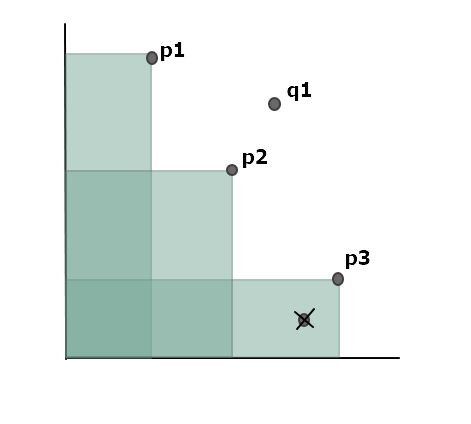

# 알고스팟 문제 : 너드인가 너드가 아닌가? 2

## 문제 설명 [[링크]](https://algospot.com/judge/problem/read/NERD2)

어떤 사람의 너드 지수는 다음 두 가지 값에 의해 결정됩니다.

- 알고스팟 온라인 채점 시스템에서 푼 문제의 수 p  
- 밤 새면서 지금까지 끓여먹은 라면 그릇 수 q   

이 이론에 따르면 어떤 참가 신청자 a 의 문제 수 pa 와 그릇 수 qa 를 다른 참가 신청자 b 의 문제 수 pb 와 그릇 수 qb 에 각각 비교했을 때, pa < pb, qa < qb 라면 참가 신청자 a 는 너드일 가능성이 없습니다. 조직위는 너드일 가능성이 있는 사람들만을 대회에 받아주기로 했습니다.


**입력**  

입력의 첫 줄에는 테스트 케이스의 수 C (1 <= C <= 50) 가 주어집니다. 각 테스트 케이스의 첫 줄에는 참가 신청한 사람들의 수 N (1 <= N <= 50000) 이 주어집니다. 그 후 N 줄에 각 2개의 정수로 각 사람의 문제 수 pi 와 라면 그릇 수 qi 가 참가 신청한 순서대로 주어집니다 (0 <= pi,qi <= 100000) . 두 사람의 문제 수나 라면 그릇 수가 같은 경우는 없다고 가정해도 좋습니다.
입력의 양이 많으므로 가능한 빠른 입력 함수를 사용하는 것이 좋습니다.


**출력**  

각 사람이 참가 신청을 할 때마다 대회 참가 자격이 되는 사람의 수를 계산한 뒤, 각 테스트 케이스마다 그 합을 출력합니다.

```
[입력 예시]
2
4
72 50
57 67
74 55
64 60
5
1 5
2 4
3 3
4 2
5 1

[출력 예시]
8
15
```


## 문제 풀이

자세한 것은 **알고리즘 문제해결 전략 2**에 나와 있으니 참고하면 된다. 

간단히 정리해보자면 x,y값들은 비교해 보면 다음과 같은 그림으로 정리가 된다.



새로운 x,y값이 들어왔을 때 그 값들이 기존 값들에 포함되는지 확인하고, 포함되지 않으면 반대로 기존 값들이 x,y값의 영역에 포함되는지 확인한 다음에 포함되는 것들을 다 삭제하면 된다.

이때 x,y 두 값중 하나라도 크다면 비교할 필요가 없다. 따라서 x값을 기준으로 했을 때 새로운 x값보다 우측에 있는 x,y값들을 제외한다. 이러한 연산에 적절한 것이 바로 이진 검색 트리이다. 

x,y값들을 이진 검색 트리에 넣을 때마다 x값보다 작은 트리만 순회하면서 y값을 비교하면서 삭제하고 그 다음 크기를 반환하면 된다.


## 코드 구현 [[전체코드]](./Main.java)

이진 검색 트리를 이용하되 한쪽으로 치우치면 연결리스트가 되기 때문에 치우지는 것을 보완한 레드 블랙 트리 등을 이용하면 되는데, 이것이 반영되어 있는 자바 콜렉션은 TreeMap이 있기 때문에 이것을 이용하였다.


#### 새로운 x,y값을 기존의 x,y값들과 비교하기

```java
TreeMap<Integer, Integer> coords = new TreeMap<>();	// 인스턴스 변수

public boolean isContained(int x, int y) {
    Map.Entry<Integer, Integer> v = coords.higherEntry(x);
    if(v == null) return false;
    return y < v.getValue();
}
```


### 기존의 x,y들 중 x,y 둘다 작은 것을 삭제

아래 코드에서 기존의 y가 크다면 순회를 멈추는 코드(break)가 있다. 이것은 위의 그림을 보면 이해할 수 있는데 코드 자체가 입력 값이 들어갈 때마다 x값이 줄어들수록 y값이 계속 커지도록 되어 있다. 따라서 어떤 x의 y가 새로운 y보다 크다면 x보다 작은 값 전부다 새로운 y보다 크다는 것이 된다. 따라서 비교할 필요도 없이 바로 멈추면 된다.

```java
TreeMap<Integer, Integer> coords = new TreeMap<>();	// 인스턴스 변수

public void removeContained(int x, int y) {
    Map.Entry<Integer, Integer> one;
    while((one = coords.lowerEntry(x)) != null) {
        if(one.getValue() > y) break;
        coords.remove(one.getKey());
    }
}
```

