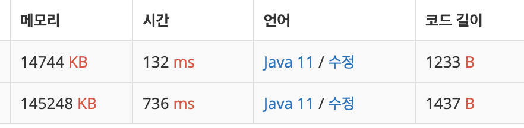

# 백준 온라인 저지 : N과 M (2)

## 문제 설명 [[링크]](https://www.acmicpc.net/problem/15650)

문제 자연수 N과 M이 주어졌을 때, 아래 조건을 만족하는 길이가 M인 수열을 모두 구하는 프로그램을 작성하시오.

1부터 N까지 자연수 중에서 중복 없이 M개를 고른 수열 고른 수열은 오름차순이어야 한다.

```
[입력]
첫째 줄에 자연수 N과 M이 주어진다. (1 ≤ M ≤ N ≤ 8)

[출력]
한 줄에 하나씩 문제의 조건을 만족하는 수열을 출력한다. 중복되는 수열을 여러 번 출력하면 안되며, 
각 수열은 공백으로 구분해서 출력해야 한다. 수열은 사전 순으로 증가하는 순서로 출력해야 한다.

[예시]
4 2


10 30 10 20 20 10

return
3
```


## 문제풀이

문제 구분이 백트래킹으로 되어 있다. 그래서 백트래킹으로 풀면 된다.  
순열과 조합중에 조합(Combination)에 해당하는 문제로 `n C r`에 대한 각 경우를 뽑으면 된다.

재귀호출로 각 경우를 순회하면서 2가지를 주의한다.

1. 중복된 숫자를 뽑지 않는다.

```
1 2 3 4 [o]
3 5 6 8 [o]
3 1 2 4 [o]

1 1 1 1 [x]
2 2 2 2 [x]
3 2 3 2 [x]
```

2. 중복된 수열을 뽑지 않는다.

```
1 2 3 4 [o]
2 3 1 4 [x] (1 2 3 4의 중복된 수열이다)
4 3 2 1 [x] (1 2 3 4, 2 3 1 4 의 중복된 수열이다)
```

1번의 경우 isUsed 배열을 하나 만들어서 사용할 때마다 체크를 하고, 수열에 값을 쓰기 전에 isUsed 배열에서 먼저 확인을 하면 된다.

2번의 경우 숫자값으로 수열을 구성할 때 그 숫자 기준으로 뒤의 숫자들로 수열을 만들면 된다. 이러면 자연스럽게 차례만 바뀐 중복 수열이 생성되지 않는다.

```
4C4를 예로 들어보자

1 2 3 4  [o]
    4    [x]
  3 4    [x] <= 2는 3,4보다 앞숫자이기 때문에 사용하지 않는다.
  4      [x] <= 2,3은 4보다 앞숫자이기 때문에 사용하지 않는다.

2 3 4    [x] <= 1은 2,3,4보다 앞숫자이기 때문에 사용하지 않는다.
```


## 코드 구현 [[전체코드]](./Main.java)

문제풀이에는 저렇게 적어놨지만, 사실 처음 접근은 다르게 했다. 1번 처럼 접근하면서 생성된 수열들을 HastSet에 등록한 다음에 그 안에 들어있는 값들을 하나하나 대조해가면서 비교했다. 

input범위가 1~8밖에 되지 않았기 때문에 다행히 통과는 했지만 이후 다른 문제에서 input이 조금만이라도 커지면 통과하기 힘들거라는 생각이 들었다.

```java

class Main2 {
    private static final BufferedReader br = new BufferedReader(new InputStreamReader(System.in));
    private static boolean[] isUsed;
    private static HashSet<String> set;
    private static StringBuilder sb;

    public static void main(String[] args)throws IOException {
        StringTokenizer st = new StringTokenizer(br.readLine(), " " );
        int N = Integer.parseInt(st.nextToken());
        int M = Integer.parseInt(st.nextToken());

        isUsed = new boolean[N+1];
        set = new HashSet<>();
        sb = new StringBuilder();
        run(N, M, 0, "");
        System.out.println(sb.toString());
    }

    public static void run(int N, int M, int cur, String text) {
        if (M == cur) {
            for (String one : set) {
                int count = 0;
                for (String oneText : text.split(" ")) {
                    if (one.indexOf(oneText) > -1) count++;
                }
                if (count == M) return;
            }

            set.add(text);
            sb.append(text).append("\n");
            return;
        }
        for (int i = 1; i <= N; i++) {
            if (isUsed[i]) continue;
            isUsed[i] = true;
            run(N, M, cur + 1, text + i + " ");
            isUsed[i] = false;
        }
    }
}

```

통과한 이후에 백준에서 맞은 다른 분들의 코드를 들여다 봤고 훨씬더 효율적이어서 그것을 적용해서 변경해보았다.

```java

public class Main{
    private static final BufferedWriter bw = new BufferedWriter(new OutputStreamWriter(System.out));
    private static final BufferedReader br = new BufferedReader(new InputStreamReader(System.in));
    private static boolean[] isUsed;
    private static HashSet<String> set;
    private static StringBuilder sb;
    private static String[] arr;

    private static int N, M;

    public static void main(String[] args) throws IOException {
        StringTokenizer st = new StringTokenizer(br.readLine(), " " );
        N = Integer.parseInt(st.nextToken());
        M = Integer.parseInt(st.nextToken());

        arr = new String[M];
        isUsed = new boolean[N+1];
        run(1, 0);
        bw.flush();
        bw.close();
    }
  
    public static void run(int start, int cur) throws IOException {
        if(cur == M) {
            bw.write(String.join(" ", arr) + "\n");
            return;
        }

        for(int i = start; i <= N; i++) {
            if(isUsed[i]) continue;

            isUsed[i] = true;
            arr[cur] = String.valueOf(i);
            run(i,cur+1);
            isUsed[i] = false;
        }
    }
}
```

그 결과 다음과 같이 개선되었다. 물론 여기에는 BufferedWriter를 쓴 것도 영향이 조금 있겠지만 그렇다고 해도 5배가 넘는 차이가 난다. 메모리 차이는 10배이다.




