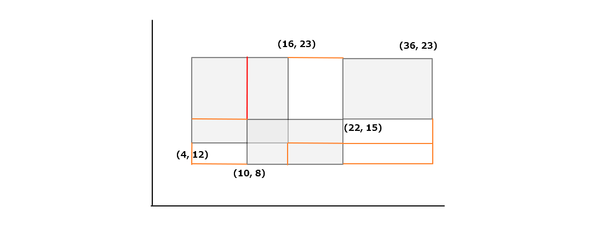

# 여러 직사각형의 전체 면적 구하기


## 문제 설명 [[링크]](https://www.acmicpc.net/problem/2672)

밑변이 모두 x축에 평행한 N개의 직사각형이 주어질 때, 이 N개의 직사각형들이 차지하는 면적을 구하는 프로그램을 작성하시오. 여기서 주어진 직사각형들은 서로 겹칠 수도 있으며, 변이나 꼭짓점을 공유할 수도 있다.


```
[입력]
첫째 줄에 직사각형의 개수 N(1 ≤ N ≤ 30)이 주어지고 그 다음 N줄에는 각각의 직사각형에 
대한 자료가 주어진다. 이 자료는 4개의 숫자로 표시되는데 첫째, 둘째 숫자는 직사각형의 
왼쪽 아래 모서리의 x좌표, y좌표이고 셋째 숫자는 폭, 넷째 숫자는 높이를 나타낸다. 
각 수는 최대 소수점 이하 한 자리까지 주어지며, 1000.0보다 작거나 같은 양의 실수이다.

[출력]
첫째 줄에 N개의 직사각형이 차지하는 면적을 소수점 이하 2자리까지 출력한다. 
단, 값이 소수 부분이 없이 정수로 맞아떨어지는 경우는 정수 부분만 출력한다.

[예시]
4
52.7 22.9 27.3 13.3
68.8 57.6 23.2 8.0
20.0 48.0 37.0 23.5
41.5 36.2 27.3 21.4

return 1853.61
```


​    

## 문제풀이

처음에는 입력값이 1000.0이므로 소수 첫번째까지 값을 경우의 수로 고려를 하면 10000 이다. 여기에 O(n^2) 로 하여도 1억이 되기 때문에 일단은 비효율적인 방법으로 풀었다. 즉 배열을 생성한 다음에 각 입력값에 따라서 값들을 순회하면서 배열에 1을 채워서 풀었다.

하지만 이렇게 하면 아무래도 많이 느렸고, 다른 분들 푼 것을 보니 훨씬 좋은 방식이 있어서 그 방식으로 다시 풀었다. 예를 들어서 좌표(x1, y1, x2, y2)가 (4,12, 16, 23) , (10, 8, 22, 15) , (22, 15, 36, 23) 이라고 하자. 여기서 x, y좌표들을 배열에 모은다음에 정렬하고, 각 x 구간과 y 구간으로 영역을 나누면 그러면 아래와 같이 그려진다. 



위의 예시에서 x, y 구간이 각각 4개, 3개이므로 12개만 3개의 사각형 영역에 포함되는지 확인하면 되므로 최대 36번만 확인하면 된다. 만약 기존 방법으로 했다면 하나의 사각형인 (4, 12, 16, 23) 만 해도 소수 첫째짜리까지 고려해야하므로 13200번을 순회하면서 배열에 값을 넣어야 했을 것이다.


​    

## 코드 구현

**1차 방법** [[전체코드]](./Main.java)

```java
while(len-- > 0) {
    st = new StringTokenizer(br.readLine(), " ");
    short x1 = (short)(Double.parseDouble(st.nextToken()) * 10);
    short y1 = (short)(Double.parseDouble(st.nextToken()) * 10);
    short x2 = (short)(x1 + (Double.parseDouble(st.nextToken())*10));
    short y2 = (short)(y1 + (Double.parseDouble(st.nextToken())*10));

    for(short x=x1; x<x2; x++) {
        for(short y=y1; y<y2; y++) {
            if(cache[y][x] == 0) {
                cache[y][x]++;
                count++;
            }
        }
    }
}
```


**2차 방법** [[전체코드]](./Main2.java)

```java
// x값들의 배열과 y값들의 배열, 그리고 각 사각형 영역인 rect 배열을 생성한 다음
// x 배열과 y배열을 순회하면서 해당 값들이 rect 들중 하나에 포함되는지 확인했다.
double[] xArr = new double[len << 1];
double[] yArr = new double[len << 1];
Rect[] rectArr = new Rect[len];

int idx = 0;
while(len-- > 0) {
    st = new StringTokenizer(br.readLine(), " ");
    Rect rect = new Rect(
        Double.parseDouble(st.nextToken()), Double.parseDouble(st.nextToken()),
        Double.parseDouble(st.nextToken()), Double.parseDouble(st.nextToken())
    );
    rectArr[idx/2] = rect;

    xArr[idx] = rect.x1; 
    yArr[idx++] = rect.y1;
    xArr[idx] = rect.x2; 
    yArr[idx++] = rect.y2;
}

// 아래로직에서 큰값 - 작은값을 해주므로 정렬이 필요하다.
Arrays.sort(xArr);
Arrays.sort(yArr);

for(int x=0; x<xArr.length-1; x++) {
    YLoop : for(int y=0; y<yArr.length-1; y++) {
        for(Rect r : rectArr) {
            if(r.isContained(xArr[x], yArr[y], xArr[x+1], yArr[y+1])) {
                area += (xArr[x+1] - xArr[x]) * (yArr[y+1] - yArr[y]);
                continue YLoop;
            }
        }
    }
}
```

```java
class Rect {
    double x1, x2, y1, y2;
    Rect(double x1, double y1, double dx, double dy) {
        this.x1 = x1;
        this.y1 = y1;
        this.x2 = x1 + dx;
        this.y2 = y1 + dy;
    }
    boolean isContained(double x1, double y1, double x2, double y2) {
        return this.x1 <= x1 && this.y1 <= y1 && x2 <= this.x2 && y2 <= this.y2;
    }
}
```

