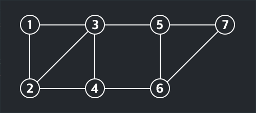
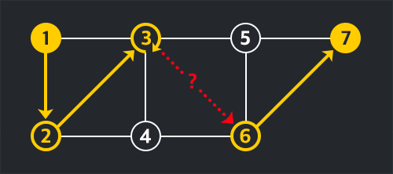
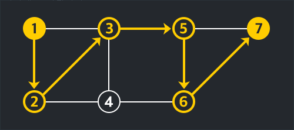

# 프로그래머스 : GPS

## 문제 설명 [[링크]](https://programmers.co.kr/learn/courses/30/lessons/1837)

택시는 다음과 같은 조건으로만 이동한다. 먼저 택시는 거점을 이동해 다니며, 거점 간의 이동은 해당하는 도로가 있는 경우에만 가능하다. 또한, 교통 상황에 따라 택시는 한 거점에 머무를 수 있고, 왔던 길을 되돌아갈 수 있다. 모든 도로는 방향이 별도로 없는 왕복 도로이다.



예를 들어, 위 그래프에서 택시가 다음과 같이 시간대별로 이동 경로를 보내왔다.

```
[1, 2, 3, 3, 6, 7]
```

하지만 위의 택시가 보내온 경로에는 `거점 3`에서 `거점 6`으로 이동할 수 있는 도로가 없으므로 이동 경로에 오류가 있다.



이러한 오류를 최소한으로 수정하여 이동 가능한 경로로 만들고 싶다. 이 경우 1회의 오류를 수정하여 다음과 같이 이동 가능한 경로를 만들 수 있다. 시간 `t=4`의 위치를 `거점 5`로 한 번 수정하면 이동 가능한 경로가 된다.



이와 비슷하게 시간 `t=4`의 위치를 `거점 4`로 바꾸거나, 시간 `t=5` 위치를 `거점 5`로 바꾸면 이동 가능한 경로로 만들 수 있다. 위의 경우 수정한 오류의 개수는 1개이다.

```
[1, 2, 3, 3, 6, 7]
=> [1,2,3,4,6,7] 또는 [1,2,3,3,5,7]
```

위와 같이 택시가 보내온 경로에서 이동 가능한 경로로 만드는 최소의 오류 수정 횟수를 구하여라.

​    

### 입력 형식

주어지는 입력은 총 다섯 가지로, 거점 개수 `n`과 도로의 개수 `m`, 각 거점 간의 연결된 도로 정보 `edge_list`, 택시가 시간대별로 보내오는 거점 정보의 총 개수 `k`, 그리고 머물렀던 거점의 정보 `gps_log`이다. 제한조건은 아래와 같다.

- `2 <= n <= 200`
- `1 <= m <= 10,000`
- `2 <= k <= 100`
- `edge_list`는 `m × 2` 크기의 2차원 배열로, 각 행의 두 값은 도로가 잇는 두 거점의 번호를 의미한다.
- 거점의 번호는 1부터 n까지 숫자이다.
- 모든 도로는 양방향 통행이 가능하다.
- 입력되는 데이터에서 항상 모든 거점 간 경로가 있음이 보장되지 않는다.
- `gps_log`의 시작 거점과 도착 거점은 바뀔 수 없다.

​    

### 출력 형식

이동 가능한 경로로 만들 수 있는 최소의 오류 수정 횟수를 리턴한다. 올바른 경로로 수정하는 것이 불가능할 경우 `-1`을 리턴한다.

​    

### 예제 입출력

| 변수명    | 값                                                           |
| --------- | ------------------------------------------------------------ |
| n         | 7                                                            |
| m         | 10                                                           |
| edge_list | [[1, 2], [1, 3], [2, 3], [2, 4], [3, 4], [3, 5], [4, 6], [5, 6], [5, 7], [6, 7]] |
| k         | 6                                                            |
| gps_log   | [1, 2, 3, 3, 6, 7]                                           |
| answer    | 1                                                            |

| 변수명    | 값                                                           |
| --------- | ------------------------------------------------------------ |
| n         | 7                                                            |
| m         | 10                                                           |
| edge_list | [[1, 2], [1, 3], [2, 3], [2, 4], [3, 4], [3, 5], [4, 6], [5, 6], [5, 7], [6, 7]] |
| k         | 6                                                            |
| gps_log   | [1, 2, 4, 6, 5, 7]                                           |
| answer    | 0                                                            |


​    

## 문제 풀이

처음에 문제 접근을 잘못해서 BFS로 시도했다가 당연히 패스를 하지 못했고 생각하다가  결국 다른 분의 글을 [참고1](https://tech.kakao.com/2017/09/13/code-festival-round-2/), [참고2]([https://wwiiiii.tistory.com/entry/%EC%B9%B4%EC%B9%B4%EC%98%A4-Code-Festival-%EB%B3%B8%EC%84%A0-16%EB%B2%88-%ED%92%80%EC%9D%B4](https://wwiiiii.tistory.com/entry/카카오-Code-Festival-본선-16번-풀이))로 하였다. 

DP를 이용해서 풀수가 있다. 2차원 배열은 아래와 같이 이용한다.

```
S[i][j]: 경로의 i번째 값이 j가 되는 경우, 
         i번째까지의 경로가 valid하도록 고쳐야 하는 최소 횟수,
         그러한 수정이 불가능하다면 INF
```

처음 택시를 탈 때와 내릴 때의 위치는 오류가 없다. 그래서 S\[0\]\[j\] 값은 0이며 다른 값들은 INF이다. 0외에 다른 값들은 INF로 해서 나중에 연산을 했을 때에는 INF와 구별되게 한다. 최소값을 구해야 하므로 Math.min을 이용한다.

i > 0 인 경우에는 i-1값을 참조해서 계산할 수 있다. 다만 택시가 한 지점에서 머무를수도 있다는 점을 고려 해야 한다. 한번 값을 다 구한 다음에는 하차한 위치 j에 대해서  S\[k-1\]\[j\]  값을 구한다.

이 때 j번 도시가 연결된 도시를 a1, a2, ..., an라고 두면

```
dp[i][j] = min(dp[i-1][a1], ..., dp[i-1][an], dp[i-1][j]) + (origin[i] == j ? 0 : 1)
```

이 될 것이다.


## 코드 구현 [[전체코드]](Solution.java)

```java
Graph g;
int[][] dp;     // dp[i][j] 경로 i번째 위치가 j번 도시가 되면서 i번째 위치까지의 경로가 유효하게 고쳐야 하는 최소 횟수
final int INF = 1_000_000_003;

public int solution(int n, int m, int[][] edge_list, int k, int[] gps_log) {

    init(n, edge_list);
    dp[0][gps_log[0]] = 0;

    for(int i=1; i<k-1; i++) {                                        // 경로별 택시 위치
        for(int j=1; j<=n; j++) {                                     // 노드 전부 검사
            
            int add = gps_log[i] == j ? 0 : 1;
            dp[i][j] = Math.min(dp[i][j], dp[i-1][j]+add);            // 현재 자리에 가만히 있는 경우

            for(int one : g.get(j)) {                                 // 현재 자리에서 연결된 지점으로 가는 경우
                dp[i][j] = Math.min(dp[i-1][one] + add, dp[i][j]);
            }
        }
    }
    
    int answer = INF;
    for(int one : g.get(gps_log[gps_log.length-1])) {                       // 마지막 도착 지점 검사
        answer = Math.min(answer, dp[gps_log.length-2][one]);
    }
    if(answer >= INF) return -1;
    return answer;
}
```

