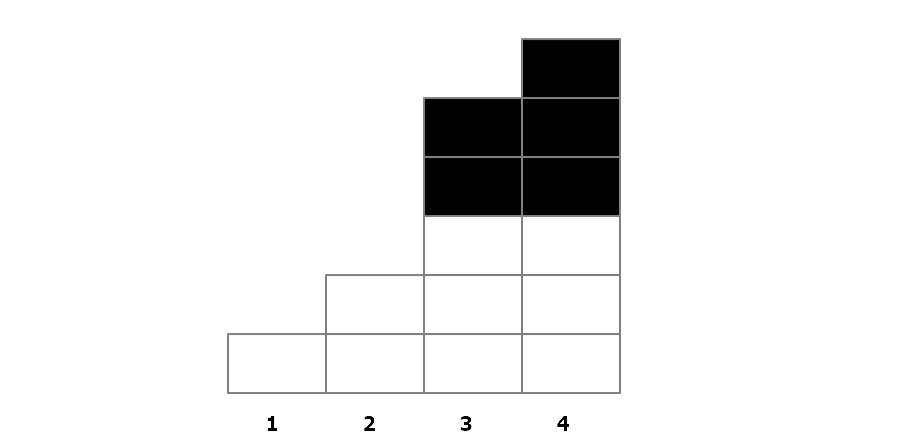

# 프로그래머스 : 야근 지수

## 문제 설명 [[링크]](https://programmers.co.kr/learn/courses/30/lessons/12927)

회사원 Demi는 가끔은 야근을 하는데요, 야근을 하면 야근 피로도가 쌓입니다. 야근 피로도는 야근을 시작한 시점에서 남은 일의 작업량을 제곱하여 더한 값입니다. Demi는 N시간 동안 야근 피로도를 최소화하도록 일할 겁니다.Demi가 1시간 동안 작업량 1만큼을 처리할 수 있다고 할 때, 퇴근까지 남은 N 시간과 각 일에 대한 작업량 works에 대해 야근 피로도를 최소화한 값을 리턴하는 함수 solution을 완성해주세요.

```
[제한 사항]
- works는 길이 1 이상, 20,000 이하인 배열입니다.
- works의 원소는 50000 이하인 자연수입니다.
- n은 1,000,000 이하인 자연수입니다.

[예시]
works=[4,3,3], n=4, result=12
works=[2,1,2], n=1, result=6
works=[1,1],   n=3, result=0
```


## 문제 풀이

이 문제에서 works는 여러 값들이 존재한다. 최소의 제곱합을 구하기 위해서는 works의 값들이 전체적으로 고르게 존재해야 한다. 예를 들어 3의 제곱은 9이지만, 1,1,1의 제곱들의 합은 3이기 때문이다. 따라서 전체적인 평균을 구한 다음에 그 평균보다 큰 값들에 대해서 적정한 수준만큼만 값을 빼면 되는데 그 적정한 값은 어떻게 구해야 할까? 간단히 적어보면 좀더 쉽게 알 수 있다.



```
1번째 n=5, total=14, total-n=9, average=2.25
2번째 n=5, total=13, total-n=8, average=2.33...
3번째 n=5, total=11, total-n=6, average=3
4번째 n=3, total= 6, total-n=6, average=3
```

정렬을 해서 작은 수부터 차례대로 전체 평균을 구한 다음에 그 평균보다 크면 큰 부분의 값을 N에서  감소시키면서 구해주면 된다. 

정렬을 오름차순으로 하는 이유는 n의 값이 적용되는 것은 평균보다 큰 값들에 한해서인데, 평균보다 적은 값들부터 먼저 제외해주기 위해서이다. 만약 그렇게 하지 않으면 아래 예시처럼 경우에 따라서 평균의 올림, 버림으로 값을 빼줘야 하기 때문에 일관성이 없어진다.

```
만약 n=5, works=[5,1,2,6]라고 한다면
n=5, total=14, len=4, total-n=9, average = 2.25 
==> 3번째 값 5에서는 3+2이므로 n에서 3를 빼줘야한다. 즉 5-(올림 2.25) = 2

만약 n=3이고 works=[2,1,1,2,2,1,2]라고 한다면
n=3, total=11, len=7, total-n=8, average=1.1
==> 1번째 값 2에서는 1+1이므로 n에서 1을 빼줘야한다. 즉 2-(버림 1.1) = 1
```

즉 평균보다 적은 값들을 먼저 다 없애주기 위해 오름차순으로 정렬을 해주는 것이다.


## 코드 구현 [[전체코드]](Solution.java)

- len을 double형으로 해서 average를 구할때 double을 자동형변환 하도록 했다.  

- n이 works의 전체 합 이상인 경우에는 전부 다 소화가능하다는 것이므로 바로 0을 반환한다.

```java
public long solution(int n, int[] works) {
    long total = arrSum(works);
    if(n >= total) return 0;

    long result = 0;
    double len = (double)works.length;

    Arrays.sort(works);
    for(int one : works) {
        int average = (int)((total-n) / len--);
        total -= one;
        if(one > average) {
            n -= (one-average);
            one = average;
        }
        result += one * one;
    }
    return result;
}
```

