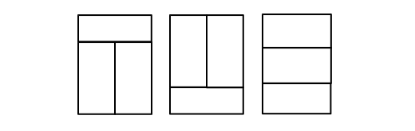
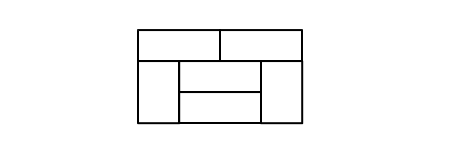
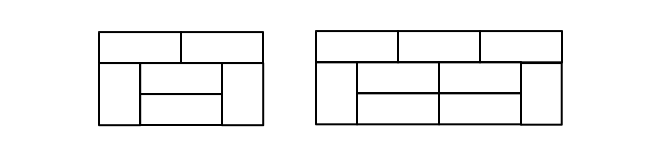

# 프로그래머스 문제 : 3 x n 타일링

## 문제 설명 [[링크]](https://programmers.co.kr/learn/courses/30/lessons/12902)

가로 길이가 2이고 세로의 길이가 1인 직사각형 모양의 타일이 있습니다. 이 직사각형 타일을 이용하여 세로의 길이가 3이고 가로의 길이가 n인 바닥을 가득 채우려고 합니다. 타일을 채울 때는 다음과 같이 2가지 방법이 있습니다

- 타일을 가로로 배치 하는 경우
- 타일을 세로로 배치 하는 경우

직사각형의 가로의 길이 n이 매개변수로 주어질 때, 이 직사각형을 채우는 방법의 수를 return 하는 solution 함수를 완성해주세요.


```
[제한사항]
가로의 길이 n은 5,000이하의 자연수 입니다.
경우의 수가 많아 질 수 있으므로, 경우의 수를 1,000,000,007으로 나눈 나머지를 return해주세요.

[입출력 예]
n result
4  11

// 자세한 예시 설명은 홈페이지 참조
```


## 문제 풀이

낮은 개수부터 시작해서 점화식을 구해보면 된다.  n이 홀수일 때에는 성립이 되지 않는다. 짝수만 신경 쓰면 된다.

​    

#### n=2일 때

n=2일때의 값을 K(2)라고 하자. K(2) = 3이다.



####  n=4일 때 

4개가 붙여지니 일단  n=2 일 때의 값인 3를 제곱 해준다. 그 다음 새로운 경우를 더 해 준다.
K(4) = 11 이다. 9 + (1 * 2)인데 상하로 반전하는 경우에 대해서 곱하기 2를 해준다.



#### n=6일 때

n=4 우측에 n=2를 붙여준다. 먼저 경우의 수 K(4) * K(2) 가 추가된다. 
그리고 2개씩 더해질 때마다 기존의 블럭과 다른 새로운 블럭이 추가된다. 각각에 대해서 누적해서 값이 더해진다.



이것을 A라고 한다면 다음과 같이 계산하면 된다. ` A(n) = A(n-2) + K(n-4) * 2`

즉 경우의 수 K(n)는 K(n-2) + A(n) 이다.


## 코드 구현

```java
public class Solution {
    public int solution(int n) {
        if (n % 2 == 1) return 0;

        long[] K = new long[n + 1];
        long[] A = new long[n + 1];
        
        K[1] = 1;
        K[2] = 3;
        A[2] = 2;

        for (int i = 4; i <= n; i += 2) {
            A[i] = A[i - 2] + K[i - 4] * 2;
            K[i] = (3 * K[i - 2] + A[i]) % 1000000007;
        }

        return (int) K[n];
    }
}
```


