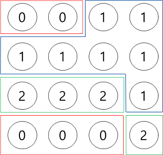

문제 설명
n x n 크기의 농장이 있습니다. 이 농장은 무, 고구마, 감자를 함께 재배하고 있습니다. 1 x 1 크기의 각 칸에는 세 개 중 하나의 작물이 자라고 있습니다. 무는 0, 고구마는 1, 감자는 2로 각 작물을 숫자로 표시한 지도가 주어질 때, 구역의 수를 구하려고 합니다. 이때, 같은 작물이 상하좌우로 인접해 있을 때 같은 구역에 속한다고 합니다.

예를 들어

이와 같은 작물이 표시된 지도가 주어진다면, 무 구역 2개, 고구마 구역 1개, 감자 구역 2개가 됩니다.

각 작물을 숫자로 표시한 지도 v가 매개변수로 주어질 때, 각 작물당 구역의 수를 return 하도록 solution 함수를 완성해 주세요. 위 예시의 경우에는 [2,1,2]를 return 하면 됩니다. 단, 무, 고구마, 감자 구역 순으로 return 해주세요.

제한사항
작물이 표시된 지도 v는 2차원 배열로 주어지며, 0, 1, 2 이외에 다른 숫자로 표시되지 않습니다.
n : 100 이하의 자연수
입출력 예
v	answer
[[0,0,1,1],[1,1,1,1],[2,2,2,1],[0,0,0,2]]	[2,1,2]
[[0,0,1],[2,2,1],[0,0,0]]	[2,1,1]
입출력 예 설명
입출력 예 #1
문제의 예시와 같습니다.

입출력 예 #2
001
221
000
의 경우는 무 구역 2개, 고구마 구역 1개, 감자 구역 1개이므로 [2,1,1]을 return 하면 됩니다.