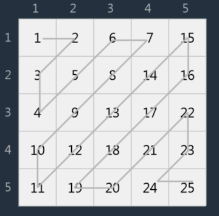

# 문제 : 지그재그

## 문제 설명

n x n으로 배열이 존재하고 지그재그 형태로 숫자값이 존재한다.
이때 특정 좌표의 값을 가져오는 숫자를 return 하는 함수를 만들어주세요.

- 6x6인 경우




```
[제한사항]
- r, c는 1이상 n이하의 자연수이다.
- 정답이 2^31-1보다 커질수 있다.

[입출력 예]
n r c result
5 3 2 9
6 5 4 29
```


## 문제 풀이

> 프로그래머스에서 테스트를 할 수 없어서 값이 큰 것에 대해서는 따로 테스트를 짜줘야 하는데 추후 추가할 예정이다.

일단 이 행렬의 경우 절반으로 나눠서 접근해야 한다. 왜냐하면 처음에는 증가하다가 나중에는 감소하기 때문이다. (문제를 분석해 보면 알게 된다.) 또한 위의 그림에서도 나오지만 ↗ ↙ 이렇게 2가지의 방향으로 나뉜다. 이부분을 잘 파악해야 한다.

먼저 방향이 ↗ 일 때에는 시작하는 값의 column이 가장 작은 값이며 그 후 1씩 증가하는 형태를 가진다. 반대로 ↙ 방향인 경우에는 row값이 증가하면서 같이 따라간다. 절반 전까지는 범위가 1 ~ (r+c-1) 까지 이다. 반대로 절반이 넘어서면 (r+c - n) ~ n 으로 변한다. 

따라서 각각의 r+c의 라인으로 봐서 그 라인에서 가장 작은 값을 구한다음, 그 값에서 방향에 따라 r, c를 각각 더해주면 답이 나온다. 


## 코드 구현 [[전체코드]](../../../../js/src/zigzag)

```javascript
function solution(n, r, c) {
  const startValueArr = getStartNumArr(n);
  const s = r + c;
  const isOdd = s % 2 > 0;

  const startValue = startValueArr[s];

  if (isOdd) {
    // col - 1만큼 값을 더해준다.
    if (s <= n + 1) {
      return startValue + r - 1;
    } else {
      const v = s - n;
      return startValue + r - v;
    }
  } else {
    // row -1 만큼 값을 더해준다.
    if (s <= n + 1) {
      return startValue + c - 1;
    } else {
      const v = s - n;
      return startValue + c - v;
    }
  }
}
```


좀더 정갈하게 정리하면 아래와 같다

```javascript
function solution(n, row, col) {
  const sum = row + col;
  const startValue = getStartNumArr(n)[sum];

  let amount = sum % 2 > 0 ? row : col;
  let minus = sum <= n + 1 ? 1 : sum - n;

  return startValue + amount - minus;
}
```

