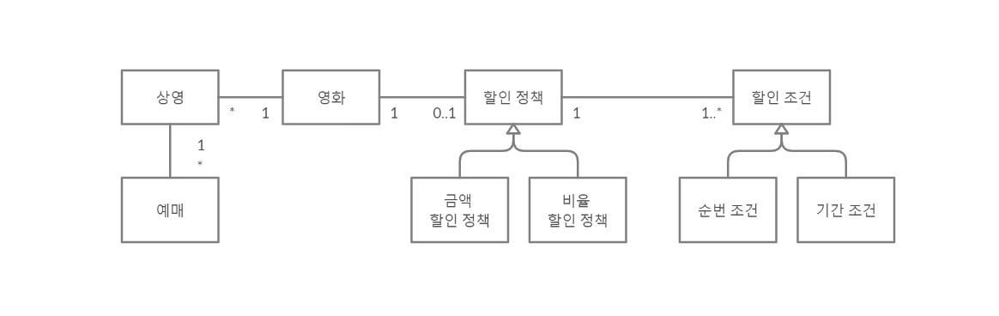
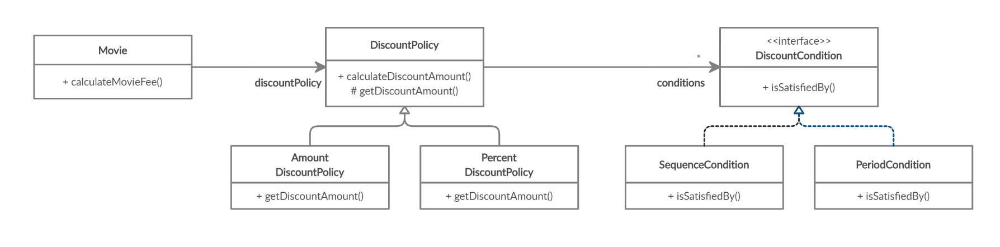

# 2장 객체지향 프로그래밍

## 01 영화 예매 시스템

### 요구사항 살펴보기

​    

#### 온라인 영화 예매 시스템

```
[영화]
- 영화에 대한 기본정보 (제목, 상영시간, 가격 정보)

[상영]
- 실제로 관객들이 영화를 관람하는 사건 (상영 일자, 시간, 순번 등)
- 사용자가 실제 예매하는 대상

[할인]
- 할인 조건 : 가격의 할인 여부를 결정, 순서 조건과 기간 조건으로 나눈다. (여러개 가능)
    - 순서 조건 : 상영 순번을 이용해 할인 여부를 결정하는 규칙
    - 기간 조건 : 영화 상영 시작 시간을 이용해 할인 여부를 결정 (요일, 시작 시간, 종료시간)
    
- 할인 정책 : 할인 요금을 결정 한다. (영화 별 최대 하나만 가능)
    - 금액 할인 정책 : 일정 금액을 할인
    - 비율 할인 정책 : 일정 비율의 요금을 할인
    
[금액계산]
- 할인 조건을 검사 후 할인 정책을 이용해 요금 계산

[예매]
- 예매 완료시 예매 정보 생성
- 예매 정보 : 제목, 상영정보, 인원, 정가, 결제 금액 포함
```

​    

## 02 객체지향 프로그래밍을 향해

### 협력, 객체, 클래스

##### 객체지향 프로그래밍에서 집중해야 할 것

1. 어떤 클래스가 필요한지를 고민하기 전에 어떤 상태와 행동을 가지는 객체가 필요한지 고민할 것.
2. 객체를 기능 구현을 위해 협력하는 공동체의 일원으로 봐야 한다.

​    

### 도메인의 구조를 따르는 프로그램 구조

도메인 : 문제를 해결하기 위해 사용자가 프로그램을 사용하는 분야

객체지향 패러다임에서는 요구사항과 프로그램을 객체라는 동일한 관점에서 보기 때문에 도메인을 구성하는 개념들이 프로그램의 객체와 클래스로 연결될 수 있다.



​    

### 클래스 구현하기

- 클래스 구현 또는 사용시 가장 중요한 것은 클래스의 경계를 구분 짓는 것이다.
- 경계의 명확성이 객체의 자율성을 보장하며 구현의 자유를 제공하기 때문이다.

```typescript
// 상영 : 상영할 영화, 순번, 상영 시작시간
class Screening {
    private movie: Movie;
    private sequence: number;
    private whenScreened: Date;
    
    constructor(movie: Movie, sequence: number, whenScreened: Date) {
        this.movie = movie;
        this.sequence = sequence;
        this.whenScreened = whenScreened;
    }
    
    getStartTime() {
        return this.whenScreened;
    }
    
    isSequence(sequence: number): boolean {
        return this.sequence === sequence;
    }
    
    getMovieFee(): Money {
        return this.movie.getFee();
    }
}
```

​    

#### 자율적인 객체

1. 객체는 상태와 행동을 함께 가지는 복합적인 존재이다.

2. 객체가 스스로 판단하고 행동하는 자율적인 존재이다.
3. 캡슐화와 접근제어로 객체는 두부분으로 나뉜다.
   1. 퍼블릭 인터페이스 : 외부에서 접근 가능한 부분
   2. 구현 : 외부에서는 접근 불가능하고 오직 내부에서만 접근 가능한 부분

​    

#### 프로그래머의 자유

- 클래스 작성자 : 새로운 데이터 타입을 프로그램에 추가
- 클라이언트 프로그래머 : 클래스 작성자가 추가한 데이터 타입을 사용
- 구현 은닉 : 숨겨 놓은 부분에 접근할 수 없게 해서 클라이언트 프로그래머에 대한 영향을 걱정하지 않고 내부 구현을 변경 가능
- 설계가 필요한 이유는 변경을 관리하기 위해서이다. 객체의 변경을 관리하는 기법 중 가장 대표적인 것이 접근 제어이다.

​        

### 협력하는 객체들의 공동체

객체지향의 장점은 객체를 이용해 도메인의 의미를 풍부하게 표현할 수 있다는 것이다. 따라서 의미를 좀 더 명시적이고 분명하게 표현할 수 있다면 객체를 사용해서 해당 개념을 구현하라.

영화를 예매하기 위해 Screening, Movie, Reservation 인스턴스들은 서로의 메서드를 호출하여 상호작용한다. 이처럼 시스템의 어떤 기능을 구현하기 위해 객체들 사이에 이뤄지는 상호작용을 **협력(Collaboration)**이라고 부른다.

객체지향 프로그래밍을 작성할 때는 먼저 협력의 관점에서 어떤 객체가 필요한지를 결정하고, 객체들의 공통 상태와 행위를 구현하기 위해 클래스를 작성한다.

​    

### 협력에 관한 짧은 이야기

객체가 다른 객체와 상호작용할 수 잇는 유일한 방법은 **메세지를 전송(send a message)**하는 것이다. 다른 객체에게 요청이 도착할 때 해당 객체가 **메세지를 수신(receive a message)**했다고 이야기 한다. 메세지를 처리하기 위한 자신만의 방법을 **메서드(method)**라고 부른다. 메세지와 메서드의 구분에서부터 다형성(polymorphism)의 개념이 출발한다.


​    

## 03 할인 요금 구하기

### 할인 요금 계산을 위한 협력 시작하기

```typescript
class Movie {
    // ... 생략 ...
    private discountPolicy: DiscountPolicy;
    
    calculateMovieFee(screening: Screening): Money {
        // 어떤 할인 정책을 사용할 것인지 결정하는 코드가 존재 하지 않는다. 
        // discountPolicy 객체에게 메세지를 전송할 뿐이다.
        
        return this.fee.minus(
            this.discountPolicy.calculateDiscountAmount(screening)
        );
    }
}
```

​    

### 할인 정책과 할인 조건

AmountDiscountPolicy와 PercentDiscountPolicy 클래스는 요금 계산방식만 조금 다르므로 중복 코드 제거를 위해 부모 클래스 DiscountPolicy를 만든다. 이 클래스는 인스턴스를 생성할 필요가 없으니 추상 클래스로 구현한다.

```typescript
abstract class DiscountPolicy {
    private conditions: Array<DiscountCondition> = [];

    // 할인 조건들을 받는다.
    constructor(...conditions: Array<DiscountCondition>) {
        this.conditions = conditions;
    }

    // 상영에 만족하는 할인 조건을 찾아서 할인되는 양을 계산한다.
    calculateDiscountAmount(screening: Screening): Money {
        if (
            this.conditions.some((each: DiscountCondition) =>
                each.isSatisfiedBy(screening)
            )
        )
            return this.getDiscountAmount(screening);

        return Money.ZERO;
    }

    protected abstract getDiscountAmount(screening: Screening): Money;
}
```

실제로 요금을 계산하는 부분은 추상 메서드인 getDiscountAmount 메서드에게 위임한다. DiscountPolicy를 상속받은 자식클래스에서 오버라이딩한 메서드가 실행 될 것이다. 

이렇게 부모 클래스에 기본적인 알고리즘의 흐름을 구현하고 중간에 필요한 처리를 자식 클래스에게 위임하는 디자인 패턴을 **템플릿 메서드 패턴** 이라고 한다.

```typescript
class AmountDiscountPolicy extends DiscountPolicy {
    private discountAmount: Money;

    constructor(discountAmount: Money, ...conditions: Array<DiscountCondition>) {
        super(...conditions);
        this.discountAmount = discountAmount;
    }

    // 오버라이드 했음.
    protected getDiscountAmount(screening: Screening): Money {
        return this.discountAmount;
    }
}
```


​    

DiscountCondition은 인터페이스를 이용해서 선언되어 있다. 이것을 implements해서 SequenceCondition, PeriodCondition을 구현할 것이다.

```typescript
interface DiscountCondition {
    isSatisfiedBy(screening: Screening): boolean;
}
```

```typescript
const enum DayOfWeek {
    SUNDAY = 0, MONDAY = 1, TUESDAY = 2, WEDNESDAY = 3,
    THURSDAY = 4, FRIDAY = 5, SATUREDAY = 6,
}

class PeriodCondition implements DiscountCondition {	// 설명을 위해 하나만 본문에 추가
    private dayOfWeek: DayOfWeek;
    private startTime: Date;
    private endTime: Date;

    constructor(
        dayOfWeek: DayOfWeek,
        startTime: Date,
        endTime: Date
    ) {
        this.dayOfWeek = dayOfWeek;
        this.startTime = startTime;
        this.endTime = endTime;
    }

    isSatisfiedBy(screening: Screening): boolean {
        return (
            screening.getStartTime().getDay() === this.dayOfWeek &&
            this.startTime.toLocaleTimeString() <= 
                screening.getStartTime().toLocaleTimeString() &&
            this.endTime.toLocaleTimeString() >= 
                screening.getStartTime().toLocaleTimeString()
        );
    }
}
```

​    

##### 영화 가격 계산에 참여하는 클래스들의 관계



​    

> 오버라이딩 (overriding) : 부모 클래스에 정의된 특정 메서드를 자식 클래스에서 재정의 하는 것을 말한다.
>
> 오버로딩 (overloading) : 메서드의 이름은 같지만 제공되는 파라미터의 목록이 다르다.

​    

### 할인 정책 구성하기

생성자의 파라미터 목록을 이용해서 초기화에 필요한 정보를 전달하도록 강제하면 올바른 상태를 가진 객체의 생성을 보장할 수 있다.

```typescript
class Movie {
	// 생략..
    
    // 하나의 영화에 하나의 할인 정책만 설정할수 있게 강제함.
    constructor(
        title: string,
        runningTime: number,
        fee: Money,
        discountPolicy: DiscountPolicy
    ) {
        this.title = title;
        this.runningTime = runningTime;
        this.fee = fee;
        this.discountPolicy = discountPolicy;
    }
    
    // 생략..
}


abstract class DiscountPolicy {
    private conditions: Array<DiscountCondition> = [];
    
    // 여러개의 할인 조건을 받을수 있도록 했음.
    constructor(...conditions: Array<DiscountCondition>) {
        this.conditions = conditions;
    }
    // 생략...
}
```
​    

아래는 '아바타'에 대한 할인 정책과 할인 조건을 설정한 것이다. 

```typescript
const avartar: Movie = new Movie(
    "아바타", 120, Money.wons(10000),
    
    new AmountDiscountPolicy(
        Money.wons(800),
        
        // 2개의 순서 조건
        new SequenceCondition(1),
        new SequenceCondition(10),
        
        // 2개의 기간 조건
        new PeriodCondition(
            DayOfWeek.MONDAY, new Date("2020-09-21 10:00"), new Date("2020-09-21 11:59")
        ),
        new PeriodCondition(
            DayOfWeek.THURSDAY, new Date("2020-09-24 10:00"), new Date("2020-09-24 20:59")
        )
    )
);

```

​        

## 04 상속과 다형성

### 컴파일 시간 의존성과 실행 시간 의존성

Movie 클래스는 추상 클래스인 DiscountPolicy에 의존하고, AmountDiscountPolicy, PercentDiscountPolicy를 모른다. 하지만 실행시점에 이 두 클래스와 협력이 가능하다. 

유연하고 쉽게 재사용 가능하며 확장 가능한 객체지향 설계는 코드의 의존성과 실행시점의 의존성이 다르다. 다만, 이렇게 의존성이 다르면 다를수록 코드를 이해하기 어려워진다. 

설계가 유연해질수록 코드를 이해하고 디버깅하기는 점점 더 어려워진다. 하지만 유연성을 억제하면 코드를 이해하고 디버깅하기는 쉬워지지만 재사용성과 확장 가능성이 낮아진다. 항상 유연성과 가독성 사이에서 고민해야 한다.

​    

### 상속과 인터페이스

상속이 가치 있는 이유는 부모 클래스가 제공하는 모든 인터페이스를 자식 클래스가 물려받기 때문이다. 인터페이스는 객체가 이해할 수 잇는 메세지의 목록을 정의한다. 자식클래스는 부모 클래스가 수신할 수 있는 모든 메세지를 수신할 수 있기 때문에 외부 객체는 자식 클래스를 부모 클래스와 동일한 타입으로 간주할 수 있다.

자식 클래스가 부모 클래스를 대신하는 것을 업캐스팅(upcasting)이라고 한다. 

​    

### 다형성

동일한 메세지를 전송하지만 실제로 어떤 메서드가 실행될 것인지는 메세지를 받는 객체의 클래스가 무엇이냐에 따라 달라지는데 이것을 다형성이라고 한다.

다형성은 객체지향프로그램의 컴파일 시간 의존성과 런타임 의존성이 다를 수 있다는 사실을 기반으로 한다. 다형성은 컴파일 시간 의존성과 런타임 의존성을 다르게 만들 수 잇는 객체지향의 특성을 이용해 서로 다른 메서드를 실행할 수 있게 한다.

다형성이란 동일한 메세지를 수신했을 때 객체의 타입에 따라 다르게 응답할 수 있는ㄴ 능력을 의미한다. 따라서 다형적인 협력에 참여하는 객체들은 모두 같은 메세지를 이해할 수 잇어야 한다. 즉 인터페이스가 동일해야 한다는 것이다. 이렇게 인터페이스를 통일하기 위해 사용한 구현 방법이 상속이다.

다형성을 구현하는 방법은 다양하지만 메세지에 응답하기 위해 실행될 메서드를 컴파일 시점이 아닌 런 타임 시점에 결정한다는 공통점이 있다. 메세지와 메서드를 ㅅ런타임 시점에 바인딩한다는 것이다. 이것을 지연바인딩 lazy binding 또는 동적 바인딩 dynamic binding 이라고 부른다. 이에 반해 전통적인 함수 호출처럼 컴파일 시점에 실행될 함수나 프로시저를 결정하는 것을 초기 바인딩 early binding,  정적 바인딩 static binding 이라고 부른다. 객체지향이 컴파일 시점의 의존성과 런타임 시점의 의존성을 분리하고, 하나의 메세지를 선택적으로 서로 다른 메서드에 연결할 수 있는 이유가 바로 지연 바인딩이라는 메커니즘을 사용하기 때문이다.

상속을 이용하면 동일한 인터페이스를 공유하는 클래스들을 하나의 타입 계층으로 묶을 수 있다. 이런 이유로 대부분의 사ㅅ람들은 다형성을 이야기할 때 상속을 함께 언급한다. 그러나 클래스를 상속받는 것만이 다형성을 구현할 수 있는 유일한 방법은 아니다.


> 구현 상속과 인터페이스 상속
>
> 구현 상속 (서브클래싱) 은 순수하게 코드를 재사용하기 위한 목적으로 상속을 사용하는 것이다.
>
> 인터페이스 상속(서브타이핑)은 다형적인 협력을 위해 부모 클래스와 자식 클래스가 인터페이스를 공유할 수 잇도록 상속을 이용하는 것이다.
>
> 상속은 인터페이스 상속을 위해 사용해야 하며 구현을 재사용할 목적으로 상속을 사용하면 변경에 취약한 코드를 낳게 될 확률이 높다.


​    

## 05 추상화와 유연성

### 추상화의 힘

DiscountPolicy, DiscountCondition은 인터페이스를 정의하며 구현의 일부, 전체를 자식 클래스가 결정할 수 있또록 결정권을 위임한다. 

추상화 사용시 장점 2가지

1) 추상화 계층만 따로 떼어놓고 살펴보면 요구사항의 정책을 높은 수준에서 서술할 수 있다.

추상화를 사용하면 세부적인 내용을 무시한 채 상위 정책을 쉽고 간단하게 표현할 수 있다. 이렇게 세부사항에 억눌리지 않고 사위 개념으로도 도메인의 중요한 개념을 설몀ㅇ할 수 있게 한다. 추상화를 이용한 설계는 필요에 따라 표현의 수준을 조정하는 것을 가능하게 해준다.

추상화를 이용해 상위 정책을 기술한다는 것은 기본적인 애플리케이션의 협력 흐름을 기술한다는 것을 의미한다. 할인 정책이나 할인 조건의 새로운 자식 클래스드은 추상화를 ㅣㅇ용해서 정의한 상위의 협력 흐름을 그대로 따르게 된다. 재사용 가능한 설계의 기본을 이루는 디자인 패턴, 프레임워크 모두 추상화를 이용해 상위 정책을 정의하는 객체지향 메커니즘을 활용하고 있다.

두 번째 특징은 첫 번째 특징으로부터 유추할 수 있다. 추상화르 링용해 상위 정채그 ㄹ표현하면 기존 구조를 수정하지 않고도 새로운 기능을 쉽게 추가하고 확장할 수 잇다. 다시 말해 설계를 유연하게 만들 수 잇따.

2) 추상화를 이용하면 설계가 좀더 유연해진다.


### 유연한 설계

영화 스타워즈를 추가해 보자. 스타워즈는 할인 정책이 적용되지 않는다.

```typescript
class Movie {
    calculateMovieFee(screening: Screening): Money {
        
        // 예외 케이스로 if문이 붙는다.
        if (!discountPolicy) {
            return this.fee;
        }
            
        return this.fee.minus(discountPolicy.calculateDiscountAmount(screening));
    }
}
```

이 방식의 문제점은 할인 정책이 없는 경우를 예외 케이스로 취급하기 때문에 지금까지 일관성 있던 협력 방식이 무너지게 된다는 것이다. 기존 할인 정책의 경우에는 할인할 금액을 계산하는 책임을 DiscountPolicy의 자식 클래스에 잇엇지만 할인 정책이 없는 경우에는 할인 금액이 0원이라는 사실을 결정하는 책임이 DiscountPolicy가 아닌 Movie쪽에 있기 때문이다. 따라서 책임의 위치를 결정하기 위해 조건문을 사용하는 것은 협력의 설계측면에서 대부분의 경우 좋지 않은 선ㅌ개이다. 항상 예외 케이스를 최소화 하고 일관성을 유지할 수 잇는 방법을 선택하라.

이 경우에 일관성을 지킬 수 잇는 방법은 0원이라는 할인 요금을 계산할 책임을 그대로 DiscountPolicy 계층에 유지시키는 것이다. NoneDiscountPolicy클래스를 추가하자.

```typescript
// 비즈니스 로직은 제거 할수가 없다. 다른 객체로 위임할 뿐이다.
class NoneDiscountPolicy extends DiscountPolicy {
    // @Override
    protected gietDiscountAmount(screening: Screening): Money {
        return Money.ZERO;
    }
}
```


이제 Movie 인스턴스에 NoneDiscountPolicy의 인스턴스를 연결해서 할인되지 않는 영화를 생성할 수 잇다.

```typescript
Movie starWars = new Movie(
    "스타워즈", 
    210, 
    Money.wons(10000), 
    new NoneDiscountPolicy()
);
```

중요한 것은 기존의 Movie와 DiscountPolicy는 수정하지 않고 NoneDiscountPolicy라는 새로운 ㄴ클래스를 추가하는 것만으로 애플리케이션의 기능을 확장했다는 것이다. 이처럼 추상화를 중심으로 코드의 구조를 설계하면 유연하고확장 가능한 설계를 만들 수 있다.

추상화가 유연한 설계를 가능하게 하는 이유는 설계가 구체적인 상황에 결합되는 것을 방지하기 때문이다. Movie는 특정한 할인 정책에 묶이지 않는다. 할인 정책을 구현한 클래스가 DiscoutnPolicy를 상속받고 있다면 어떤 클래스와도 협력이 가능하다.

DiscountPolicy 역시 특정한 할인 조건에 묶여있지 않다. DiscountCondition을 상속받은 어떤 클래스와도 협력이 간으하다. 이것은 DiscountPOlicy와 DiscountCondition이 추상적이기 때문에 가능한ㄷ 것이다. 8장에서 나오는 컨텍스트 독립성(context independency)라고 불리는 이 개념은 프레임워크와 같은 유연한 설계가 필수적인 분야에서 꼭 필요한 개념이다.

결혼은 간단하다. 유연성이 필욯나 곳에 추상화를 사용하라.


### 추상 클래스와 인터페이스 트레이드오프

앞의 NoneDiscountPolicy 클래스의 코드를 보면 getDiscountAmount()  메서드가 어떤 값을 반환하더라도 상관이 없다는 사실을 알 수 있다. 부모 클래스인 DiscountPolicy에서 할인 조건이 없을 경우에는 getDiscountAmount() 메서드를 호출하지 않기 때문이다. 이것은 부모 클래스인 DiscountPolicy와 NoneDiscountPolicy를 개념적으로 결합시킨다. NoneDiscountPolicy 개발자는 getDiscountAmount()가 호출되지 않을 경우 DiscountPolicy가 0원을 반환할 것이라는 사실을 가정하고 있기 때문이다.

```typescript
calculateDiscountAmount(screening: Screening): Money {
    if (this.conditions.some((each: DiscountCondition) =>each.isSatisfiedBy(screening)))
        return this.getDiscountAmount(screening);

    return Money.ZERO;
}
```

이 문제를 해결하는 방법은 DiscountPolicy를 인터페이스로 바꾸고 NoneDiscountPolicy가 DiscountPolicy의 getDiscountAmount()메서드가 아닌 calculateDiscountAmount() 오퍼레이션으 ㄹ오버라이딩하도록 변경하는 것이다.

```typescript
interface DiscountPolicy {
    calculateDiscountAMount(screening: Screening):Money;
}

// 이전의 DiscountPolicy 클래스의 이름을 DefaultDescountPolicy로 변경하고 인터페이스를 구현한다.
abstract class DefaultDiscountPolicy implements DiscountPolicy {
    // ...
}
    
// NoneDiscountPolicy가 DiscountPolicy 인터페이스를 구현하도록 변경하면 개념적 혼란과 결합을 제거할 수 있다.
class NoneDiscountPolicy implements DiscountPolicy {
    // @Override
    calculateDiscountAmount(screening: Screening): Money {
        return Money.ZERO;
    }
}
```

어떤 설계가 더 좋은가? 이상적으로는 인터페이스를 사용하도록 변경한 설계가 더 좋을 것이다. 현실적으로는 NoneDiscountPolicy만을 위해 인터페이스를 추가하는 것이 과하다는 생각이 들수도 있을 것이다. 변경전의 NoneDiscountPolicy클래스 역시 할인 금액이 0원이라는 사실을 효과적으로 ㄷ전달하기 때문이다. 이 책에서는 설명을 단순화하기 위해 인터페이스를 사용하지 않는 원래의 설계를 기반해서 설명ㅇ을 이어갈 것이다.

여기서 이야기하고 싶은 사실은 구현과 관련된 모든 것들이 트레이드 오프의 대상이될 수 잇다는 사실이다. 여러분이 작성하는 모든 코드에는 합당한 이유가 있어야 한다. 비록 아주 사소한 결정이더라도 트레이드 오프를 통해 얻어진 결론과 그렇지 않은 결론사이의 차이는 크다. 고민하고 트레이드 오프하라.


### 코드 재사용

코드 재사용을 위해 상속보다는 합성이 더 좋은 방법이라는 이ㅑㅇ기를 많이 들었을 것이다. 합성은 다른 객체의 인스턴스를 자신의 인스턴스 변수로 포함해서 재사용하는 방법을 말한다.  그렇다면 많은 사람들이 상속대신 합성을 선호하는 이유는 무엇일까?


### 상속

상속은 2가지 관점에서 설계에 한좋은 영향을 미친다. 

하나는 상속이 캡슐화를 위반한다는 것이고, 다른 하나는 설계를 유연하지 못하게 만든다는 것이다.

상속의 가장 큰 문제점은 캡슐화를 위반한다는 것이다. 상속을 이용하기 위해서는 부모 클래스의 내부구조를 잘 알고 있어야 한다. 결과적으로 부모 클래스의 구현이 자식 클래스에게 노출되기 때문에 캡슐화가 약화된다. 캡슐화의 약화는 자식클래스가 부모 클래스에 강하게 결합되도록 만들기 때문에 부모 클래스를 변경할 때 자식 클래스도 함께 변경될 확률을 높인다. 결과적으로 상속을 과도하게 사용한 코드는 변경하기도어려워진다.

상속의 두번째 단점은 설꼐가 유연하지 않다는 것이다. 상속은 부모 클래스와 자식 클래스 사이의 관계를 컴파일 시점에 결정한다. 따라서 실행 시점에 객체의 종류를 변경하는 것이 불가능하다.

예를 들어 실행 시점에 금액 할인 정책인 영화를 비율할인 정책으로 변경한다고 가정하자. 상속을 사용한 설계에서는 AmountDiscountMovie 인스턴스를 PercentDiscountMovie인스턴스로 변경해야 한다. 이 문제를 해결할수 잇는 방법은 PercentDiscountMovie 인스턴스를 생성한 후에 AmountDiscountMovie 상태를 복사하는 것 뿐이다. 이것은 부모 클래스와 자식 클래스가 강하게 결합되어 있기 때문에 발생하는 문제이다.

반면 인스턴스 변수로 연결된 기존 방ㅂ버을 사용하면 실행 시점에 할인 정책을 간단하ㅔㄱ 변경할수 잇다.

```typescript
// changeDiscountPolicy메서드를 이용해서 할인정책을 간단하게 변경가능하다.
class Movie {
    private discountPolicy: DiscountPolicy;
    
    changeDIscountPolicy(discountPolicy: DiscountPolicy):void {
        this.discountPolicy = discountPolicy;
    }
}
```

위의 예제를 통해 상속보다 인스턴스 변수로 관계를 연결한 원래의 설계가 더 유연하다는 사실을 알 수 있다. Movie가 DiscountPolicy를 포함하는 방법 역시 코드를 재사용하는 방법이다. 


### 합성

Movie는 요금을 계산하기 위해 DiscountPolicy의 코드를 재사용한다. 이 방법이 상속과 다른 점은 상속이 부모 클래스의 코드와 자식 클래스의 코드를 컴파일 시점에 하나의 단위로 강하게 결합하는데 비해 Movie가 DiscountPolicy의 인터페이스를 통해 약하게 결합된다는 것이다. 실제로 Movie는 DiscountPolicy가 외부에 calculateDiscountAmount 메서드를 제공한다는 사실만 알고 내부 구현에 대해서는 전혀 알지 못한다. 이처럼 인터페이스에 정의된 메세지를 통해서만 코드를 재사용하는 방법을 합서잉라고 부른다.

합성은 상속이 가지는 무가지 문제점을 모두 해결한다. 인터페이스에 정의된 메세지를 통해서만 재사용이 가능하기 때문에 구현을 효과적으로 캡슐화할 수 잇다. 또한 의존하는 인스턴스를 교체하는 것이 비교적 쉽기 때문에 설계를 유연하게 만든다. 상속은 클래스를 통해 강하게 결합되는데 비해 합성은 메세지를 통해 느슨하게 결합된다. 따라서 코드 재사용을 위해서는 상속보다는 합성을 선호나느 ㄴ것이 더 좋은 방법이다.

코드를 재사용하는 경우 상속보다 합성을 선호하는 것이 옳지만 다형성을 ㅜ이해 인터페이스를 제ㅐ사용하는 경우에는 상소고가 합성을 함께 조합해서 사용할수 밖에 없다.

객체지향에서 가장 중요한 것은 애플리켕션의 기능을 구현하기 위해 협력에 참여하는 객체들 사이의 상호작용이다. 객체들은 협력에 참여하기 위해 역할을 부여받고 역할에 적합한 책임을 수행한다.

객체지향 설계의 핵심은 적절한 협력을 식별하고 협력에 필요한 역할을 정의한 후에 역할으 수행할 수 있는 적절한 객체에게 적절한 책임을 할당하는 것이다.


