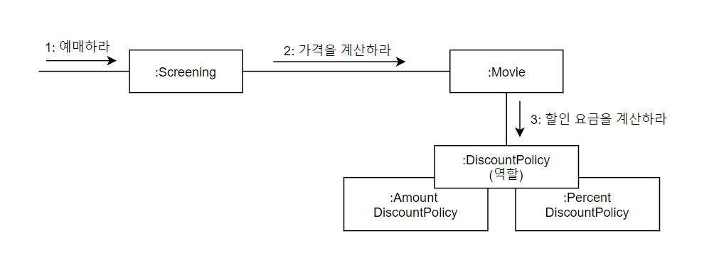
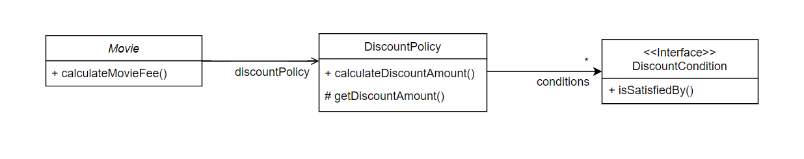
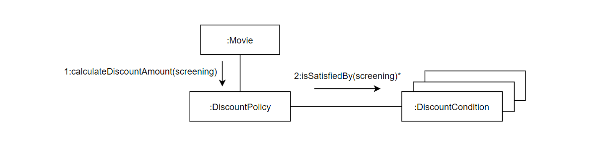

# 3장 역할, 책임, 협력

객체들이 애플리케이션의 기능을 구현하기 위해 수행하는 상호작용을 **협력**이라고 한다. 객체가 협력에 참여하기 위해 수행하는 로직은 **책임**이라고 부른다. 객체들이 협력안에서 수행하는 책임들이 모여 객체가 수행하는 **역할**을 구성한다.

​     

​     

## 01 협력

### 협력

**협력**은 객체지향의 세계에서 기능을 구현할 수 있는 유일한 방법이다. 두 객체 사이의 협력은 하나의 객체가 다른 객체에게 도움을 요청할 때 시작된다. **메세지 전송(message sending)** 은 객체사이의 협력을 위해 사용할 수 있는 유일한 커뮤니케이션 수단이다. 메세지를 수신한 객체는 **메서드**를 실행해 요청에 응답한다.

​    

### 협력이 설계를 위한 문맥을 결정한다.

객체의 행동을 결정하는 것은 객체가 참여하고 있는 협력이다. 협력이 바뀌면 객체가 제공해야 하는 행동 역시 바뀌어야 한다.객체의 상태는 그 객체가 행동을 수행하는데 필요한 정보가 무엇인지로 결정된다.

**상태**는 객체가 행동하는 데 필요한 정보에 의해 결정되고 **행동**은 협력 안에서 객체가 처리할 메세지로 결정된다. 결과적으로 객체가 참여하는 **협력**이 객체를 구성하는 행동과 상태 모두를 결정한다. 따라서 협력은 객체를 설계하는데 필요한 일종의 **문맥(context)** 를 제공한다.

​    

​     

## 02 책임

### 책임이란 무엇인가

협력에 참여하기 위해 객체가 수행하는 행동을 **책임**이라고 부른다. 책임이란 객체에 의해 정의되는 응집도 있는 행위의 집합으로, 객체가 유지해야 하는 정보와 수행할 수 있는 행동에 대해 개략적으로 서술한 문장이다. 즉, 객체의 책임은 객체가 `무엇을 알고 있는가`, `무엇을 할 수 있는가`로 구성된다.

​    

#### 하는것

- 객체를 생성하거나 계산을 수행하는 등의 스스로 하는 것
- 다른 객체의 행동을 시작시키는 것
- 다른 객체의 활동을 제어하고 조절하는 것

#### 아는 것

- 사적인 정보에 관해 아는 것
- 관련된 객체에 관해 아는 것
- 자신이 유도하거나 계산할 수 있는 것에 관해 아는 것

​      

### 책임 할당

자율적인 객체를 만드는 가장 기본적인 방법은 책임을 수행하는데 필요한 정보를 가장 잘 알고 있는 전문가에게 그 책임을 할당하는 것이다. 이것을 **INFORMATION EXPERT(정보 전문가) 패턴** 이라고 한다.

객체에게 책임을 할당하기 위해서는 먼저 협력이라는 문맥을 정의해야 한다. 협력을 설계하는 출발점은 시스템이 사용자에게 제공하는 기능을 시스템이 담당할 하나의 책임으로 바라보는 것이다. 객체지향 설계는 시스템의 책임을 완료하는 데 필요한 더 작은 책임을 찾아내고 이를 객체들에게 할당하는 반복적인 과정을 통해 모양을 갖춰간다.

​     

### 책임 주도 설계

책임을 찾고 책임을 수행할 적절한 객체를 찾아 책임을 할당하는 방식으로 협력을 설계하는 방법을 **책임 주도 설계 (Responsibility Driven Design)** 라고 한다.

##### 책임 주도 설계 방법의 과정

- 시스템이 사용자에게 제공해야 하는기능인 시스템 책임을 파악한다.
- 시스템 책임을 더 작은 책임으로 분할 한다.
- 분할된 책임을 수행할 수 있는 적절한 객체 또는 역할을 찾아 책임을 할당한다.
- 객체가 책임을 수행하는 도중 다른 객체의 도움이 필요한 경우 이를 책임질 수 있는 적절한 객체 또는 역할을 찾는다.
- 해당 객체 또는 역할에게 책임을 할당함으로써 두 객체가 협력하게 된다.

​      

### 책임 할당시 고려해야 하는 요소 1 : 메세지가 객체를 결정한다

메세지가 객체를 선택하게 해야 하는 두가지 이유

1. 객체가 최소한의 인터페이스를 가질 수 있게 된다.

2. 객체는 충분히 추상적인 인터페이스를 가질 수 있게 된다. 

​     

### 책임 할당 시 고려해야 하는 요소 2 : 행동이 상태를 결정한다

객체의 행동은 객체가 협력에 참여할 수 있는 유일한 방법이다. 객체가 협력에 적합한지를 결정하는 것은 그 객체의 상태가 아니라 행동이다. 얼마나 적절한 객체를 창조했느냐는 얼마나 적절한 책임을 할당했느냐에 달려 있고, 책임이 얼마나 적절한지는 협력에 얼마나 적절한가에 달려 있다.

캡슐화를 위반하지 않도록 구현에 대한 결정을 뒤로 미루면서 객체의 행위를 고려하기 위해서는 항상 협력이라는 문맥 안에서 객체를 생각해야 한다. 협력 관계 속에서 다른 객체에게 무엇을 제공해야 하고 다른 객체로부터 무엇을 얻어야 하는지를 고민해야 하는 것이다.

​       

​     

## 03 역할

### 역할과 협력

객체가 어떤 특정한 협력 안에서 수행하는 책임의 집합을 역할이라고 부른다. 

​     

### 유연하고 재사용 가능한 협력

역할이 중요한 이유는 역할을 통해 유연하고 재사용 가능한 협력을 얻을 수 있기 때문이다. 이해를 돕기 위해 역할이라는 개념을 고려하지 않고 객체에게 책임을 할당한다고 가정해 보자. 

영화 예매 도메인에는 금액 할인 정책과 비율 할인 정책이라는 두 가지 종류의 가격 할인 정책이 존재한다. 따라서 두 가지 종류의 객체가 `할인 요금을 계산하라` 는 메세지에 응답할 수 있어야 한다. 하지만 두 종류의 객체가 참여하는 협력을 개별적으로 만들면 대부분의 코드가 중복될 것이다.

따라서 객체가 아닌 책임에 초점을 맞춘다. 순수하게 책임의 관점에서 두 협력을 바라보면 두 객체 모두 할인 요금 계산이라는 동일한 책임을 수행한다는 사실을 알 수 있다. 따라서 객체라는 존재를 지우고 할인 요금을 계산하라는 메세지에 응답할 수 있는 대표자를 생각한다면 두 협력을 하나로 통합할 수 있을 것이다. 이 대표자를 협력 안에서 두 종류의 객체를 교대로 바꿔 끼울 수 있는 일종의 슬롯이 바로 역할이다.

여기서 역할이 두 종류의 구체적인 객체를 포괄하는 추상화라는 점에 주목하자.

요점은 동일한 책임을 수행하는 역할을 기반으로 두 개의 협력을 하나로 통합할 수 있다는 것이다. 따라서 역할을 이용하면 불필요한 중복 코드를 제거할 수 있다. 더 좋은 소식은 협력이 더 유연해졌다는 점이다.

​     

### 역할의 구현

역할을 구현하는 가장 일반적인 방법은 **추상 클래스**와 **인터페이스**를 사용하는 것이다. 협력의 관점에서 추상 클래스와 인터페이스는 구체 클래스들이 따라야 하는 책임의 집합을 서술한 것이다. 추상 클래스는 책임의 일부를 구현해 놓은 것이고 인터페이스는 일체의 구현 없이 책임의 집합만을 나열해 놓았다는 차이가 있지만 협력의 관점에서는 둘 모두 역할을 정의할 수 있는 구현 방법이다.

​         

### 객체 대 역할

협력에 적합한 책임을 수행하는 대상이 한 종류라면 객체로 간주한다. 만약 여러 종류의 객체들이 참여할 수 있다면 역할이라고 부르면 된다.

설계 초반에는 단순하게 객체로 시작하고 반복적으로 책임과 협력을 정제해가면서 필요한 순간에 객체로부터 역할을 분리해내는 것이 가장 좋은 방법이다. 그러다 다양한 시나리오를 설계로 옮기면서 협력을 지속적으로 정제하다 보면 두 협력이 거의 유사한 구조를 보인다는 것을 발견하게 될 것이다. 이 경우 두 협력을 하나로 합치면서 두 객체를 포괄할 수 있는 역할을 고려해서 객체를 역할로 대체할 수 있다.

​       

### 역할과 추상화

추상화를 하게 되면 1) 추상화 계층만을 이용해 중요한 정책을 상위 수준에서 단순화할 수 있고 2) 설계가 좀더 유연해 진다는 2가지 장점이 있다. 역할은 공통의 책임을 바탕으로 객체의 종류를 숨기기 때문에 이런 관점에서 역할을 객체의 추상화로 볼 수 있다. 

​        

**추상화의 장점 1. 상위 수준의 정책을 쉽고 간단하게 표현할 수 있다.** 

영화 요금 계산에서 세부 사항은 할인 정책과 할인 조건의 종류다. 추상화는 할인 정책과 할인 조건이 조합되어 영화 요금을 결정한다는 사실이다. 따라서 세부사항을 무시하고 DiscountPolicy와 DiscountCondition만 바라보면 상황을 추상화 할 수 있다.

영화 요금을 계산하기 위해 DiscountPolicy와 DiscountCondition의 인스턴스를 조합해야 한다는 사실과 Movie가 DiscountPolicy에게, DiscountPolicy가 DiscountCondition에게 메세지를 전송하며 협력한다는 사실이 명확해 진다.

이렇게 구체적인 할인 정책, 할인 조건의 조합을 고려하지 않고도 상위 수준에서 협력을 설명할 수 있다. 

​    

**추상화의 장점 2. 설계를 유연하게 만들 수 있다.** 

협력 안에서 동일한 책임을 수행하는 객체들은 동일한 역할을 수행하기 때문에 서로 대체 가능하므로 협력을 유연하게 만든다.

​      

### 배우와 배역

연극의 배역과 배우간의 관계 특성

- 배역을 연극 배우가 특정 연극에서 연기하는 역할이다.
- 배열은 연극이 상영되는 동안에만 존재하는 일시적인 개념이다.
- 연극이 끝나면 연극 배우는 배역이라는 역할을 벗어 버리고 원래의 연극 배우로 돌아온다.
- 서로 다른 배우들이 동일한 배역을 연기할수 있다.
- 하나의 배우가 다양한 연극 안에서 서로 다른 배역을 연기할 수 있다.

​     

#### 연극과 객체간 협력

| 연극 | 협력 |
| ---- | ---- |
| 극본 | 코드 |
| 배우 | 객체 |
| 배역 | 역할 |

협력이라는 문맥 안에서 역할은 특정한 협력에 참여해서 책임을 수행하는 객체의 일부이다. 역할은 오직 시스템의 문맥 안에서 무엇을 하는지에 의해서만 정의될 수 있다. 역할은 객체의 페르소나이다. 협력 관점에서 동일한 역할을 수행하는 객체들은 서로 대체 가능하다.

객체는 다양한 역할을 가질 수 있다. 객체는 협력에 참여할 때 협력 안에서 하나의 역할로 보여진다.객체가 다른 협력에 참여할 때는 다른 역할로 보여진다. 협력의 관점에서 동일한 역할을 수행하는 객체들은 서로 대체가능하고 다형적이다.

