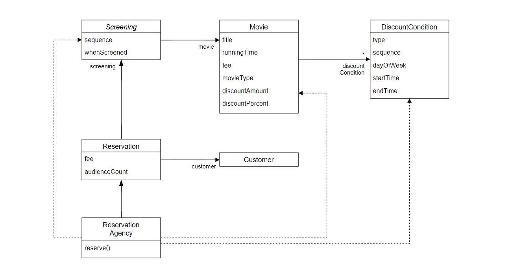

# 4장 설계 품질과 트레이드 오프

이번 장에서는 상태를 표현하는 데이터 중심의 설계를 살펴보고 객체지향 적 설계 구조와의 차이점을 살펴본다.

​     

## 01. 데이터 중심의 영화 예매 시스템

데이터 중심의 관점에서 객체는 자신이 포함하고 있는 데이터를 조작하는 데 필요한 오퍼레이션을 정의한다. 데이터 중심의 관점은 객체의 상태에 초점을 맞추고 객체를 독립된 데이터 덩어리로 바라본다.

상태를 객체 분할의 중심축으로 삼으면 구현에 관한 세부사항이 객체의 인터페이스에 스며들게 되어 캡슐화의 원칙이 무너진다. 결과적으로 상태 변경은 인터페이스의 변경을 초래하며 이 인터페이스에 의존하는 모든 객체에게 변경의 영향이 퍼지게 된다. 따라서 데이터에 초점을 맞추는 설계는 변경에 취약할 수 밖에 없다.

​         

### 데이터를 준비하자

데이터 중심의 설계란 객체 내부에 저장되는 데이터를 기반으로 시스템을 분할하는 방법이다. 데이터 중심의 설계는 객체가 내부에 저장해야 하는 '데이터가 무엇인가'를 묻는 것으로 시작한다. 먼저 Movie에 저장될 데이터를 결정하는 것으로 설계를 시작한다.

```typescript
public class Movie {
    private title: string;
    private runningTime: number;
    private fee: Money;
    private discountConditions: Array<DiscountCondition>;
    
    private movieType: MovieType;
    private discountAmount: Money;
    private discountPercent: number;
}
```

가장 두드러지는 차이점은 할인 조건의 목록(discountCondition)이 인스턴스 변수로 Movie 안에 직접 포함되어 있다는 것이다. 금액 할인 정책에 사용되는 할인 금액(discountAmount)과 비율 할인 정책에 사용되는 할인 비율(discountPercent)을 Movie안에서 직접 정의하고 있다.

할인 정책은 영화별로 오직 하나만 지정할 수 있기 때문에 한 시점에 discountAmount와 discountPercent중 하나의 값만 사용될 수 있다. 할인 정책의 종류를 결정하는 것이 movieType이다.

```typescript
const enum MovieType {
    AMOUNT_DISCOUNT,
    PERCENT_DISCOUNT,
    NONE_DISCOUNT
}
```

데이터 중심의 설계에서는 객체가 포함해야 하는 데이터에 집중한다. 이 객체가 포함해야 하는 데이터는 무엇인가? 객체의 책임을 결정하기 전에 이런 질문에 휩싸여 있다면 데이터 중심의 설계에 매몰돼 있을 확률이 높다. 특히 Movie 클래스의 경우처럼 객체의 종류를 저장하는 인스턴스 변수movieType와 인스턴스 종류에 따라 배타적으로 사용될 인스턴스 변수 discountAmount, discountPercent를 하나의 클래스 안에 함께 포함시키는 방식은 데이터 중심의 설계 안에서 흔히 볼 수 있는 패턴이다.

내부 데이터가 외부 다른 객체들을 오염시키는 것을 막기 위해 내부 데이터를 반환하는 접근자와 데이터를 변경하는 수정자를 추가한다.

```typescript
public class Movie {
    public getMovieType(): MovieType {
        return movieType;
    }
    public setMovieType(movieType: MovieType): void {
        this.movieType = movieType;
    }
    public getFee(): Money {
        return fee;
    }
    public setFee(fee: Money): void {
        this.fee = fee;
    }
    public getDiscountConditions(): Array<DiscountCondition> {
        return Object.freeze(this.discountConditions.slice());
    }
    public setDiscountConditions(discountConditions: Array<DiscountConditions>): void {
        this.discountConditions = discountConditions;
    }
    public getDiscountAmount(): Money {
        return this.discountAmount;
    }
    public setDiscountAmount(discountAmount:Money): void {
        this.discountAmount = discountAmount;
    }
    public getDiscountAmount(): number {
        return this.discountPercent;
    }
    public setDiscountAmount(discountPercent: number): void {
        this.discountPercent = discountPercent;
    }
}
```

Movie를 구현하는데 필요한 데이터를 결정했고 메서드를 이용해 내부 데이터를 캡슐화하는 데도 성공했다. 이제 할인 조건을 구현해 보자. 영화 예매 도메인에는 순번 조건과 기간 조건이라는 두가지 종류의 할인 조건이 존재한다.

데이터 중심의 설계방법을 따르기 때문에 할인 조건을 설계하기 위해 해야 하는 질문은 다음과 같다. 할인 조건을 구현하는데 필요한 데이터는 무엇인가? 먼저 현재의 할인 조건의 종류를 저장할 데이터가 필요하다. 

```typescript
const enum DiscountConditionType {
    SEQUENCE,	// 순번 조건
    PERIOS		// 기간 조건
}
```

```typescript
public class DiscountCondition {
    private type: DiscountConditionType;    // 할인 조건 타입
    private sequence: number;        // 상영 순번
    private dayOfWeek: DayOfWeek;    // 기간 조건
    private startTime: Date;
    private endTime: Date;
    
    public getType(): DiscountConditionType {
        return this.type;
    }
    public setType(type: DiscountConditionType): void {
        this.type = type;
    }
    public getDayOfWeek(): DayOfWeek {
        return this.dayOfWeek;
    }
    public void setDayOfWeek(dayOfWeek: DayOfWeek): void {
        this.dayOfWeek = dayOfWeek;
    }
    public getStartTime(): Date {
        return this.startTime;
    }
    public setStartTime(startTime: Date): void {
        this.startTime = startTime;
    }
    public getEndTime(): Date {
        return endTime;
    }
    public setEndTime(endTime: LocalTime): void {
        this.endTime = endTime;
    }
    public getSequence(): number {
        return this.sequence;
    }
    public setSequence(sequence: number): void {
        this.sequence = sequence;
    }
}
```

```typescript
public class Screening {
    private movie: Movie;
    private sequence: number;
    private whenScreened: Date;
    
    public getMovie(): Movie {
        return this.movie;
    }
    public setMovie(movie: Movie) : void {
        this.movie = movie;
    }
    public getWhenScreened(): Date {
        return this.whenScreened;
    }
    public setWhenScreenined(whenScreened: Date): void {
        this.whenScreened = whenScreened;
    }
    public getSequence(): number {
        return this.sequence;
    }
    public setSequence(sequence: number): void {
        this.sequence = sequence;
    }
}
```

영화 예매 시스템의 목적은 영화를 예매하는 것이다. Reservation 클래스를 추가한다.

```typescript
public class Reservation {
    private customer: Customer;
    private screening: Screening;
    private fee: Money;
    private audienceCount: number;
    
    constructor(customer: Customer, screening: Screening, fee: Money, audienceCount: number) {
        this.customer = customer;
        this.screening = screening;
        this.fee = fee;
        this.audienceCount = audienceCount;
    }
    public getCustomer(): Customer {
        return customer;
    }
    public setCustomer(customer: Customer): void {
        this.customer = customer;
    }
    public getScreening(): Screening {
        return this.screening;
    }
    public setScreening(screening: Screening): void {
        this.screening = screening;
    }
    public getFee(): Money {
        return this.fee;
    }
    public setFee(fee: Money): void {
        this.fee = fee;
    }
    public getAudienceCount(): number {
        return this.audienceCount;
    }
    public setAudienceCount(audienceCount: number): void {
        this.audienceCount = audienceCount;
    }
}
```

```typescript
// Customer는 고객의 정보를 보관하는 간단한 클래스다.
public class Customer {
    private name: string;
    private id: string;
    
    constructor(name: string, id: string) {	
    	this.id = id;
        this.name = name;
    }
}
```


아래와 같은 구조가 될 것이다.


​      

### 영화를 예매하자

```typescript
// ReservationAgency는 데이터 클래스들을 조합해서 영화 예매 절차를 구현하는 클래스이다.
public class ReservationAgency {
    
    public reserve(screening: Screening, customer: Customer, audienceCount: number) {
        movie: Movie = screening.getMovie();
        
        discountable: boolean = false;
        // DiscountCondition의 루프를 돌면서 할인 가능 여부를 확인
        movie.getDiscountConditions().find(condition => {
            // 할인 조건이 기간
            if(condition.getType() === DiscountConditionType.PERIOD) {
                discountasble = 
                    screening.getWhenScreened().getDayOfWeek().equals(condition.getDayOfWeek()) 
                && condition.getStartTime().compareTo(screening.getWhenScreened().toLocalTime()) <= 0 
                && condition.getEndTime().compareTo(screening.getWhenScreened().toLocalTime()) >= 0;
            } else {
                // 할인 조건이 순번 조건
                discountable = condition.getSequence() === screening.getSequence();
            }
            return discountable;
        });
        
        fee: Money;
        
        // discountable 변수의 값을 체크, 적절한 할인 정책에 따라 예매 요금 계산
        if(discountable) {
            discountAMount: Money = Money.ZERO;
            // 할인 정책의 타입에 따라 할인 요금을 계산하는 로직을 분기
            switch(movie.getMovieType()) {
                case AMOUNT_DISCOUNT:
                    discountAmount = movie.getDiscountAmount();
                    break;
                case PERCENT_DISCOUNT:
                    discountAMount = movie.getFee().times(movie.getDiscountPercent());
                    break;
                case NONE_DISCOUNT:
                    discountAMount = Money.ZERO;
                    break;
            }
            fee = movie.getFee().minus(discountAmount).times(audienceCount);
        } else {
            fee = movie.getFee();
        }
        return new Reservation(customer, screening, fee, audienceCount);
    }
}
```

​          

## 02. 설계 트레이드 오프

### 캡슐화

캡슐화란 변경 가능성이 높은 부분을 객체 내부로 숨기는 추상화 기법이다. 

​      

### 응집도와 결합도

**응집도**는 모듈에 포함된 내부 요소들이 연관돼 있는 정보를 나타낸다. 모듈 내의 요소들이 하나의 목적을 위해 긴밀하게 협력한다면 그 모듈은 높은 응집도를 가진다. 모듈 내의 요소들이 서로 다른 목적을 추구한다면 그 모듈은 낮은 응집도를 가진다. 객체지향의 관점에서 응집도는 객체 또는 클래스에 얼마나 관련 높은 책임들을 할당했는지를 나타낸다.

**결합도**는 의존성의 정도를 나타내며 다른 모듈에 대해 얼마나 많은 지식을 갖고 있는지를 나타내는 척도이다. 어떤 모듈이 다른 모듈에 대해 꼭 필요한 지식만 알고 있다면 두 모듈은 낮은 결합도를 가진다. 객체지향의 관점에서 결합도는 객체 또는 클래스가 협력에 필요한 적절한 수준의 관계만을 유지하고 있는지를 나타낸다.

일반적으로 좋은 설계란 높은 응집도와 낮은 결합도를 가진 모듈로 구성된 설계를 의미한다. 이렇게 되면 설계를 변경하기 쉽게 만든다. 

​         

## 03. 데이터 중심의 영화 예매 시스템의 문제점

### 캡슐화 위반

```typescript
public class Movie {
    private fee: Money;
    
    public getFee(): Money {
        return this.fee;
    }
    public setFee(fee: Money): void {
        this.fee = fee;
    }
}
```

위 코드에서 접근자와 수정자 메서드는 객체 내부의 상태에 대한 어떤 정보도 캡슐화하지 못한다. getFee, setFee 메서드는 Movie 내부에 Money 타입의 fee라는 이름의 인스턴스 변수가 존재한다는 사실을 퍼블릭 인터페이스에서 드러낸다. 이렇게 Movie가 캡슐화의 원칙을 어기게 된 근본적인 원인은 객체가 수행할 책임이 아니라 내부에 저장할 데이터에 초점을 맞췄기 때문이다.

설계할 때 협력에 관해 고민하지 않으면 캡슐화를 위반하는 과도한 접근자와 수정자를 가지게 되는 경향이 있다. 객체가 사용될 문맥을 추측할 수 밖에 없는 경우 개발자는 어떤 상황에서도 해당 객체가 사용될 수 있게 최대한 많은 접근자 메서드를 추가하게 되는 것이다. 결과적으로 대부분의 내부 구현이 퍼블릭 인터페이스에 그대로 노출될 수 밖에 없는 것이다. 그 결과 캡슐화의 원칙을 위반하는 변경에 취약한 설계를 얻게 된다.
      

### 높은 결합도

객체 내부의 구현이 객체의 인터페이스에 드러난다는 것은 클라이언트가 구현에 강하게 결합된다는 것을 의미한다. 그리고 더 나쁜 소식은 단지 객체의 내부 구현을 변경했음에도 이 인터페이스에 의존하는 모든 클라이언트들도 함께 변경해야 한다는 것이다.

데이터 중심 설계는 객체의 캡슐화를 약화시키기 때문에 클라이언트가 객체의 구현에 강하게 결합된다.

결합도 측면에서 데이터 중심 설계가 가지는 또 다른 단점은 여러 데이터 객체들을 사용하는 제어 로직이 특정 객체 안에 집중되기 때문에 하나의 제어 객체가 다수의 데이터객체에 강하게 결합된다는 것이다. 이 결합도로 인해 데이터 객체를 변경하면 제어 객체를 함께 변경할 수 밖에 없다.



영화 예매 시스템을 보면 대부분의 제어 로직을 가지고 있는 **제어 객체인 ReservationAgency가 모든 데이터 객체에 의존**한다는 것을 알 수 잇다. DiscountCondition의 데이터가 변경되면 DiscountCondition뿐만 아니라 ReservationAgency도 함께 수정해야 한다. Screening의 데이터가 변경되면 Screening뿐만 아니라 ReservatiopnAgency도 함게 수정해야 한다. ReservationAgency는 모든 의존성이 모이는 결합도의 집결지이다. 시스템 안의 어떤 변경도 ReservationAgency의 변경을 유발한다.

데이터 중심의 설계는 전체 시스템을 하나의 거대한 의존성 덩어리로 만들어 버리기 때문에 어떤 변경이라도 일단 발생하고 나면 시스템 전체가 요동칠 수 밖에 없다.

​     

### 낮은 응집도

서로 다른 이유로 변경되는 코드가 하나의 모듈 안에 공존할 때 모듈의 응집도가 낮다고 말한다. 따라서 각 모듈의 응집도를 살펴보기 위해서는 코드를 수정하는 이유가 무엇인지 살펴봐야 한다.

ReservationAgency를 예로 들어 변경과 응집도 사이의 관계를 살펴보자. 아래 같은 경우에 ReservationAgency 코드가 수정해야 할 것이다.

- 할인 정책이 추가될 경우
- 할인 정책별로 할인 요금을 계산하는 방법이 변경될 경우
- 할인 조건이 추가되는 경우
- 할인 조건별로 할인 여부를 판단하는 방법이 변경될 경우
- 예매 요금을 계산하는 방법이 변경될 경우


낮은 응집도는 2가지 측면에서 설계에 문제를 일으킨다.

1. 변경의 이유가 서로 다른 코드들을 하나의 모듈안에 뭉쳐놓았기 때문에 변경과 상관이 없는 코드들이 영향을 받는다.

2. 하나의 요구사항 변경을 반영하기 위해 동시에 여러 모듈을 수정해야 한다. 

​    

## 04. 자율적인 객체를 향해

### 캡슐화를 지켜라

낮은 응집도와 높은 결합도라는 문제의 근본적인 원인은 캡슐화의 원칙을 위반했기 때문이다. 객체는 스스로의 상태를 책임져야 하며 외부에서는 인터페이스에 정의된 메서드를 통해서만 상태에 접근할 수 있어야 한다. 여기서 속성의 가시성을 private으로 설정했다고 해도 접근자와 수정자를 통해 속성을 외부로 제공하고 있다면 캡슐화를 위반하는 것이다.

```typescript
class Rectangle {
    private left: number;
    private top: number;
    private right: number;
    private bottom: number;
    
    constructor(left: number, top: number, right: number, bottom: number) {
        this.left = left;
        this.top = top;
        this.right = right;
        this.bottom = bottom;
    }
    
    public getLeft(): number {
        return this.left;
    }
    public setLeft(left: number): void {
        this.left = left;
    }
    public getTop(): number {
        return this.top;
    }
    public setTop(top: number): void {
        this.top = top;
    }
    public getRight(): number {
        return this.right;
    }
    public setRight(right: number): void {
        this.right = right;
    }
    public getBottom(): number {
        return this.bottom;
    }
    public setBottom(bottom: number): void {
        this.bottom = bottom;
    }
}
```

이 사각형의 너비와 높이를 증가시키는 코드가 필요하다고 가정해 보자. 아마 이 코드는 Rectangle 외부의 어떤 클래스 안에 다음과 같이 구현되어 있을 것이다.

```typescript
class AnyClass {
    public anyMethod(rectangle: Rectangle, multiple: number) {
        rectangle.setRight(rectangle.getRight() * multiple);
        rectangle.setBottom(rectangle.getBottom() * multiple);
        // ....
    }
}
```

이 코드의 **첫번째 문제는 '코드 중복'이 발생할 확률이 높다**는 것이다. 다른 곳에서도 사각형의 너비와 높이를 증가시키는 코드가 필요하다면 getRight, getBottom메서드를 호출해서 right, bottom을 가져온 후 수정자 메서드를 이용해 값을 설정하는 유사한 코드가 존재할 것이다. 

**두번째 문제점은 '변경에 취약'하다**는 점이다. Rectangle이 right, bottom 대신 length, height를 이용하는 것으로 수정한다면 접근자, 수정자, 기존 메서드를 사용하던 모든 코드에 영향을 미친다.

이것을 해결하는 방법은 캡슐화를 강화시키는 것이다.

```typescript
class Rectangle {
    public void enlarge(int multiple) {
        right *= multiple;
        bottom *= multiple;
    }
}
```

자신의 크기를 Rectangle 스스로 증가시키도록 '책임을 이동'시킨 것이다. 즉 객체가 자기 스스로를 책임진다는 의미이다.

​     

### 스스로 자신의 데이터를 책임지는 객체

객체는 내부의 데이터보다 객체가 협력에 참여하면서 수행할 책임을 정의하는 오퍼레이션이 더 중요하다. 따라서 객체 설계할 때 "이 객체가 어떤 데이터를 포함해야 하는가?" 라는 질문은 다음 2가지로 나눌 수 있다.

-  이 객체가 어떤 데이터를 포함해야 하는가?
- 이 객체가 데이터에 대해 수행해야 하는 오퍼레이션은 무엇인가?

이 두 질문을 조합하면 객체의 내부 상태를 저장하는 방식과 저장된 상태에 대해 호출할 수 있는 오퍼레이션의 집합을 얻을 수 있다. 즉 새로운 데이터 타입을 만들 수 있다.

###       

## 05. 하지만 여전히 부족하다

### 캡슐화 위반

```typescript
public class DiscountCondition {
    private type: DiscountConditionType;
    private sequence: number;
    private dayOfWeek: DayOfWeek;
    private startTime: Date;
    private endTime: Date;
    
    public getType(): DiscountConditionType {
        //...
    }
    public isDiscountable(dayOfWeek?: DayOfWeek, time?:Date, sequence?: int): boolean {
        //...
    }
}
```

`isDiscountable(dayOfWeek?: DayOfWeek, time?:Date, sequence?: int)` 를 보면 DiscountCondition 속성으로 포함되어 있는 DayOfWeek 타입의 요일 정보와 LocalTime 타입의 시간 정보가 인스턴스 변수로 포함되어 있다는 사실을 인터페이스를 통해 외부에 노출한다. 비록 setType 메서드는 없지만 getType 메서드를 통해 내부에 DiscountConditionType을 포함하고 있다는 정보 역시 노출하고 있다.

만약 DiscountCondition의 속성을 변경해야 한다면 isDiscountable 메서드의 파라미터를 수정하고 이 메서드를 사용하는 모든 클라이언트들도 함께 수정해야 한다. 내부 구현의 변경이 외부로 퍼져나가는 파급효과는 캡슐화가 부족하다는 증거이다.

```typescript
public class Movie {
    private title: string;
    private runningTime: number;
    private fee: Money;
    private discountConditions: Array<DiscountCondition>;
    
    private movieType: MovieTYpe;
    private discountAmount: Money;
    private discountPercent: number;
    
    public getMovieType(): MovieType {
        // ...
    }
    public calculateAmountDiscountedFee(): Money {
        // ...
    }
    public calculatePercentDiscountedFee(): Money {
        // ...
    }
    public calculateNoneDiscountedFee(): Money {
        // ...
    }
}
```

calculateAmountDiscountedFee, calculatePercentDiscountedFee, calculateNoneDiscountedFee 라는 세 개의 메서드는 할인 정책에는 금액 할인 정책, 비율 할인 정책, 미적용의 세가지가 존재한다는 것을 알려준다.

만약 새로운 할인 정책이 추가되거나 제거된다면 의존하는 모든 클라이언트가 영향을 받을 것이다. 따라서 Movie는 세 가지 할인 정책을 포함하고 있다는 내부 구현을 성공적으로 캡슐화하지 못한다.

​     

### 높은 결합도

```typescript
public class Movie
    public isDiscountable(whenScreened: Date, sequence: number): boolean {
        return discountConditions.find(condition => {
            if(condition.getType() === DiscountConditionType.PERIOD) {
                if(condition.isDiscountable(whenScreened.getDayOfWeek(), whenScreened.toLocalTime()))
                    return true;
            } else {
                if(condition.isDiscountable(sequence)) return true;
            }
            return false;
        }) !== undefined;       
    }
}
```

Movie의 isDiscountable 메서드는 DiscountCondition의 목록을 순회하면서 할인 조건의 종류에 따라 DiscountCondition에 구현된 두개의 isDiscountable 메서드 중에서 적절한 것을 호출한다. 중요한 것은 Movie와 DiscountCondition 사이의 결합도이므로 DiscountCondition에 대한 어떤 변경이 Movie에게 까지 영향을 미치는지 살펴봐야 한다.

- DiscountCondition의 기간 할인 조건의 명칭이 PERIOD에서 다른 값으로 변경된다면 Movie를 수정해야 한다.
- DiscountCondition의 종류가 추가되거나 삭제된다면 Movie 안의 if~ 구문을 수정해야 한다.
- 각 DiscountCondition의 만족 여부를 판단하는데 필요한 정보가 변경된다면 Movie의 isDiscountable 메서드로 전달된 파라미터를 변경해야 한다. 이로 인해 Movie의 isDiscountable 메서드 시그니처도 함께 변경될 것이고 결과적으로 이 메서드에 의존하는 Screening에 대한 변경을 초래할 것이다.

DiscountCondition을 변경을 하게 되면 Movie뿐만 아니라 관련 있는 모든 객체들이 문제가 생긴다.

​      

### 낮은 응집도

```typescript
public clas Screening {
    public Money calculateFee(int audienceCount) {
        switch(movie.getMovieType()) {
            case AMOUNT_DISCOUNT:
                if(movie.isDiscountable(whenScreened, sequence))
                    return movie.calculateAmountDiscountedFee().times(audienceCount);
            case PERCENT_DISCOUNT:
                if(movie.isDiscountable(whenScreened, sequence)) 
                    return  movie.calculatePercentDiscountedFee().times(audienceCount);
            case NONE_DISCOUNT:
                return movie.calculateNoneDiscountedFee().times(audienceCount);
            default:
                return movie.calculateNoneDiscountedFee().times(audienceCount);
        }
    }
}
```

할인 조건의 종류를 변경하기 위해서는 DiscountCondition, Movie, Screening을 함께 수정해야 한다. 하나의 변경을 수용하기 위해 코드의 여러 곳을 동시에 변경해야 한다는 것은 설계의 응집도가 낮다는 증거이다.

DiscountCondition과 Movie의 내부 구현이 인터페이스에 그대로 노출되고 있고 Screening은 노출된 구현에 직접적으로 의존하고 있다. 이것은 원래 DiscountCondition이나 Movie에 위치해야 하는 로직이 Screening으로 새어나왔기 때문이다.

###           

## 06. 데이터 중심 설계의 문제점

### 데이터 중심 설계는 객체의 행동보다는 상태에 초점을 맞춘다

데이터는 구현의 일부이다. 데이터 주도 설계는 설계를 시작하는 처음부터 데이터에 관해 결정하도록 강요하기 때문에 너무 이른 시기에 내부 구현에 초점을 맞추게 된다. 데이터 중심 설계 방식은 데이터 와 기능을 분리하는 절차적 프로그래밍 방식을 따르게 되면서 객체지향 패러다임에 지키지 않게 된다. 접근자와 수정자는 public 속성과 차이가 없기 때문에 객체의 캡슐화가 무너질 수 밖에 없다. 또한 데이터를 먼저 결정하고 데이터 처리 오퍼레이션을 나중에 결정하면 데이터에 관한 지식이 객체의 인터페이스에 고스란히 느러나게 되어 캡슐화에 실패한다.

​      

### 데이터 중심 설계는 객체를 고립시킨 채 오퍼레이션을 정의하도록 만든다.

데이터 중심 설계에서 초점은 객체의 내부로 향한다. 실행 문맥에 대한 고민 없이 객체가 관리할 데이터의 세부 정보를 먼저 결정한다. 객체의 구현이 결정된 상태에서 다른 객체와의 협력을 고민하기 때문에 이미 구현된 객체의 인터페이스를 억지로 끼워넣는다. 따라서 객체의 협력이 구현 세부사항에 종속되어 있고 객체 내부 구현이 변경되었을 때 객체 모두가 영향을 받을 수밖에 없는 것이다.