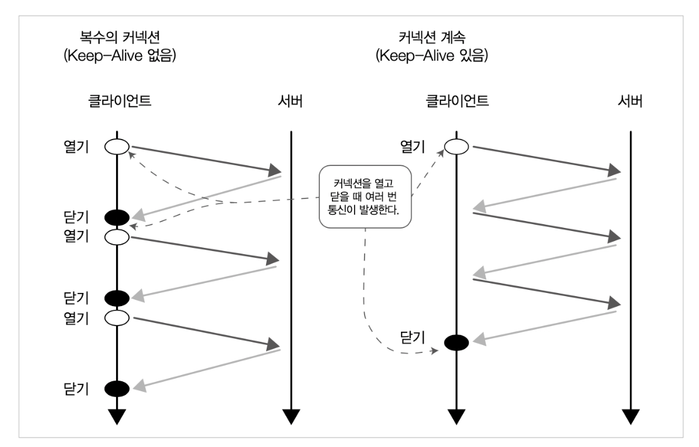
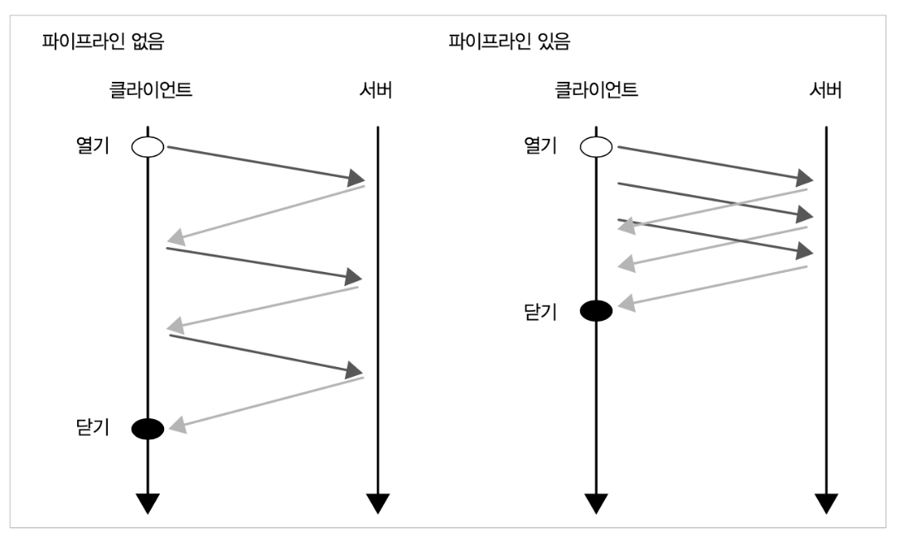
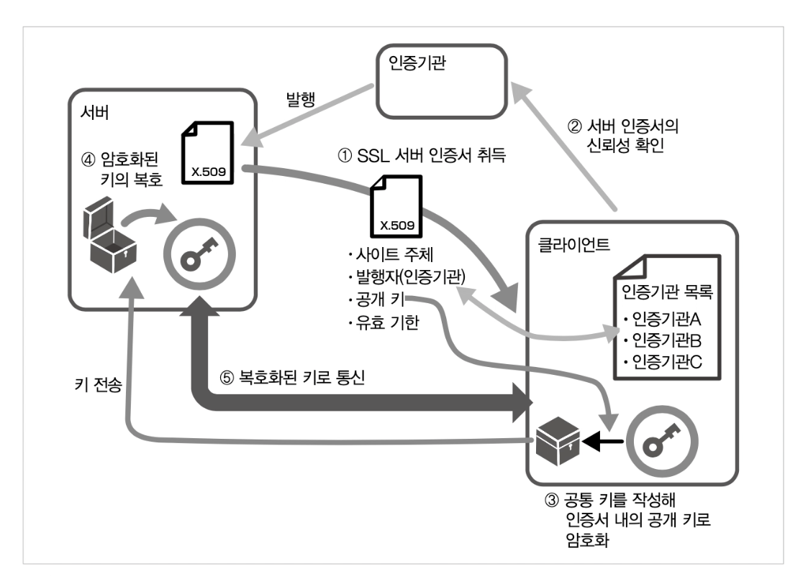

# 4장 HTTP/1.1 신택스 : 고속화와 안전성 추구

HTTP/1.1에 규격화된 것 가운데 가장 큰 주제는 TLS를 통한 안전한 통신 제공이다. 그밖에 여러가지가 추가되었다.

​                                

## HTTP/1.1 변경사항

- 통신 고속화
  - Keep-Alive가 기본적으로 유효하다.
  - 파이프라이닝
- TLS에 의한 암호화 통신을 지원한다.
- 새 메서드 추가
  - PUT, DELETE가 필수 메서드가 되었다.
  - OPTION, TRACE, CONNECT 메서드가 추가되었다.
- 프로토콜 업그레이드
- 이름을 사용한 가상 호스트를 지원
- 크기를 사전에 알 수 없는 콘텐츠의 청크 전송 인코딩 지원

​                         

## 4.1 통신 고속화

### 4.1.1 Keep-Alive

Keep-Alive는 HTTP의 아래층인 TCP/IP통신을 효율화하는 구조이다. 이것을 사용하면 요청마다 통신을 닫는 것이 아니라 연속된 요청에는 접속을 다시 이용한다. 이로써 TCP/IP는 접속까지의 대시 시간이 줄어들고, 통신 처리량이 많아지므로 속도가 올라간 것처럼 느껴진다. 모바일 통신에서는 배터리 낭비도 줄어든다.

HTTP/1.0에서는 헤더에 `Connection:Keep-Alive` 를 추가해서 이용할 수 있지만, HTTP/1.1에서는 이 동작이 기본으로 되어 있다. 이것은 TLS통신을 이용할 때, 특히 통신 시간을 많이 줄여준다. 

HTTP 아래 계층의 프로토콜인 TCP/IP도 접속할 때 1.5회 왕복 통신을 한다. 패킷이 1회 왕복하는 시간을 1RTT(round-trip time)으로 부르며 TLS에서 서버/클라이언트가 통신을 시작하기 전에 정보를 교환하는 핸드셰이크(handshake) 과정에서 2RTT만큼 시간이 걸린다. Keep-Alive를 이용하면 핸드셰이크 횟수를 줄일수 있으며 응답 시간을 개선할 수 있다. 



Keep-Alive를 이용한 통신은 클라이언트가 서버 중 한쪽이 헤더에 `Connection:close` 를 부여해 접속을 끊거나 타이아웃될 떄까지 연결이 유지된다. 

js로 동적으로 request가 가능하기 때문에 실제로는 명시적으로 보내기 보다는 타임아웃으로 접속이 끊어지기를 기다리게 된다. Keep-Alive지속 시간은 클라이언트, 서버 모두 가지고 있으며 한쪽이 TCP/IP연결이 끊는 순간에 통신이 완료되므로 어느 쪽이든 짧은 쪽이 사용된다.

통신이 지속되는 동안 OS 자원을 소비하기 때문에 통신 없이 접속 유지는 바람직하지 않다.

```shell
# curl 커맨드는 복수의 요청을 나열해서 Keep-Alive를 사용한다.
$curl -v http://www.google.com http://www.google.com
```

​                             

### 4.1.2 파이프라이닝

파이프라이닝도 고속화를 위한 기능이다. 이것은 최초의 요청이 완료되기 전에 다음 요청을 보내는 기술이다. 다음 요청까지의 대기 시간을 없애서 네트워크 가동률을 높이고 성능을 향상시킨다. Keep-Alive를 전제로 하며 서버는 요청이 들어온 순서대로 응답을 반환한다.



그대로 동작한다면 왕복 시간이 특히 걸리는 모바일 통신에서 큰 효과를 기대할수 있지만, 클라이언트, 프록시, 서버등의 여러 기능 구현, 설정등에 따라서 제대로 동작하지 않거나 성능이 거의 좋아지지 않았다는 보고도 있다. 

요청받은 순서대로 응답해야만 하므로, 응답 생성에 시간이 걸리거나 크기가 큰 파일을 반환하는 처리가 있으면 다른 응답에 영향을 준다. 이것을 HOL 블로킹 (head-of-lie blocking)이라고 불리는 문제이다.

curl 커맨드 자체에서는 파이프라이닝이 지원하지 않는다. 

> HTTP/2에서 스트림이라는 구조로 다시 태어났다. 7장 참고

​                            


## 4.2 전송 계층 보안 (TLS)

[[SSL/TLS역사]](https://www.feistyduck.com/ssl-tls-and-pki-history/)

> ## August 2018
>
> #### TLS 1.3 published as RFC 8446
>
> After 5 years in development, TLS 1.3 has finally been published as [RFC 8446](https://tools.ietf.org/html/rfc8446). This TLS protocol update comes 10 years after the previous version, TLS 1.2.
>
> 
>
> ## July 2020 
>
> #### Browsers disable TLS 1.0 and 1.1
>
> TLS 1.0 and 1.1 have been removed from [Chrome](https://www.chromestatus.com/feature/5759116003770368) and [Firefox](https://hacks.mozilla.org/2020/02/its-the-boot-for-tls-1-0-and-tls-1-1/). Internet Explorer [removed support in September 2020](https://techcommunity.microsoft.com/t5/microsoft-sharepoint-blog/tls-1-0-and-1-1-deprecation/ba-p/1620264).


### curl 활용

curl 커맨드로 접속할 때는 URL을 https로 하면 된다. 다음 옵션으로 세밀하게 동작을 설정할 수 있다. 서버 설정이 맞는지, 각 버전에서 예상한 대로 동작하는지 확인하는데 편리하다.

- `-1, --tlsv1` : TLS로 접속한다.
- `--tlsv1.0, --tls1.1, --tls1.s, --tlsv1.3` : TLS 니고시에이션 시 지정한 버전으로 연결하도록 강제한다.
- `--cert-status : 인증서를 확인한다.`
- `-k, --insecure` : 자가 서명 인증서라도 오류가 되지 않는다.

```shell
$ curl --cert-status -v  https://www.naver.com
```

​                                   

### 4.2.1 해시 함수

해시 함수는 암호화 통신을 하는데 편리한 수학적 특성이 있다.

> 해시 함수 : h() //  입력 데이터 : A, B, ... // 산출된 해시 값 : X, Y, ... // 길이 : len()

- 같은 알고리즘과 같은 입력 데이터라면, 결과로서 생성되는 값은 같다. `h(A) = X` 가 항상 성립
- 해시 값은 알고리즘이 같으면 길이가 고정된다. SHA-256 알고리즘에선 256 비트이다. 따라서 입력 데이터가 너무 작을 경우 해시 값이 더 커지지만 기본적으로는 len(X) < len(A)가 된다.
- 해시 값에서 원래 데이터를 유추하기 어렵다. h(A) = X에서 X로 A를 찾기 곤란하다.  (약한 충돌 내성)
- 같은 해시 값을 생성하는 다른 두 개의 데이터를 찾기 어렵다. h(A) = h(B)가 되는 임의의 데이터 A,B를 찾기가 곤란하다. (강한 충돌 내성)

해시 함수는 여러 용도로 쓰이는데 유명한 해시 함수로는 MD5(128비트), SHA-1, SHA-2 등이 있는데 현재 MD5, SHA-1은 보안 용도로 추천하지 않는다. 

```shell
$ md5 package-lock.json
MD5 (package-lock.json) = da0f337121cfdaac08c72005fc422592

```

​                                

### 4.2.2 공통 키 암호와 공개 키 암호 그리고 디지털 서명

암호화에서 중요한 것은 알고리즘 자체를 비밀로 하는 것이 아니라, 알고리즘이 알려져도 안전하게 통신할 수 있는 것이다. 현재 일반적으로 사용하는 방식은 암호화 알고리즘은 공개하고, 그 암호화에 사용하는 데이터(키)를 따로 준비하는 방식이다. TLS에서 사용되는 방식으로는 공통 키 방식과 공개 키 방식 두 종류가 있다.

공통키 방식은 대칭암호라고도 불린다. 자물쇠 잠글 때와 열 때 모두 같은 열쇠를 사용하는 방식이다. TLS에서는 일반 통신의 암호화에 사용한다.

공개키방식은 비대칭 암호라고도 불린다. 공개 키 방식에서 필요한 것은 공개 키와 비밀키이다. 이 방식에서는 암호화 키와 암호해독 키가 따로 있다. 암호화는 공개키로 하고, 해독하는 것은 비밀 키로하는것이다. 

​                               

### 4.2.3 키 교환

키 교환은 클라이언트와 서버 사이에 키를 교환하는 것이다. 간단한 방법으로는 클라이언트에서 공통 키를 생성한 다음 서버 인증서의 공개키로 암호화해 보내는 방법이 있고, 키 교환 전용 알고리즘도 있다.  (책 148 페이지부터 참고)

​                       

### 4.2.4 공통 키 방식과 공개 키 방식

TLS에서는 통신마다 한 번만 사용되는 공통 키를 만들어내고, 공개 키 방식을 사용해 통신 상대에게 키를 전달한 이후는 공통 키로 고속으로 암호화하는 2단계 방식을 이용한다. 공개 키 방식이 안전성이 높지만, 키를 가지고 있어도 암호화, 복호화 계산량이 공통 키 방식보다 많이 때문이다. 

​                               

### 4.2.5 TLS 통신 절차

1. 핸드셰이크 프로토콜로 통신을 확립하는 단계
2. 레코드 프로토콜로 불리는 통신단계
3. SessionTicket 구조를 이용한 재접속 시의 고속 핸드셰이크



### 서버의 신뢰성 확인

서버의 신뢰선을 보증하는 구조는 공개 키를 보증하는 구조이기도 해서, 공개 키 기반구조(public key infrastructure) PKI 라고 불린다. 브라우저는 서버에서 그 서버의 SSL 서버 인증서를 가져오는 것부터 시작한다.

인증서는 RFC 2459 에서 정의된 X.509 형식이다. 이 인증서에는 사이트 subject, 발행자, 소유자 서버의 공개 키, 유효기한 등의 항목이 있다. 이 신뢰성 확인의 핵심은 발행자이다.

인증서에는 발행자의 디지털 서명이 있다. 그 발행자의 인증서를 취득해서 서명을 검증할 수 있다. 그리고 다시 상위 발행자의 인증서도 차례로 검증해간다. 최종적으로는 발행자와 주체자가 동일한 인증서가 나온다. 이것은 루트 인증기관이라고 불린다. 이것만 가지고는 신뢰성을 보증할수가 없기 때문에 브라우저와 OS에는 미리 신뢰할 수 있는 인증기관의 인증서가 설치되어 있다. 이 인증서와 대조해서 최종적으로 서버가 승인된 것임을 확인할 수 있다.

신뢰가 확인되지 않은 발행자와 주체가 같은 인증서는 '자가 서명 인증서'라고 한다. 인증서 자체는 OpenSSL 등의 도구로 손쉽게 만들 수 있다. 자신이 만든 인증서를 직접 OS에 등록해서 개인용 서비스 인증에 사용하거나 사내 PC에 일괄적으로 설치해 사내 전용 서버를 확인하는데 사용할 수 있다.

> 공개키 기반에는 인증기관이 해킹당한 경우를 대비해 실효된 인증서를 관리하는 시스템도 갖추고 있다.


### 4.2.6 암호강도

### 4.2.7 암호화 스위트

### 4.2.8 프로토콜 선택

### 4.2.9 TLS가 지키는 것


## 4.3 PUT 메서드와 DELETE 메서드


## 4.4 OPTIONS, TRACE, CONNECT

### 4.4.1 OPTIONS

### 4.4.2 TRACE(TRACK)

### 4.4.3 CONNECT


## 4.5 프로토콜 업그레이드

### 4.5.1 클라이언트 쪽에서 업그레이드

### 4.5.2 서버 쪽에서 업그레이드를 

### 4.5.3 TLS 업그레이드의 문제점


## 4.6 가상 호스트 지원


## 4.7 청크

### 4.7.1 메세지 끝에 헤더 추가


## 4.8 바디 전송 확인


끗

