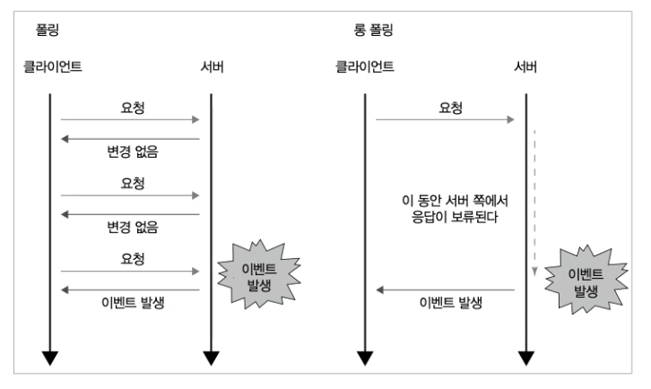
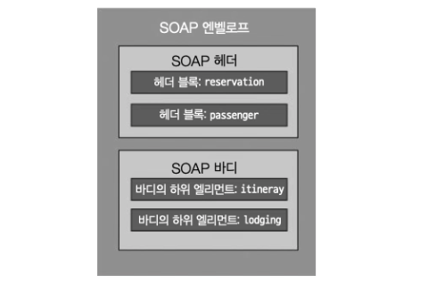

# 5장 확장되는 HTTP용도

## 5.1 파일 다운로드 후 로컬에 저장

브라우저가 파일을 어떻게 처리할지 결정하는 것은 서버가 보낸 MIME 타입이다. 

예를 들어 서버 응답에 `Content-Disposition` 헤더가 있으면 브라우저는 다운로드 대화상자를 표시하고 파일을 저장한다. filename으로 지정된 파일명이 다운로드 대화상자에 기본값으로 표시한다.

```
Content-Disposition: attachment; filename=filename.xlsx
```


다음과 같이 RFC 6266에 정의된 규칙대로 인코딩하면, 모던 브라우저에서는 UTF-8로 인코딩된 파일명을 사용할수 있다. 

```
// 파일명으로 한글도 사용가능
Content-Disposition: attachment; filename*=utf-8'' 파일명.xlsx; filename=filename.xlsx
```

RFC 5987 파일명 규칙이 `*utf-8''` 이라는 쪽이고, 또 한쪽은 하위 호환성을 위한 이름이다.


curl 커맨드는 `-J/--remote-header-name` 옵션을 지정하면 Content-Disposition 헤더에 설정된 이름으로 로컬을 저장한다. 단 URL 인코드의 디코드는 하지 않아서 `%20` 등이 그대로 출력된다. `-0/--remote-name` 옵션을 지정하면, URL 자체를 이름으로 저장한다. 아무 옵션도 주지 않으면 파일로 저장하지 않고 콘솔에 출력한다.

```shell
$ curl -0 http://example.com/download/sample.pdf
```

헤더에 `Content-Disposition: inline` 이 있으면 브라우저가 파일을 저장하지 않고 명시적으로 브라우저에서 인라인 표시를 한다. `Content-Dispositioin` 헤더를 이용한 다운로드 기능은 원래는 이메일 첨부 파일을 위해 정의된 규격이다. 

아래와 같은 다운로드 페이지가 있는 경우가 있다.

```
다운로드해주셔서 감사합니다.
만약 다운로드가 시작되지 않을 때는 이곳을 클릭하세요.
```

이 때 서버는 두 개의 URL을 제공한다. 하나는 실제로 파일을 다운로드하는 페이지로 `Content-Disposition`헤더로 다운로드할 파일을 Body로 반환한다. 

또 하나의 URL은 HTML페이지를 반환하는데, 거기에는 위에서 예로 든 다운로드 감사 메세지와 함께 아래 헤더를 포함한다. 

```html
<meta http-equiv="refresh" content="0;URL=./download_file">
```

브라우저가 페이지를 표시할 때 `Content-Disposition` 헤더가 있으면, 페이지 표시를 리셋하지 않고 다운로드만 한다. 그 점을 이용해서 다운로드 완료 페이지를 보여줄 수 있다. 우선 완료 페이지를 사용자에게 보여준다. 브라우저는 그 콘텐츠를 표시할 때 상기의 메타 태그를 발견하고 그 페이지로 이동하려고 한다. 이동할 곳에는 `Content-Disposition` 헤더가 있으므로, 이동을 지시한 페이지를 그대로 둔 채 다운로드가 시작된다.  (?? 왜 이렇게 해야 하는가?)

​                                   

## 5.2 다운로드 중단과 재시작


HTTP는 다운로드가 중단되면 중단 지점부터 다시 시작하는 방법을 제공한다. RFC 2616, RFC 7233 이다. 중간부터 재시작한다는 것은 큰 파일에서 지정한 범위를 잘라내 다운로드한다는 의미이다. 서버가 범위 지정 다운로드를 지원하는 경우는 Accept-Ranges 헤더를 응답에 부여한다. 

```
Accept-Ranges: bytes
```

Accept-Ranges 헤더는 두 가지 값을 가질 수 있다.

- Accept-Ranges: bytes; 범위 지정 다운로드를 받아들인다. 단위는 바이트
- Accept-Ranges: none; 범위 지정 다운로드를 받아들이지 않는다.

주의할 것은 재 다운로드 시 대상 파일이 중간에 변경되면, 이미 다운로드 해둔 파일 조각의 가치가 없어지므로 파일 변경을 탐지할 필요가 있다는 점이다. 대상 파일의 Etag 헤더도 서버에서 받아오는게 좋다.

요청을 보낼 때 Range 헤더를 추가해 전송해서 원하는 범위;를 지정한다.

```
Range: bytes=1000-1999
```

바이트 지정은 0부터 카운트 하며 끝위치도 다운로드 대상이 된다. 

- 1000-1999 : 1001번째 바이트 부터 2000번째 바이트까지의 컨텐츠를 요구
- 0-0 : 처음 1바이트만을 요청하는 지시
- -999: 파일 처음부터 1000바이트를 가져온다.
- 2000- : 2001바이트부터 파일 끝까지 가져온다.

```
HTTP/1.1 206 Parial Content
.
.
.
Content-Length: 1000
Content-Ranges: 1000-1999/5000
```


Content-Length 헤더에는 실제로 보낸 바이트수가 들어간다. 

Content-Ranges 는 실제로 반환한 범위이다. `/` 이후에는 전체 바이트 수가 들어간다. 서버 자신도 범위를 인지하지 못한 경우는 별표(*)가 설정되기도 한다. 

Content-Type도 요청한 파일의 MIME 타입이 들어간다. 클라이언트는 이미 다운로드된 데이터 조각과 연결해 원래 파일로 복원한다.

클라이언트가 지정한 범위가 무효인 경우에는 서버는 다음과 같은 응답을 반환한다.

```
HTTP/1.1 416 Range Not Satisfiable
.
.
Content-Ranges: */5000
```

콘텐츠가 압축된 경우는 압축된 바이너리 파일에 대한 범위를 지정한다. 압축 전 크기나 어떤 방식으로 압축됐는지는 이 범위 지정 구조에서 알 수 없는 블랙박스로 되어 있다.

If-Range를 사용해 조건부 GET을 할 수 있다. 이 헤더에는 ETag나 일시를 설정한다. 일반 캐시처럼 비교해 조건에 맞는 경우, 서버는 범위 지정 액세스를 실행하고 응답을 반환한다. 만약 조건이 맞지 않으면 범위 지정 액세스가 아니라 일반 GET 액세스가 된 것으로 보고 파일 전체를 반환한다.

​                                 

### 5.2.1 복수 범위 다운로드

Ranges 헤더로 복수의 범위를 지정할 수 있다. 이 경우 멀티파트 폼과 비슷한 multipart/byteranges 라는 Content-Type으로 결과가 돌아온다. 

```
// 요청 예시
Range: bytes=500-999,7000-7999
```

응답

```
HTTP/1.1 206 Partial Content
Date: Wed, 15 Nov 1995 06:25:24 GMT
Last-Modified: Wed, 15 Nov 1995 04:58:08 GMT
Content-Length: 1741
Content-Type: multipart/byteranges; boundary=THIS_STRING_SEPARATES

--THIS_STRING_SEPARATES
Content-Type: application/pdf
Content-Range: bytes 500-999/8000

...처음 지정된 범위 데이터...
--THIS_STRING_SEPARATES
Content-Type: application/pdf
Content-Range: bytes 7000-7999/8000

...두 번째로 지정된 범위 데이터
```

멀티파트 폼은 요청에 많은 데이털르 넣으려고 사용했지만, multipart/byteranges는 응답에 많은 데이터 조각을 넣으려고 사용한다.

​                                      

### 5.2.2 병렬 다운로드

서버가 세션마다 대역을 제한할 경우, 영역을 나눠 세션마다 Range 헤더를 이용해 HTTP 접속을 하는 것으로 병렬로 다운로드 할 수 있었다. 다만 병렬 다운로드는 서버에 지나치게 부담을 주기 때문에 권장되진 않는다. 중간 회선이 병목이 되면 아무리 병렬화해도 속도는 변하지 않고, 통신량이 몰려 오히려 늦어질 수 있다. 

​                                                   

## 5.3 XMLHttpRequest

XMLHttpRequest는 클라이언트가 서버에 요청을 보내고, 그 응답으로 서버가 클라이언트에 데이터를 보낼 수 있다. 

```js
var xhr = new XMLHttpRequest();
xhr.open("GET", "/json", true);

// 버전에 따라서 onreadystatechange이기도 하다.
xhr.onload = function() {
  // 응답이 돌아왔을 때 호출되는 메서드
  if(xhr.status === 200) {
    // JSON 파싱해서 표시
    console.log(JSON.parse(xhr.responseText));
  }
};
xhr.setRequestHEader("MyHeader", "HeaderValue");
xhr.send();
```

```shell
# 다음과 같은 의미이다.
$ curl -H "MyHeader=HeaderValue" /json
```

open() 메서드로 메서드와 보낼 곳을 지정하고 있다. 3번째 파라미터는 비동기 여부이다.  만약 동기 실행일 경우 send() 메서드가 응답이 돌아올때까지 끝나지 않게 된다.

send() 메서드로 실제 전송을 시작한다. 이 메서드에 데이터를 넘겨주면 데이터를 서버로 전송한다.

```js
var xhr = new XMLHttpRequest();
xhr.open("POST", "/json", true);
xhr.onload = function() {
  // 응답이 돌아왔을 때 호출되는 메서드
};
xhr.send(JSON.stringify({"message":"hello world"}));
```

```shell
# curl 커맨드로 똑같은 작업을 하려면 -d로 데이터를 넘겨준다. 
# 전송하고 싶은 JSON을 파일에서 읽어오고 싶을 때는 @을 붙여 파일명을 지정하거나 -T를 사용한다.
$ curl -d @send.json /json
$ curl -T send.json /json
```

​                         

### 5.3.1 XMLHttpRequest와 브라우저의 HTTP 요청차이

`XMLHttpRequest를 이용한 처리 ` 와 `브라우저에서 HTML일고 폼으로 데이터 전송하는 처리` 를 비교하는 다음이 다르다.

- 송수신할 때 HTML 화면이 새로 고침되지 않는다.
- GET, POST 이외의 메서드도 전송할 수 있다.
- 폼의 경우 키와 값이 1:1이 되는 형식의  데이터만 전송할 수 있고, 응답은 브라우저로 표시되지만, 플레인 텍스트, JSON, 바이너리 데이터, XML등 다양한 형식을 송수신할 수 있다.

- 몇 가지 보안상 제약이 있다.

브라우저와 달리 XMLHttpRequest를 이용하면 js 내에서 송수신이 완결되므로 화면이 지워지지 않아도 서버에 가져올 수 있다. 이렇게 화면을 지우지 않고 웹페이지를 읽어오거나 시간이나 타이밍에 따라 몇번이고 갱신할 수 잇는 아키텍처를 Ajax라고 부른다. 

XMLHttpRequest는 다양한 포맷을 지원한다. responseType에 문자열을 설정해서 반환값을 어떤 오브젝트로서 respnose에 저장할지 결정할 수 있다. 파일 형식과 이진 데이터를 덩어리로 저장하는 자료형인 Blob 오브젝트를 받아 img 태그로 표시하는 코드는 다음과 같다.

```js
// ...
xhr.responseType = 'blob';
xhr.onload = function(e) {
  if(this.status == 200) {
    var blog = this.reponse;
    var img = document.createElement('img');
    img.onload = function(e) {
      wihndow.URL.revokeObjectURL(img.src);
    };
    img.src = window.URL.createObjectURL(blob);
    document.body.appendChild(img);
    // ....
  }
};
xhr.send();
```


#### responseType으로 설정가능한 문자열

| 설정값      | 데이터형     |
| ----------- | ------------ |
| arraybuffer | ArrayBuffer  |
| blob        | Blog         |
| document.   | Document     |
| json        | JSON         |
| xml         | XML          |
| text        | string(기본) |


responseType을 설정하지 않은 경우, 데이터가 XML의 MIME 타입(text/xml, application/xml) 이면 responseXML, 그 외에는 문자열 형식으로 저장된다. 서버가 MIME 타입을 설정하지 않으면 다음처럼 MIME 타입을 클라이언트가 지정한다.

```
xhr.overrideMimeType('text/xml');
```

```js
// IE에서는 JSON을 사용할 수 없다.

// ...
xhr.onload = function(e) {
  if(this.status == 200) {
    // IE11 대책
    var json = JSON.parse(xhr.responseText);
    // 그외
    var json = xhr.response;
    console.log(json);
  }
}


// IE 이외
xhr.responseTYPe = 'json';
xhr.send();
```

​                           

### 5.3.2 코멧

XMLHttpRequest를 이용해 거의 실시간 양방향 통신을 하는 기술을 코멧(comet)이라고 한다. 이 방법은 가장 레거시한 구조를 응용한 기술로 고성능이 아닌 대신 더 많은 환경에서 사용할 수 있다.

단방향 통신을 이용해 양방향 통신을 하기 위해서는 폴링, 롱 폴링이라는 2가지 방법이 있다. 



폴링은 통지를 받는 쪽에서 빈번하게 통지가 없는지 묻는 방식이다. 코멧은 롱 폴링을 사용한 구현 방법이다. 일단 클라이언트가 서버에 요청을 보내면, 서버는 바로 응답하지 않고 응답을 보류한 채 대기한다. HTTP 통신에서는 서버가 통신을 종료하거나 요청이 타임아웃될 때까지는 클라이언트로 응답이 돌아오지 않는다. 접속 완료 권한이 서버에 있는 점을 응용해 서버의 응답을 자유로운 타이밍에 돌려줘서 서버에 요청인 것처럼 가장해 정보를 송신한다. 리버스 Ajax라고 불리는 일도 있다.

레거시 구조를 응용하므로 비교적 많은 환경에서 동작한다는 장점이 있지만, 당연히 단점도 있다. 우선 HTTP는서버에서 클라이언트로 메세지를 보내는 전용 API가 아니고, 쿠키 등을 포함한 대ㅇ량의 헤더를 부여해 송수신하는 구조이다. 나중에 등장한 다른 시스템보다도 메세지당 오버헤드는 큰 편이다. 그리고 ㅣㅇㄹ단 서버에서 메세지를 보내면 클라이언트 ㅈ고에서 세션을 다시 연결하지 않는 이상 통신을 보낼 수 없다. 서버로부터 연속된 메세지 전송에는 강하지 않다. 이후 레거시 HTTP에서 응답성이 더 좋은 SSE 가 만들어 졌다. (7장)

​                                         

### 5.3.3 XMLHttpRequest의 보안

XMLHttpRequest의 보안 제어는 액세스할 수 있는 정보 제한과 전송 제한이라는 두 가지 제한으로 구성된다. 

### 정보 제한

우선 액세스할 수 있는 정보의 제한으로는 쿠키가 있다. httpOnly 속성을 쿠키에 부여하면, 스크립트로 액세스할 수 없으므로, 임의의 스크립트가 삽입되더라도 보안상 바람직하지 않은 쿠키를 외부로 유출될 위험이 줄어든다.


### 전송 제한

전송 제한에는 도메인, 메서드, 헤더 세종류가 있다. 

​                            

#### 도메인 제한

우선 동일 출처 정책으로 요청을 보낼 수 잇는 도메인 제한이 있다. 스크립트로 어느 웹사이트에나 자유롭게 액세스할 수 잇게 되면, 악의가 있는 웹사이트로 정보를 전송해버리는 문제가 있다. 이를 방지하기 위해 기본적으로 브라우저가 액세스하고 있는 호스트에만 접근할 수 있다. 그 밖의 사이트에 액세스하는 방법으로 XMLHttpRequest뿐만 아니라 브라우저에서 널리 이용되는 크로스 오리진 리소스 공유 CORS라는 액세스 제한 시스템이 있다. 

#### 메서드 제한

CONNECT, TRACE, TRACK을 지정하면 open()메서드를 호출할 때 SecurityError 예외를 보낸다. CONNECT가 가능해지면 잘못해서 악의적인 페이지를 열었을 때 메일 서버로 스팸 메일등을 보낼 수 있다. TRACK, TRACE는 크로스 사이트 트레이싱 대책이다. (4.4.2 참고)

#### 헤더 제한

헤더는 현재이ㅡ 프로토ㅗㄹ 규약이나 환경에 영향을 미치는 것, 쿠키처럼 보안에 영향을 주는 것, 브라우저의 능력을 넘을 수 없을 것 등이 금지되어 있다. 브라우저의 능력을 넘을 수 없단ㄴ 것은 브라우저 자신이 지원하지않는 압축 ㅣ형식을 Accept-Encoding으로 지정하는 행위를 할 수 없다는 뜻이다. 앞으로 사용될 것에 대비해서, Sec-..으로 시작되는 키가 Proxy-로 시작되는 키도 금지되어 있다.

​                                    

## 5.4 지오로케이션

물리적 위치를 측정하는 데는 클라이언트 자신이 측정해서 서버에 보내는 방법과 서버가 클라이언트의 위치를 추측하는 방법 2가지가 있다.

​                            

### 5.4.1 클라이언트 자신이 위치를 구하는 방법

모던 브라우저는 지오로케이션 API를 제공한다. 스마트폰은 내장된 GPS나 기지국 정보를 활용해 위치 정보를 알려줄 수 있다. GPS가 없는 컴퓨터라도 와이파이 등을 이용한 위치 측정으로 대략적인 위치를 추측해서, 그 위도와 경도를 알려 줄 수 있다. 

와이파이 자체에는 GPS가 없어서 와이파이에서 위치 정보를 알아내는 것은 다음과 같다. 우선 와이파이 액세스 포인트의 고유 ID(BSSID)와 위도, 경도 정보를 데이터 베이스로 사전에 구추갷준다. 클라이언트는 OS의 API를 이용해 현재 자신이 액세스할 수 잇는 액세스 포인트의 BSSID를 가져와 서버에 문의해 위도와 경도를 조회한다. 

BSSID는 스마트폰이나 컴퓨터에서 와이파이를 선택할 때 보이는 이름 (SSID, ESSID)과 다르다.  BSSID는 와이파이 기기의 식별자의 48비트 수치로, 기기마다 독특한 수치로 되어 있다. 맥주소 같은 것이다.

차를 몰아서 접속가능한 액세스 포인트 정보와 위치 정보 DB를 구축, 또는 스마트폰 GPS와 와이파이을 이용해서 위치 정보 수집 (크라우드 소싱) 지오로케이션 API로 규격화 

​                                                                             

### 5.4.2 서버가 클라이언트 위치를 추측하는 방법

GEO IP 라고 불리는 IP 주소로 추측하는 방법이 있다. IP 주소는 지역마다 등록 관리 기관이 있어, 기업이나 프로바이더 등에 IP주소를 할당한다. 정확한 장소까지는 관리하지 않는다. 이 방식도 지오로케이션처럼 꾸준히 모은 데이터를 바탕으로 위치 정보를 알려주는 서비스가 있다.

​                      

### 5.5 X-Powered-By 헤더

서버가 브라우저에 응답할 때에 부여하는 헤더에 X-Powerer-By라는 헤더가 있다. 브라우저단에서 호환성 문제를 피하기 위해 이 헤더를 사용할 수 있다. 서버의 종류, 버전 정보를 표시하는 헤더라고 보면된다. 서버의 종류와 버전을 알면 알려진 이슈들을 이용해서 공격하기 쉬워지기 때문에 숨겨야 할지 논란이 있다.

​                               

## 5.6 원격 프로시저 호출

프로시저는 각 언어가 제공하는 함수, 클래스 메서드와 같은 것을 말한다. 서브루틴으로 불린적도 있다. '일련의 처리가 나열된 처리의 집합'이라고 보면 된다.

원격 프로시저 호출 RPC란 다른 컴퓨터에 있는 기능을 마치 자신의 컴퓨터안에 있는것ㅊ럼 호출하고, 필요에 따라 반환값을 받는 구조이다. 원격 메서드 호출 RMI이라고 불리는 경우도 있다. 

​                                      

### 5.6.1 XML-RPC

최초로 규격화된 것이 XML-RPC이다. Content-Length를 명시해야 했고, HTTP/1.1의 청크 방식은 지원하지 않는다. 전송에 사용하는 메서드는 POST이고 호출하는 인수와 반환값  모두 XML로 표현하므로, Content-Type은 항상 text/xml이다. GET은 캐시될 가능성이 있으므로 RPC통신에는 적합하지 않다. 

XML-RPC를 공개한 서버는 조금 오류가 있어도 스테이터스 코드에는 기본적으로 200 OK를 되돌려주도록 되어 있다.

 XML-RPC는 RPC통신이면서도 통신 내용이 플레인 텍스트이므로, 개발자가 특별한 도구를 사용하지 않아도 읽을 수 있는 것이 특징이다. 파이썬은 표준 라이브러리로 XML-RPC의 서버와 클라이언트 작성을 모두 지원한다.

- https://wiki.kldp.org/HOWTO/html/XML-RPC-HOWTO/xmlrpc-howto-intro.html
- http://xmlrpc.com/

​                         

### 5.6.2 SOAP

SOAP는 XML-RPC를 확장해서 만들어진 규격이다. SOAP는 단순한 RPC였던 XML-RPC보다 복잡하게 되어 있다. 

SOAP 자체는 데이터 표현 형식으로 SOAP 규격 안에 SOAP을 사용한 RPC인 SOAP-RPC도 정의되어 있습니다. HTTP 안에 미니 HTTP와 같은 구조로 되어 있다. 이로써  HTTP이외에도 메일 전송 프로토콜(SMTP)을 써서 SOAP 메세지를 주고받을 수도 있다. 헤더에는 요청의 메서드나 트랜잭 정보를 기술하고, 엔벨로프에는 데이터가 들어간다. 



SOAP와 강하게 연관된 WSDL(웹 서비스 정의 언어)을 사용해서 어느 웹 섭의 어느 경로가 어떤 SOAP 메세지를 받고, 어떤 응답의 SOAP 메세지를 반환할 것인지 기술할 수 있게 됐다. 손으로 작성하기는 매우 힘들다. 

​                      

### 5.6.3 JSON-RPC

JSON-RPC는 XML-RPC의 XML대신 JSON을 이용한 원격 프로시져 호출이다. JSON-RPC는 HTTP 이외에 TCP/IP 소켓등을 사용하는 것도 가정하고 있다. 단순함을 추구하면서도 몇가지 XML-RPC와 다른 기능도 갖추고 있다.

요청할 때 필요한 것은 Content-Type, Content-Length, Accept이다. 메서드는 대부분 POST를 사용하는 것이 바람직하다고 한다. 다만 멱등하면서 안전한 메서드를 호출할 때는 GET도 사용할 수 있다. 각 메세지에는 버전 지정을 위해 `"jsonrpc": "2.0"` 이 필요하다. id를 생략하면 서버에서 응답을 돌려주지 않는 Notification이라는모드가 된다. 이 경우 응답에는 아무것도 포함되지 않는다. JSON-RPC는 이밖에도 스테이터스 코드를 몇 가지 정했다.

- 200 OK
- 204 No Response/202 Accepted : Notification 시의 바환값
- 307 Temporary Redirect/308 Permanent Redirect : 리다이렉트 (자동재전송은 하지 않는다.)
- 405 Method Not Allowed : GET 메서드가 지원되지 않는 안전하지 않은 메서드에 GET 메서드를 이용했다. 
- 415 Unsupported Media Type : Content-Type이 application/json이 아니다.

다른 메서드 호출 규약으로 Batch모드가 있다. 요청의  JSON 오브젝트를 여러 개 모아 배열에 넣어 전송해 한 번의 HTTP 요쳥으로 복수의 프로시저를 호출한다. 이 경우 응답도 배열에 담겨 돌아온다.

- https://www.jsonrpc.org/specification
- https://slidesplayer.org/slide/15012108/

​                           

## 5.7 WebDAV

WebDAV는 HTTP를 확장해 분산 파일 시스템으로 사용할 수 있게 한 기술이다. 단순히 이용하는 것이라면 윈도우 익스플로러(네트워크 위치 추가), 맥 OS의 finder(서버에 연결), 리눅스 계열 운영체제에도 쉽게 연결할 수 있다. 또한 WebDAV를 더욱 확장해 달력과 투두를 동기화하는데 쓰기 위한 CalDAV 도 RFC4791에서 규정했다. 

- 리소스 : 일반 파일 시스템에서는 데이터를 저장하는 아토믹 요소를 '파일'이라고 부르지만 WebDAV 에서는 HTTP용어를 그대로 이어받아 '리소스'로 부른다.
- 컬렉션 : 폴더와 디렉터리에 해당하는 요소이다.
- 프로퍼티 : 리소스와 컬렉션이 가질 수 있는 추가 속성이다. 작성일시와 갱신일지, 최종 갱신자와 같은 정보가 해당한다. 
- 락 : 분산 파일 시스템은 같은 폴더를 여러 사람이 동시에 보고 데이터를 공유할 수 있지만, 같은 파일을 동시에 편집하게 될 경우가 있다. 같은 파일에 여러 사람이 동시에 기록하면 마지막에 전송된 내요 ㅇ이외에는 지워져 버린다. 이를 피하기 위해 먼저 선언한 살마 이외의 변경을 거절하는 시스템이다. 

HTTP/1.1의 POST, GET, PUT, DELETE 메서드와 COPY, MOVE, MKCOL (컬렉션을 작성), PROPFIND , LOCK, UNLOCK 이 추가되었다. 

WebDAV은 동기를 전제로한다. 네트워크가 없으면 파일 목록을 가져올 수 조차 없다. WebDAV는 구조상 로컬 파일 시스템보다 성능이 떨어진다.

- https://ko.wikipedia.org/wiki/WebDAV

​                                 

## 5.8 웹사이트 간 공통 인증 및 허가 플랫폼

- 인증 (authentication) : 로그인하려는 사용자가 누구인지 확인한다. 브라우저를 조작하는 사람이 서비스에 등록 어느 사용자 ID의 소유자인지 확인한다.
- 권한 부여 (authorization) : 인증된 사용자가 누구인지 파악한 후, 그 사용자에게 어디까지 권한을 부여할지 결정한다.

​                                        

### 5.8.1 싱글 사인온 (SSO : single sign-on)

싱글 사인온은 시스템 간 계정 관리를 따로따로 하지 않고, 한 번의 로그인을 전 시스템에 유효하게 하는 기술이다. 싱글 사인온은 프로토콜이나 정해진 규칙이 아니라 이런 용도로 사용되는 시스템을 가리키는 명칭이며 구현 방법도 여러가지 이다.

각 서비스가 인증 서버에 직접 액세스하러 가는 방법이 가장 이해하기 쉽다. 사용자 ID와 패스워드를 서비스마다 입력해야 하므로 싱글 사인온은 아니지만 사용자 ID를 일원화대 관리할 수 있게 된다. 각 애플리케이션은 인증 시스템에 로그인하는 과정을 대행한다. 그밖에도 티켓을 이용한 방법이 있다. 

웹 서비스에서는, 각 서비스의 앞단에 HTTP 프록시 서버를 두고 인증을 대행하는 방법과 각 서비스에 인증을 대행하는 에이전트를 넣고 로그인 시 중앙 서버에 액세스해 로그인됐는지 확인하는 방법도 있다 ??

​                        

### 5.8.2 커베로스 인증

본래의 사용자 관리 구조를 하나로 정리해, 모든 시스템에서 이용하는 방법이 있다. 

공통 규격으로 기업 내에서도 많이 이용되는 것이 RFC 2251에서 정의된 LDAP (Lightweight Directory Access Protocol) 이다. OpenLDAP, AD (Active Directory) 같은 구현이 있다. LDAP는 원래 싱글 사인온을 위한 시스템이 아니라, 이용자, 조직, 서버 등 기업 내 정보를 일원화해 관리하는 데이터 베이스이다. v3에서 추가된 SASL (Simple Authentication and Security Layer) 이라는 인증 기능과 세트로 기업 내 마스터 인증 시스템으로 사용된다. RFC 1510, RFC 4120 에 정의된 커베러스 (Kerberos) 인증이 널리 사용된다.

커베로스 인증을 하면, 티켓 보증 서버로의 액세스 토큰인 티켓 보증 티켓 (TGT)과 세션 키를 얻을 수 있다. 서비스와 시스템을 사용할 때는 TGT와 세션 키를 티켓 보증 서버(TGS)에 보내고 클라이언트에서 서버로 액세스하기 위한 티켓과 세션키를 받는다. 이들은 서비스가 가진 비밀 키로 암호화 되어 있다. 사용자가 서비스를 사용할 때는 이 티켓과 세션 키를 서비스에 보내면서 싱글 사인온이 실현된다.

​                                                                               

### 5.8.3 SAML (Security Assertion Markup Language)

SAML은 웹 계통의 기술(HTTP/SOAP)을 전제로 한 싱글 사인온 구조이다. 이것은 XML 기반의 표준을 만힝 다루는 OASIS에서 책정한 규격이다. SAML은 쿠키로 세션을 관리하는 웹 구조를 따르고, 도메인을 넘어선 서비스 간 통합 인증을 할 수 있다. SAML을 지원하는 싱글 사인온은 많은 SaaS 웹서비스가 나온다. 서비스 간 정보 교환 케타데이터도 공통화되었다.

- 사용자 : 브라우저를 조작하는 사람
- 인증 프로바이더 (IdP) : ID를 관리하는 서비스
- 서비스 프로바이더 (SP) : 로그인이 필요한 서비스

#### 구현 방법

- SAML SOAP 바인딩
- 리소스 SOAP (PAOS) 바인딩
- HTTP 리다이렉트 바인딩
- HTTP POST 바인딩
- HTTP 아티팩트 바인딩
- SAML URI 바인딩


#### HTTP POST 바인딩

우선 사전 준비로 인증 프로바이더에 서비스 정보를 등록한다. 등록할 때는 메타 데이터로 불리는 XML파일을 사용한다. XML파일에는 다음과 같은 항목이 포함된다.

- 서비스 아이디 (인증 프로바이더가 서비스를 식별하기 위한 것)
- 인증 프로바이더가 HTTP-POST 할 엔드 포인트 URL
- 바인딩 (urn:oasis:names:tc:SAML:2.0:bindings:HTTP-POST 등)
- 경우데 따라서는 X.509 형식의 공개 키

서비스 프로바이더 쪽에도 인증 프로바이더 정보를 등록한다. 등록할 정보는 인증 프로바이더가 XML 파일로 제공한다. 여기에도 일련의 통신에서 사용할 엔드포인트 URL 목록과 인증서가 포함된다. 일련의 프로세스사이에 신뢰관계가 맺어져 있는 것이 전제이다.

실제 통신은 단순하다. 사용자가 서비스를 이용하려고 접속했다고 하면, 아직 로그이낳지 않았을 때 서비스 프로바이더는 인증 프로바이더로 리다이렉트 한다. HTTP 리다이렉트 바인딩에는 일반적인 302 스테이터스 코드를 사용한다. 브라우저는 인증 프로바이더 화면을 표시한다. 그 화면에서 로그인에 성공하면 인증 프로바이더는 로그인 정보를 서비스 프로바이더로 POST 한다. 이 때도 자동으로 POST 하는 HTML을 반환한다. 이제 서비스 프로바이더는 사용자가 로그인에 성공한 것을 알 수 있으므로, 처음에 사용자가 요청한 페이지의 콘텐츠를 보여준다. 

​                                 

### 5.8.4 오픈아이디

오픈 아이디는 중앙 집중형 ID 관리를 하지 않고, 이미 등록된 웹 서비스의 사용자 정보로 다른 서비스에 로그인할 수 있는 시스템이다. 현재는 후속 기술인 오픈아이디 커넥트를 이용하는 웹사이트가 늘고 있다. 

#### 오픈 아이디 고유 용어

- 오픈 아이디 프로바이더 : 사용자 정보를 가진 웹서비스. 사용자는 이미 이 서비스의 ID가 있다.
- 릴레잉 파티 : 사용자가 새로 이용하고 싶은 웹 서비스.
- 사용자 입력 식별자 : 사용자가 입력할 URL 형식으로 된 문자열. 오픈 아이디 프로바이더가 제공하며, 오픈아이디 프로바이더의 사용자 프로필 화면등에 표시된다. 사용자를 판별하는 ID가 아니라 서비스명 수준의 식별자가 사용되기도 한다.   

​                                                 

### 5.8.5 오픈소셜

오픈소셜은 회원 정보나 친구 관계를 가져오는 Person&Friend API, 액티비티를 작성하는 Activities API, 정보를 저장하거나 공유하는 Persistence API, 다른 멤버에게 메세지를 보내는 requestSendMessage 등 다양한 기능을 지원하며 인증 뿐만 아니라 플랫폼을 지향했다. 

오픈 아이디의 릴레이 파티의 경우 서비스 쪽 제약은 거의 없고 오픈 아이디 프로바이더와 릴레잉 파티를 사전에 등록할 필요도 없다. 옾느 소셜의 경우, 오픈 아이디 프로바이더에 해당하는 부분이 소셜 네트워크 서비스 제공자이다. 인증과 권한 부여를 모두 이쪽에서 한다. 릴레잉 파티인 서드 파티 애플리메이션은 서버를 SNS 외부에 준비하지만, UI 부분은 가젯으로 불리며 미리 정해진 규칙에 따라 XML 파일을 만들고, 친구 목록을 가져오거나 하는 각종 API를 이용해 자바스크립트와 AJAX로 애플리케이션을 개발한다. 오픈 아이디와 비교하면 여러가지가 밀결합되어 있다.

브라우저의 관점, HTTP 차원에서 보면 오픈 소셜을 사용하는 소셜 인터넷 워크 서비스에 평소처럼 로그인할 뿐 특별한 기능은 사용하지 않는다. HTML의 IFRAME을 사용해 가젯이라는 서드파티 앱에 액세스하지만, 브라우저에서 사용하는  js AJAX API나 도메인 외부 서버에 대한 요청등은 이 가젯 서버에서 대응한다.

가젯 설정 파일인 XML은 외부 서버에 두고, 가젯 서버가 HTTP로 가져온다. 클라이언트 브라우저 요청도 가젯 서버가 중계해서 HTTP로 외부 서버에 도달한다. 외부 서버가 사용자 보를 취득하려면 RESTful API에 HTTP로 액세스한다. 

​                                   

### 5.8.6 OAuth

OAuth는 인증이 아니라 권한을 부여하는 시스템으로 개발되었다. 

지금까지 소개한 것은 모두 '사용자가 누구인가'를 판정하는 인증 프로세스였다. OAuth는 인증이 아니라 권한 부여에 특화된 시스템이다. 권한 부여에 사용하는 시스템은 이것이 처음이다. 최초의 권한 부여에 사용할 수 있는 개방된 시스템이다. 


- 권한 부여 서버 : 오픈아이디에서 말하는 오픈아이디 프로바이더. 사용자는 이 권한 부여 서버의 계정이 있다.
- 리소스 서버 : 사용자가 허가한 권한으로 자유롭게 액세스할 수 있는 대상. 트위터나 페이스북의 경우 권한 부여 서버와 같다.
- 클라이언트 : 오픈아이디에서 말하는 릴레잉 파티. 사용자가 이제부터 사용할 서비스나 애플리케이션. 오픈 아이디와 달리 권한 부여 서버에 애플리케이션 정보를 등록하고 전용 ID (client_id와 client_secret) 를 가져와야 한다. 이  ID를 크레덴셜이라고 부르기도 한다.

오픈 아이디와 OAuth 모두 비슷하게 화면을 전환한다. 사용자가 새로운 웹 서비스를 이용하려고 할 때, 이미 계정이 있는 서비스(트위터나 페이스북)의 웹사이트로 전환된다. 바뀐 화면에서 사용자가 승인 버튼을 누르면, 처음에 연 웹 서비스 화면으로 다시 돌아와 정상적으로 서비스를 이용할 수 있게 된다. 클라이언트갓사용자의 ID와 팻워드를 건들지 않는 것도 같다. (예외는 존재)

화면 전환이 비슷하다고 해도, 인증보다 권한 부여는 큰 영향을 미친다. OAuth로 하는 일은 요금 납부를 하기 위해 신용카드 번호를 맡기는 것과 같다. 이 비유가 조금 극단적이긴 하지만, 실제로 클라이언트=외부 웹 서비스에 무엇을 허가 할지는 '범위로' 결정된다. OAuth도 오픈 아이디처럼 나중에 권한 부여 서버의 설정 화면에서 허가를 취소하거나 허가 범위를 변경할 수 있다.

#### OAuth 2.0 4가지 플로

**Authorization Code**

자주 사용되는 일반적인 방법이다. 웹 서비스의 서버 내에 client_secret을 감출 수 있고, 외부에서 볼 가능성이 없는 경우에 사용한다. 

**Implicit Grant**

client_secret 없이 액세스할 수 있는 패턴. client_secret이 없으므로 클라이언트의 신원을 보증하지 않는다. 안전하게 client_secret을 유지할 수 없는 자바스크립트, 사용자 단말에 애플리케이션 코드를 다운로드하는 스마트폰 앱등을 위한 방법이다.

**Resource Owner Password Credentials Grant**

이제까지는 클라이언트 자신이 사용자의 ID와 패스워드에 접근하지 않았지만 이 방법은 예외이다. 허가 서버가 신뢰하는 클라이언트에서 사용한다. IOS에 내장된 페북, 트위터 연계등이 있다.  (지금도?)

**Client Credentials Grant**

사용자 동의 없이 client_id와 client_secret만으로 액세스하는 방법이다. client_secret을 이용한 클라이언트 인증만 하므로, 서버 사이드 등 client_secret을 외부로부터 감출 수 있는 환경에서 이용할 수 있다.

​                                                  

### 5.8.7 오픈아이디 커넥트

오픈아이디 커넥트는 OAuth 2.0을 기반으로 한 권한 부여뿐만 아니라 인증으로 사용해도 문제가 없게 확장한 규격이다. 인증과 허가에 모두 사용할 수 있고, 게다가 서비스 제공자 (릴레잉 파티/클라이언트) 에서 구현하기도 어렵지 않아 앞으로 사실상의 표준이 될 것이다. 현 시점에서는 구글, 야후! 재팬, 믹시 등의 오픈 아이디 커넥트 프로바이더로서 서비스를 제공하고 있다.

클라이언트 입장에서 볼 때 OAuth 2.0과의 차이는 사용자 프로필에 액세스하는 방법을 규격화한 점이다. 이전에도 서비스마다 사용자 프로필 액세스 권한을 개별적으로 설정해 비슷하게 할 수 있었지만, 규격화되자 어느 서비스나 같은 방법으로 오픈아이디 프로바이더에 사용자 ID 같은 정보를 요청하고 인증에 사용할 수 있게 되었다. 일반 액세스 토큰과 별개로 ID 토큰이 발행되는데, 이 토큰을 사용해 액세스할 수 있다. 사용자 관점에서의 절차는 오픈아이디, OAuth와 같다.

오픈 아이디 커넷트에서는 액세스 토큰과  ID 토큰을 가져오기 위해 두 개의 엔드포인트와 세개의 플로를 정의 했다.

​                                            

##### 권한 부여 엔드포인트

클라이언트가 권한 부여 요청을 보낼 서비스 창구. 클라이언트 인증을 하는 플로에서는 토큰 엔드포인트에 액세스하기 이한 키(권한 부여 코드)를 반환한다. 인증하지 않는 플로에서는 세스 토큰과 ID 토큰은 이 엔드포인트가 반환한다.

​                                                    

##### 토큰 엔드포인트

액세스 토큰과 ID 토큰을 반환하는 창구. 클라이언트를 인증해 강한 권한을 가진 토큰을 반환한다.


#### 3개의 플로

##### Authorization Code Flow

OAuth의 Authorization Code와 같다. client_secret을 은닉할 수 있는 서버 환경용. 권한 부여 엔드포인트에 액세스해서 권한 부여 코드를 가져온 후, 토큰 엔드포인트에 액세스해서 토큰을 얻는다. 클라이언트 인증을 사용할 수 있으므로 가장 강한 권한을 허용할 수도 있다. 

##### Implicit Flow

OAuth의 Implicit Grant와 같다. HTML 상의 자바스크립트 등 client_secret을 은닉할 수 없는 클라이언트 환경용. 권한 부여 엔드 포인트에 액세스해 코드와 토큰을 한 번에 가져온다.

##### Hybrid Flow

Implicit Flow와 비슷하지만 권한 부여 엔드포인트에서 통신에 필요한 토큰과 추가 정보를 얻기 위한 권한 부여 코드를 얻을 수 잇다. 이 권한 부여 코드를 사용해 토큰 앤드포인트에 액세스한다. 


OAuth 2.0에서는 Implicit Grant로 사용자 인증을 하려고하면, 보안에 큰 구멍이 뚫린다고 한다. 이에 대해서 오픈아이디 커넥트에서는 해시 코드를 사용해 각종 토큰을 검증할 수 있게 개량했다.

OAuth 2.0과의 차이는 Hybrid Flow가 가장 크다. OAuth가 목표로 한 것은 3자의 워크플로였지만, 모바일 앱이 보급되면서 4자간의 워크플로가 필요해 졌다.

- 사용자
- 클라이언트1 : 스마트폰 단말의 애플리케이션
- 클라이언트2 : 백엔드 웹 서비스
- 권한 부여 서버


Hybrid Flow는 클라이언트1에서 cliend_secret을 은닉할 수 없는 환경을 위한 Implict Flow로 권한을 부여한 후에, 클라이언트2가 클라이언트 인증을 하면서 토큰의 엔드포인트에 요청을 보내 더 강력한 권한을 가진 토큰을 얻을 수 있게 되었다.

