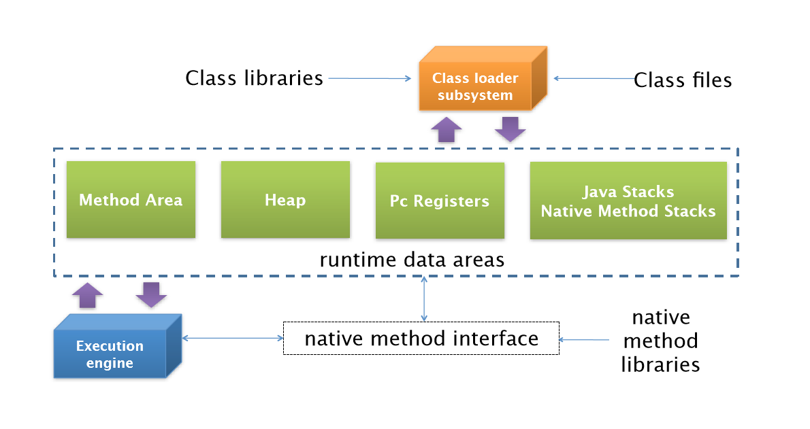

# Runtime Data Areas

## Runtime Data Areas의 구조

Rumtime Data Areas는 Process로서의 JVM이 프로그램을 수행하기 위해 OS로부터 할당받는 메모리 영역이라고 할 수 있다. JVM에서 Class 파일의 실행은 Class Loader를 통해 로딩되면서 시작된다. Heap 이라는 메모리 영역이 속해 있는 Runtime Data Areas와 Garbage Collection을 먼저 다룰 것이다. 그리고 나서 Class Loader와 Execution Engine, Thread Synchronization의 순서로 진행한다.

Runtime Data Areas는 WAS를 사용할 때 가장 빈번하게 성능문제가 발생하는 영역이다. 

주의해야 하는 점은 JVM은 하나의 스펙(Specification)이라는 것이다. Runtime Data Areas 또한 하나의 정의일 분이다. 따라서 구현체보다는 정의, 역할, 목적과 같은 기본 원리에 대해 설명을 할 것이다.

Runtime Data Areas는 각각의 목적에 따라 5개의 영역으로 나뉜다.

- PC Registers
- Java Virtual Machine Stacks
- Native Method Stacks
- Method Artea
- Heap

이중에서 PC Register, JVM Stacks, Native Method Stacks는 각 Thread 별로 생성이 되고 Method Area와 Heap은 모든 Thread에게 공유된다.

## PC Registers

프로그램의 실행은 CPU에서 명령어, 즉 인스트럭션(Instruction)을 수행하는 과정에서 이루어진다. CPU는 이러한 Instruction을 수행하는 동안 필요한 정보를 레지스터라는 CPU내의 기억장치를 사용한다. 이 레지스터는 CPU마다 다르게 구현될 수 있는데 보통 하나의 CPU는 수십 개의 레지스터를 가지고 있다.

그러나 Runtime Data Areas의 메모리 영역인 PC Registers는 이것과 다르다. 자바는 Register-Base가 아니라 Stack-Base로 작동한다. JVM은 CPU에 직접 Instruction을 수행하지 않고 Stack에서 Operand를 뽑아내어 이를 별도의 메모리 공간에 저장하는 방식을 취하고 잇다. 이러한 메모리 공간을 PC Registers라고 한다.

JVM이 이러한 방식을 취한 이유는 레지스터는 CPU에 종속된 것이기 때문이다. 자바는 플랫폼에 독립적이지만 머신의 리소스를 사용하기 위해 현재 작업 내용을 CPU에 Instruction으로 제공해야 한다. 이를 ㅜ이한 버퍼공간으로 PC Registers라는 메모리 영역을 생성한 것이다.

이 PC Registers에는 각 Thread 마다 하나씩 존재하며 Thread가 시작할 때 생성된다. 만약 Thread가 Java Method를 수행하고 있으면 이 PC Registers에는 현재 수행 중인 Java Virtual Machine Instruction의 주소를 가지고 있게 된다. C어넝 등으로 Native Method를 수행하고 있다면 PC Registers는 undefined상태로 있게 된다. 이 PC Registers에 저장되는 Instruction의 주소는 Native Pointer일수도 Method Bytecode의 시작점 일수도 있다.

Native Method를 수행할 때는 JVM을 거치지 않고 바로 수행하게 된다. 어차피 Native Code는 플랫폼에 종속될 수 밖에 없기 때문에 JVM을 경유할 필요가 없기 때문이다. 

## Java Virtual Machine Stacks

Stack Frame

## Native Method Stacks

## Method Area

Type Information

Constant Pool

Field Information

Method Information

Class Variable

Reference to Class (ClassLoader)

Reference to Class (class)

Method Table

## Java Heap

Object Layout

Head의 구조

## Runtime Data Area Simulation

Java Variable Arrangement

Runtime Data Areas Sinulation

