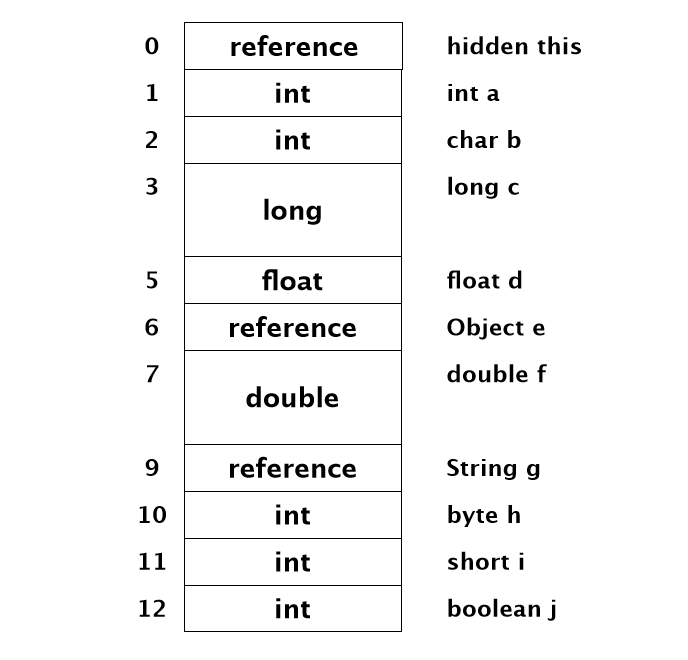
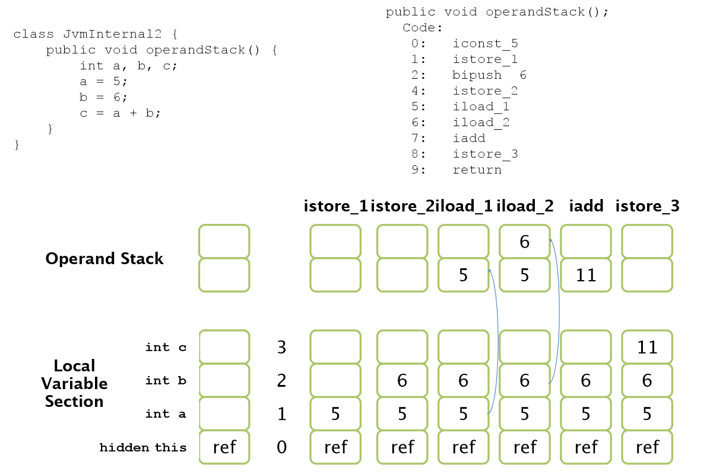
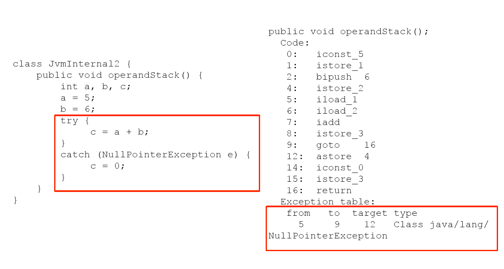
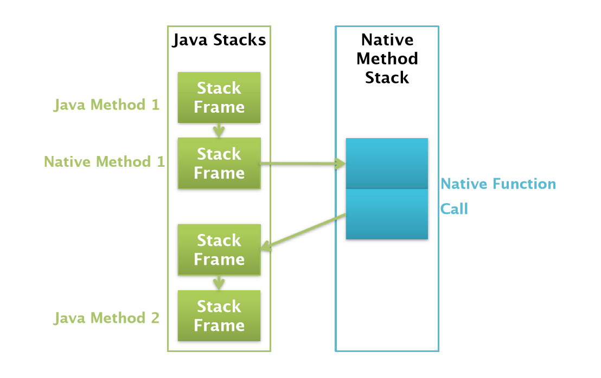

# Runtime Data Areas

## Runtime Data Areas의 구조

Rumtime Data Areas는 Process로서의 JVM이 프로그램을 수행하기 위해 OS로부터 할당받는 메모리 영역이라고 할 수 있다. JVM에서 Class 파일의 실행은 Class Loader를 통해 로딩되면서 시작된다. Heap 이라는 메모리 영역이 속해 있는 Runtime Data Areas와 Garbage Collection을 먼저 다룰 것이다. 그리고 나서 Class Loader와 Execution Engine, Thread Synchronization의 순서로 진행한다.

Runtime Data Areas는 WAS를 사용할 때 가장 빈번하게 성능문제가 발생하는 영역이다. 

주의해야 하는 점은 JVM은 하나의 스펙(Specification)이라는 것이다. Runtime Data Areas 또한 하나의 정의일 분이다. 따라서 구현체보다는 정의, 역할, 목적과 같은 기본 원리에 대해 설명을 할 것이다.


Runtime Data Areas는 각각의 목적에 따라 5개의 영역으로 나뉜다.

- PC Registers
- Java Virtual Machine Stacks
- Native Method Stacks
- Method Artea
- Heap


이중에서 PC Register, JVM Stacks, Native Method Stacks는 각 Thread 별로 생성이 되고 Method Area와 Heap은 모든 Thread에게 공유된다.


## PC Registers

프로그램의 실행은 CPU에서 명령어, 즉 인스트럭션(Instruction)을 수행하는 과정에서 이루어진다. CPU는 이러한 Instruction을 수행하는 동안 필요한 정보를 레지스터라는 CPU내의 기억장치를 사용한다. 이 레지스터는 CPU마다 다르게 구현될 수 있는데 보통 하나의 CPU는 수십 개의 레지스터를 가지고 있다.

그러나 Runtime Data Areas의 메모리 영역인 PC Registers는 이것과 다르다. 자바는 Register-Base가 아니라 **Stack-Base**로 작동한다. **JVM은 CPU에 직접 Instruction을 수행하지 않고 Stack에서 Operand를 뽑아내어 이를 별도의 메모리 공간에 저장하는 방식**을 취하고 잇다. 이러한 메모리 공간을 PC Registers라고 한다.

JVM이 이러한 방식을 취한 이유는 레지스터는 CPU에 종속된 것이기 때문이다. 자바는 플랫폼에 독립적이지만 머신의 리소스를 사용하기 위해 현재 작업 내용을 CPU에 Instruction으로 제공해야 한다. 이를 위한 버퍼공간으로 PC Registers라는 메모리 영역을 생성한 것이다.

이 PC Registers에는 **각 Thread 마다 하나씩 존재하며 Thread가 시작할 때 생성**된다. 만약 Thread가 Java Method를 수행하고 있으면 이 PC Registers에는 현재 수행 중인 Java Virtual Machine Instruction의 주소를 가지고 있게 된다. C언어 등으로 Native Method를 수행하고 있다면 PC Registers는 undefined상태로 있게 된다. 이 PC Registers에 저장되는 Instruction의 주소는 Native Pointer일수도 Method Bytecode의 시작점 일수도 있다.

Native Method를 수행할 때는 JVM을 거치지 않고 바로 수행하게 된다. 어차피 Native Code는 플랫폼에 종속될 수 밖에 없기 때문에 JVM을 경유할 필요가 없기 때문이다. 


## Java Virtual Machine Stacks

JVM Stacks은 Thread의 수행 정보를 기록하는 Frame을 저장하는 메모리 영역이다. JVM Stacks도 Thread별로 하나씩 존재하며 Thread가 시작할 때 생성된다. JVM Stacks에 있는 모든 데이터는 각 Thread가 소유하며 다른 Thread는 접근이 불가능하다. 따라서 JVM Stacks에서는 동기화에 대한 이슈가 발생하지 않는다.

JVM Stacks는 Stack Frame들로 구성이 되는데 JVM은 Stack Frame을 JVM Stacks에 push, pop 작업만 수행한다. 흔히 WAS나 Java Application에 문제가 있을때 `kill -3 pid` 로 Stack Trace, Stack Dump를 얻어내어 분석을 하는데 이 때 나타나는 정보가 JVM Stacks의 Stack Frame의 정보이다. Stack Trace는 각 Strack Frame을 한 라인으로 표현한 것이다.


위는 JVM Stacks의 구조를 나타낸 것이다. JVM Stacks에 있는 여러 Stack Frame중 현재 수행하고 있는 메서드의 정보를 저장하는 것을 Current Frame이라고 한다. 그리고 현재 수행하고 있는 메서드의 클래스를 Current Class라고 한다. JVM이 현재 메서드를 수행하고 있다면 Current Frame을 통해 Current Class와 같은 Current정보를 계속해서 주시하게 된다. 이 Stack Frame에는 메서드의 파라미터 변수, 지역 변수, 연산의 결과 등과 같은 데이터들을 저장하게 된다.

쓰레드가 자바 메서드를 하나 수행하게 되면 JVM은 Stack Frame을 하나 생성하여 JVM Stacks에 push한다. 새로 들어간 Stack Frame은 Current Frame이 된다. 이 메서드가 수행을 마치게 되면 JVM Stacks에서 pop되고 바로 이전의 Stack Frame이 Current Frame이 된다. 만약 메서드가 비정상 종료하게 되면 Exception처리를 하는 작업을 수행한 후 JVM Stacks에서 사라지게 된다.

JVM Stacks 및 Stack Frame은 JVM과 마찬가지로 벤더에서 구현하기 나름이다. 이것은 JVM 구현 벤더의 재량이다.


### Stack Frame

Stack Frame은 쓰레드가 수행하고 있는 어플리케이션을 메서드 단위로 기록하는 곳이다. 메서드의 상태 정보를 저장하는 Stack Frame은 `Local Variable Section, Operand Stack, Frame Data` 세 부분으로 구성되어 있다. Stack Frame은 메서드를 실행하게 되면 클래스의 메타 정보를 이용하여 적절한 크기로 생성된다. 그러나 Stack Frame의 크기는 가변이 아니며 컴파일 타임에 이미 결정된다. 이것은 메서드 내에서 사용하는 변수, 연산에 관련된 내용, 반환값의 타입등이 이미 소스코드내에서 결정되기 때문이다. JVM은 생성된 Stack Frame을 JVM Stacks에 push하고 메서드를 수행한다.


#### LocalVariable Section

LocalVariable Section은 `메서드의 파라미터 변수`와 `지역변수`들을 저장한다. LocalVariable Section은 배열로 구성되어 있고 인덱스를 통해 데이터에 접근한다. 메서드 파라미터는 선언된 순서로 인덱스가 할당되며 지역 변수는 컴파일러가 알아서 인덱스를 할당한다. 만약 선언만 하고 사용하지 않는 지역 변수가 있다면 인덱스를 할당하지 않을수도 있다.

Stack Frame의 크기는 컴파일 타임에 결정된다고 했다. LocalVariable Section 또한 Stack Frame의 일부이므로 동일하게 적용된다. 지역변수나 파라미터 변수가 Primitive Type인 경우는 고정된 크기로 할당된다. 반면에 객체 타입일 때는 가변 크기이다. 또한 Primitive Type과 객체 타입인 경우 LocalVariable Section에 저장되는 값이 다르다. 

```java
class JvmInternal {
    public int testMethod(int a, char b, long c, float d, Object e, doube f, String g, byte b, short i, boolean j) {
        return 0;
    }
}
```



위의 testMethod()는 10개의 파라미터를 가지며 LocalVariable Section에는 위의 그림과 같이 할당 받게 된다. Primitive Type인 경우 그대로 할당을 받지만, 객체 타입으로 선언한 e, g의 경우 reference형으로 할당을 받는다. 

Java는 모든 객체를 Reference로 넘겨 받으며 모든 객체가 저장되는 곳은 Heap 메모리 영역이다. JVM Stacks, Stack Frame, Local Variable Section에도 Reference를 저장한다. 이 Reference를 이용해서 객체가 저장되어 있는 Heap을 찾아가는 것이다.

따라서 Primitive 타입이 좀더 성능이 좋다는 것을 알 수 있다. 객체 타입은 다시 LocalVariable Section에서 Reference를 타고 Heap으로 넘어가야 하기 때문이다. 이렇게 객체를 찾는 작업은 CPU연산을 필요로 한다. 또한 Heap에 변수 값이 존재한다는 것은 Method Area의 java.lang.someclass의 클래스 정보를 읽어 인스턴스를 생성했다는 것을 의미하기 때문에 이로 인한 CPU자원, 메모리 자원도 추가되었을 것이다.

이상한 점은 char, byte, short, boolean형 선언들이 LocalVariable Section에서는 모두 int형으로 할당된 것을 볼 수 있다. 이것은 Primitive Type이라 하더라도 JVM 지원 여부와 JVM Stacks의 저장 형태에 따라 달라지기 때문이다. boolean형을 제외한 모든 원시타입은 JVM이 직접적으로 지원하는 형태이다. 하지만 byte, short, char은 LocalVariable Section, Operand Stack에서는 int형으로 변환 후 저장되고 Heap 등의 다른 곳에서는 원래의 형으로 원복하여 저장한다.

JVM에서 직접 지원하고 있지 않는 형태의 boolean의 경우도 Stack Frame에서는 int형으로 변경되어 저장된다. 하지만 JVM 내부에서 원복되는 일은 없다. 즉 Heap이나 다른 메모리 영역에서도 int형을 유지하는 것이다.

또 한가지 이상한 점은 인덱스 숫자가 비연속적으로 할당되어 있는 부분이 있다는 것이다. long형, double형에서 인덱스 값이 비연속적인데 그것은 다른 원시타입이 1개의 엔트리로 저장되는데 반해 long, double형은 연속된 2개의 엔트리를 차지하는 대형 타입이기 때문이다. LocalVariable Section에서는 이 두 타입을 찾아갈 때 첫 엔트리의 인덱스를 통해 찾아간다. 

마지막으로 봐야 할 부분은 0번 인덱스에 있다. 0번 인덱스는 `hidden this`라고 되어 있다. 이것은 메서드에서 선언된 적이 없는 파라미터 변수이다. 이것은 Local Method, Instance Method에 무조건 포함되는 것으로 여기에 저장된 Reference를 통해 Heap에 있는 클래스의 인스턴스 데이터를 찾아가게 된다.

하지만 Class Method, 즉 static으로 선언한 메서드의 경우는 이 Reference 정보가 존재하지 않는다. 이것은 인스턴스가 아닌 클래스 자체에 속해 있기 때문이다.


#### Operand Stack

Operand Stack는 JVM의 작업공간이라 할 수 있다. JVM은 프로그래믕ㄹ  수행함녀서 연산을 위해 사용되는 데이터, 결과를 Operand Stack에 넣고 처리하기 때문이다. 하나의 Instruction이 연산을 위해 Operand Stack에 값을 push하고 다음 Instruction에서 이 값을 pop해서 사용하게 된다. 그리고 그 결과가 다시 Operand Stack에 저장되어 보내지게 된다. (`javap -c 클래스파일`  명령어 사용)



```
Stack Frame에서 byte, short형은 내부에서 int형으로 변환되어 사용된다. 하지만 값의 범위에 따라 내부적으로 구분되어 -128 ~ -1 & 6 ~ 127 까지의 정수는 byte로 인식된다. 그리고 128 ~ 32767까지는 short로 인식한다. 만약 6을 pushgksekaus byte 범위안이므로 bipush라는 Bytecode로 처리되는 것이다.
```


```
iconst_5 : 상수5를 push
istore_1 : LocalVariable Section의 1번 인덱스에 값을 저장
bipush 6 : 상수6을 Stack에 push
istore_2 : LocalVariable Section의 2번 인덱스에 값을 저장
iload_1  : LocalVariable Section의 1번 인덱스의 값을 Operand Stack에 로드
iload_2  : LocalVariable Section의 2번 인덱스의 값을 Operand Stack에 로드
iadd     : int형의 값들을 더한다. 
           연산 대상이 되는 Operand Stack 값들이 모두 pop되고 결과값이 push된다. 
istore_3 : LocalVariable Section의 3번 인덱스에 값을 저장
return   : 메서드의 수행을 마치고 Stack Frame을 나간다
```


#### Frame Data

Stack Frame을 구성하고 있는 또 하나의 영역은 Frame Data이다. 이곳에는 Constant Pool Resolution 정보와 메서드가 정상 종료했을 때의 정보들, 비정상 종료 했을 때 발생하는 Exception 관련 정보들을 저장하고 있다.

먼저 Resolution의 의미를 살펴보자. Class File Format에서 Java는 모든 참조 정보를 Symbolic Reference로 가지고 있다. 이 Symbolic Reference는 JVM에서 실제로 접근할 수 있는 Direct Reference로 변경이 되는데 이러한 것을 Resolution이라 한다. 즉 Symbolic Reference로 표현된 Entry를 찾아 Direct Reference로 변경하는 과정을 말한다.

클래스의 모든 Symbolic Reference는 Method Area의 Constant Pool 에 저장되기 때문에 Resolution을 Constant Pool Resolution 이라고 부르는 것이다. Constant Pool 은 Method Area에서 다룬다.

Frame Data에 저장된 Constant Pool Resolution 정보의 정체는 관련 Constant Pool 의 포인터 정보이다. JVM은 이 포인터를 이용하여 필요할 때마다 Constant Pool 를 찾아간다.

상수를 가져올 때 Constant Pool 의 엔트리 정보를 참조하기도 하지만 다른 클래스를 참조하거나 메서드를 수행하거나 특정 변수들을 접근할 때에도 Constant Pool을 참조해야 한다. 즉 자바의 모든 Reference는 Symbolic Reference 이기 때문에 클래스, 메서드, 변수, 상수에 접근할 때도 Resolution이 수행된다. 그리고 특정 객체가 특정 클래스나 인터페이스에 의존관계가 있는지 확인하기 위해서도 Constant Pool 의 엔트리를 참조한다.

메서드가 수행을 마치고 종료하는 시점에 JVM Stacks에서 해당 Stack Frame이 pop되어 사라진다. 그리고 이전의 메서드를 호출했던 메서드의 Stack Frame이 Current Frame이 된다. 그런데 JVM Stacks에 존재하는 여러 Stack Frame 중에 어떤 Stack Frame으로 찾아 돌아가야 하는 것일까? 그 답은 바로 Frame Data에 있다.

Frame Data에는 자신을 호출한 Stack Frame의 Instruction Pointer가 들어가 있다. 메서드가 종료되면 JVM은 이 정보를 PC Register에 설정하고 Stack Frame을 빠져 나간다. 만약 메서드가 반환값이 있다면 다음번 Current Frame의 Operand Stack에 Push하는 작업도 병행한다.

만약 메서드가 Exception을 발생시키고 강제 종료되었을 경우에는 Exxception을 핸들림 해주어야 한다. 이러한 Excpetion정보를 Frame Data에 저장하고 있다. Frame Data에서 관리하는 Exception정보는 Exception Tabld의 Reference이다. 각 클래스 파일은 Exception Table을 가지고 있는데 Exception이 발생하면 JVM은 이를 참조하여 catch절에 해당하는 Bytecode로 점프하게 된다.



Exception Table은 4가지 요소로 구성된다. 

- from은 try블록이 시작되는 Bytecode의 엔트리 넘버를 의미
- to는 try블록이 끝나는 엔트리 넘버를 의미
- target은 try가 발생했을 때 점프해야 할 엔트리 넘버를 의미
- type은 정의한 Exception을 의미

try블록 내에서 Exception이 발생하거나 Throw되면 이 Exception Object가 type의 클래스 정보와 비교하게 된다. 만약 클래스 정보와 일치하게 되면 target으로 점프하여 수행하고, 일치하지 않으면 JVM은 Current Frame을 종료하고 이 메서드를 호출한 메서드의 Stack Frame에 이 Exception을 다시 던져 처리를 반복한다.


## Native Method Stacks

자바는 자바외의 언어로 작성된 프로그램 등과의 통합을 위해서 JNI(Java Native Interface) 라는 표준 규약을 제공하고 있다. 즉 Native Code로 되어 있는 Fuction의 호출을 Java 프로그램 내에서 직접 수행할 수도 있고 결과 값을 받아 올 수도 있다.

자바의 메서드 호출은 새로운 Stack Frame을 생성하여 쓰레드의 JVM Stack에 push한다. 

Native Method의 경우에는 Native Method Stacks 라는 메모리 공간이 존재한다. 어플리케이션에서 Native Method 를 호출하게 되면 자바 메서드의 Stack Frame이 있는 JVM Stacks를 남겨두고 Native Method Stacks에 새로운 Stack Frame을 생성하여 push하고 여기서 Native Method 를 계속 수행하게 된다.

Native Method Stacks는 작성한 언어에 맞게 생성된다. Native Method 가 C로 작성되어 있었다면 C Stack이 생성되어 수행되고 C++로 작성이 되었다면 C++ Stack이 생성된다. 또한 Native Method 도 역시 Stack Operation을 수행하게 된다. Native Method Stacks는 고정 크기일 필요는 없고 어플리케이션에 따라 확대, 축소가 가능하다.

Native Method 수행이 끝나면 다시 Native Method Stacks에서 나와 해당 쓰레드의 JVM Stacks로 돌아오게 된다. 하지만 Native Method를 호출한 Stack Frame으로 다시 돌아가는 것이 아니라 새로운 Stack Frame을 하나 생성하여 여기서 다시 작업을 수행하게 된다.

아래 그림에서는 쓰레드가 Method1을 수행하다가 Native Method를 Call하고 쓰레드는 다시 NativeMethodStack에 Stack Frame을 생성하여 2개의 함수를 수행하고 다시 돌아온다. 이 때 쓰레드는 JVM Stacks로 돌아오지만 다른 Stack Frame을 생성하여 돌아오고 그후 Method2를 실행한다.



지금까지 JVM Stacks, Native Method Stack에 대해서 설명했다. 하지만 Hotspot JVM, IBM JVM은 두 Stack 영역의 구분을 두지 않고 Native Stack으로 통합이 되어 있다. 이것은 JVM의 쓰레드가 모두 Native Thread라는 것과 관련이 있다. Native Thread를 사용하면서 작업공간인 Stack도 Native Stack으로 통합되어 사용하게 된다. Stack이 통합되었다고 해도 JVM Stacks가 하던 작업 내용이나 방식은 달라진 것은 없다. Java Stack이 단지 Native Stack에 이식된 것으로 보면 된다. 

Hotspot JVM에서 Stack Size를 조정하는 옵션은 -Xss, -Xoss 두가지가 있다. 전자는 쓰레드의 Native Stack Size를 조정하는 옵션이고, 후자는 자바의 Stack Size를 조정하는 옵션이다. 하지만 Hotspot JVM에서는 Stack Size의 조정은 오로지 -Xss만 통해서 하도록 되어 있다.

> JVM에서 Native Memory를 설정하는 방법은 따로 없다. 보통 Native Memory는 가용한 프로세스의 메모리 공간에서 Java Runtime Memory를 뺀 만큼을 사용할 수 있다.  가용한 프로세스의 메모리는 OS와 비트에 따라 다르다. 32비트라면 커널과 공유 메모리 영역을 제외한 2GB 정도 사용가능하다. 64비트라면 거의 무한일거 같지만 실제로는 프로세스에서 할당 받을 수 있는 양을 OS별로 정해놓았다. 
>
> Native Memory가 부족할 때도 OutOfMomoryError가 발생하게 된다. 이 경우 Java Runtime Memory를 줄이는 것도 한 방법이지만 Native Momory Leak을 의심해 볼 필요도 있다.


## Method Area

Type Information

Constant Pool

Field Information

Method Information

Class Variable

Reference to Class (ClassLoader)

Reference to Class (class)

Method Table


## Java Heap

Object Layout

Head의 구조


## Runtime Data Area Simulation

Java Variable Arrangement

Runtime Data Areas Sinulation


