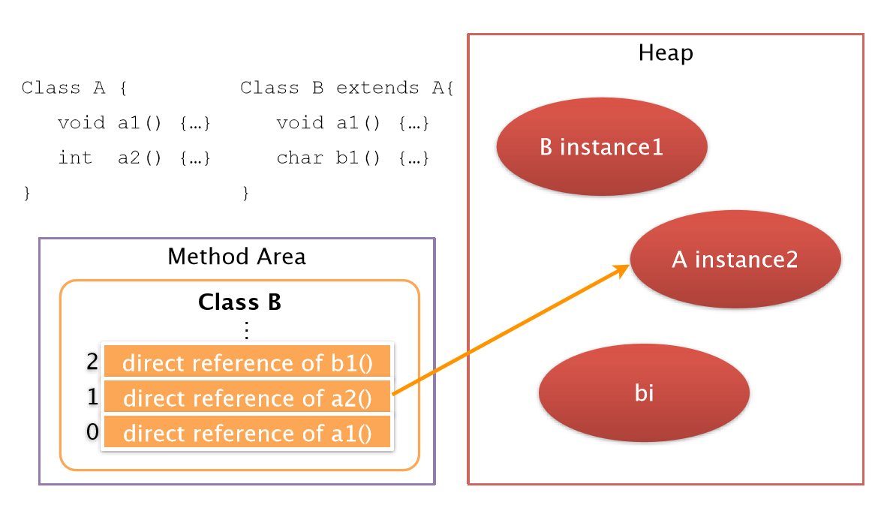

## Method Area

Method Area는 모든 쓰레드들이 공유하는 메모리 영역이다. 이 영역은 Load된 타입을 저장하는 논리적 메모리 공간으로 정의할 수 있다. 여기서 타입이란 클래스나 인터페이스를 의미한다.

저장되는 정보는 타입의 Bytecode 뿐만 아니라, 모든 변수, 상수, Reference, Method Data 등이 포함된다. 또한 클래스나 인스턴스, 인터페이스의 초기화 때 사용되는 클래스 변수, 메소드와 생성자의 정보도 포함된다. 이 정보들은 ClassLoader에게 넘겨받은 Class File에서 타입 관련 정보를 추출하여 저장하게 된다. 

Method Area의 타입 정보는 7가지 정보로 구성된다.

```
[ Type Information in Method Area ]

Type Information
Constant Pool
Field Information
Method Information
Class Variable
Reference to Class (ClassLoader)
Reference to Class (class)
Method Table
```


### Type Information

가장 기본이 되는 정보로 Type에 대한 전반적인 내용이 포함된다. Type은 자바 클래스, 인터페이스를 의미하며 Java Class File은 Java Type을 표현하는 Standard Binary이다.

- Type의 전체이름 (Package명 + class명)
- Type의 직계 super class의 전체이름 (타입이 인터페이스, `java.lang.object` 클래스, super class가 없는 경우는 제외)
- Type이 클래스인지 인터페이스인지의 여부
- Type의 Modifier (public, abstract, final 등 )
- 직접 연관된 인터페이스의 전체이름(package.class) 리스트(참조 순서대로)


### Constant Pool

Constant Pool는 Type의 모든 Constant 정보를 가지고 있는 부분이며 Constant의 Ordered Set이다. 여기서 Constant는 상수의 의미를 지니고 있는 Literal Constant과 Type, Field (멤버변수, 클래스 변수), Method 로의 모든 Symbolic Reference 까지 확장된 개념이다. Constant Pool의 엔트리는 배열처럼 인덱스로 접근한다.

객체의 이름으로 Reference를 구성하는 것을 Symbolic Reference라고 하는데 이것이 Constant Pool내에 저장되는 것이다. JVM은 실행 시 참조하는 객체에 접근할 핑요가 있으면 Constant Pool의 Symbolic Reference를 통해 해당 객체가 위치한 메모리의 주소를 찾아 동적으로 연결한다. (Dynamic Linking)


### Field Information

Field Information은 Type에서 선언된 모든 Field의 정보이다. 이 정보는 `이름, 타입, Modifier`가 있다. 여기에 Field의 정보는 선언된 순서대로 기록한다.

- Field Name
- Field Type
- Field Modifier (public, private, protected, static, final, volatile, transient)


> 자바에는 총 4가지 변수가 있다. 인스턴스 변수, 클래스 변수, 지역 변수, 파라미터 이다. 이중에서 Field는 인스턴스 변수와 클래스 변수를 의미한다. 나머지 지역 변수와 파라미터 변수는 메소드에 속한다.


### Method Information

Method Information는 Type에서 선언된 모든 메소드 정보를 의미한다.

- Method Name
- Method Return Type (void)
- Method Parameter Number와 Type (순서대로)
- Method Modifier (public, private, protected, static, final, syncronized, native, abstract)

메서드가 native, abstract가 아니라면 다음 정보가 추가된다.

- Method의 Bytecode
- Method Stack Frame의 Operand Stack 및 Local Variable Section 크기
- Exception Table

- 


### Class Variable

Class에서 static으로 선언된 변수이다. 이 변수는 모든 인스턴스에 공유되며 인스턴스가 없어도 접근이 가능하다. 이 변수는 Class를 사용하기 전부터 Method Area에 미리 메모리를 할당 받는다. 

만약 Class Variable을 final로 선언할 경우에는 이를 변수가 아닌 상수로 취급하여 Constant Pool에 Literal Constant로 저장된다.


### Reference to Class (ClassLoader)

Type이 다른 Type을 참조할 때 같은 ClassLoader를 사용하기 때문에 Type의 ClassLoader 정보가 필요하다. 

ClassLoader는 User-Defined ClassLoader와 Bootstrap ClassLoader가 있다. User-Defined ClassLoader인 경우에는 Reference를 저장하고 Bootstrap ClassLoader는 null로 저장된다. 이 정보는 Dynamic Linking을 할 때 해당 Type과 동일한 ClassLoader를 통해 참고하는 Type을 로딩하기 위해 사용된다.


### Reference to Class (class)

Type이 JVM에 Load되면 항상 `java.lang.class` 클래스의 인스턴스가 하나 생성된다. 그래서 Method Area에는 Type 정보의 일부로 이 인스턴스의 Reference를 저장하고 있다. getName(), isInterface(), forClass() 등의 메서드를 호출하면 이 클래스 인스턴스의 Reference를 통해 값을 반환한다.


### Method Table

Method Table는 클래스의 메서드에 대한 Direct Reference를 갖는, 메서드 호출을 위한  자료구조이다. JVM은 이를 통해 메서드에 대한 참조를 빠르게 수행할 수 있다. 인터페이스나 추상 클래스가 아닌 클래스에서 존재하며 해당 클래스의 메서드 뿐만 아니라 슈퍼 클래스에서 상속된 메서드의 Reference까지 포함한다. 클래스가 로딩될 때 함께 생성된다.




## Java Heap

Object Layout

Head의 구조


## Runtime Data Area Simulation

Java Variable Arrangement

Runtime Data Areas Sinulation


